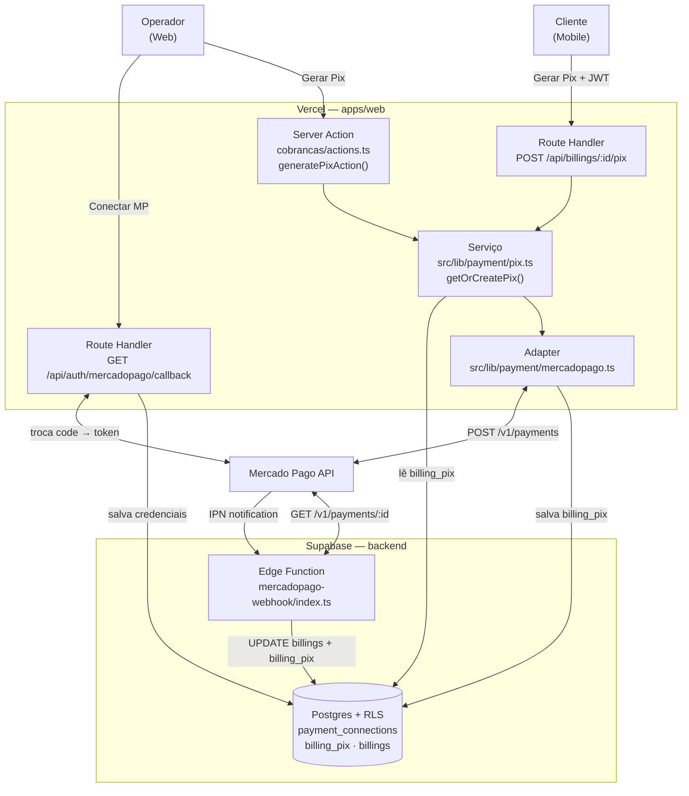
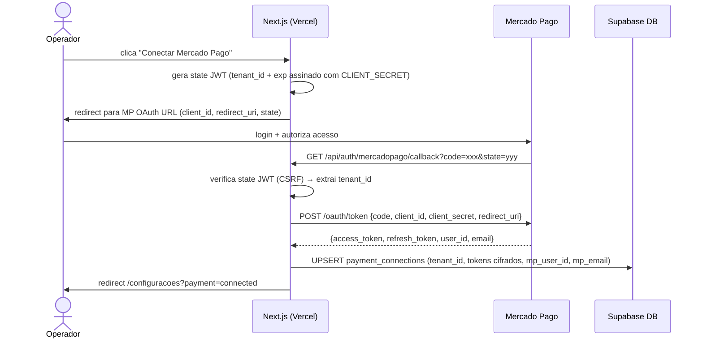
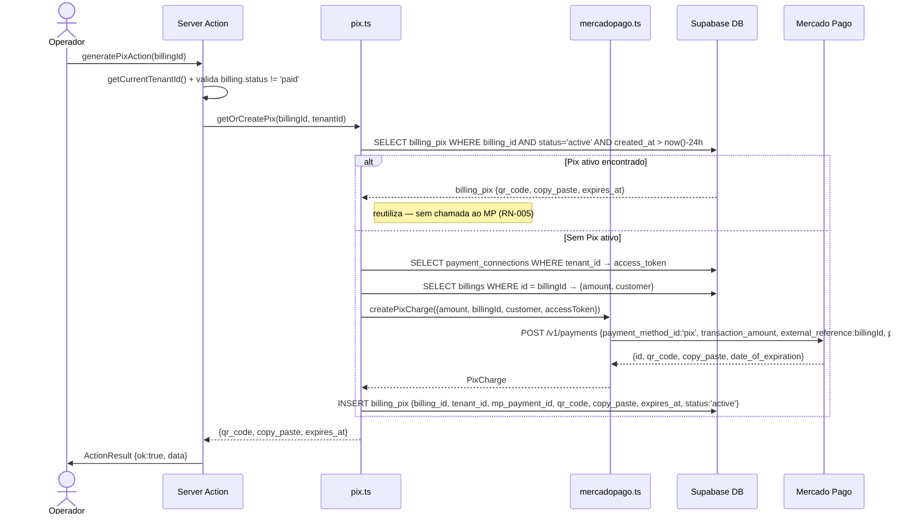
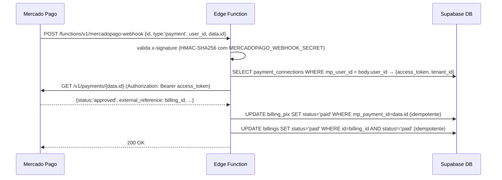

# Spec 0005 — Integração Mercado Pago

> 🟢 **Status: aprovado** em 2026-06-25. Spec técnica derivada de [[PRDs/0005-integracao-mercado-pago]] (v1.0). Próximo passo: implementar na ordem — migrations → schemas Zod em `@gomoto/core` → adapter MP → server actions / route handlers → UI web → UI mobile → testes.

---

## 2. Arquitetura

### 2.1 Contexto



### 2.2 Componentes

**`packages/core` (`@gomoto/core`) — novos:**

- `src/schemas/payments.ts` — Zod: `ConnectMercadoPagoSchema`, `GeneratePixSchema`, `PixResponseSchema`, `DisconnectPaymentSchema`
- `src/rules/payments.ts` — regras puras: `isPixActive(createdAt)`, `isPixExpired(createdAt)`, `canGeneratePix(billing, hasActiveConnection)`
- `src/types/payments.ts` — tipos TS: `PaymentConnection`, `BillingPix`, `PixStatus` (`'none' | 'active' | 'expired' | 'paid'`)

**`packages/data` (`@gomoto/data`) — novos / modificados:**

- `src/hooks/usePaymentConnection.ts` — lê `payment_connections` para o tenant atual (expõe `isConnected`, `accountName`)
- `src/hooks/useBillings.ts` — atualiza query para incluir join com `billing_pix` e expor `pix_status`

**`apps/web` — novos:**

- `src/lib/payment/mercadopago.ts` — thin adapter: `exchangeCodeForTokens()`, `createPixCharge()`, `getPayment()`
- `src/lib/payment/pix.ts` — serviço: `getOrCreatePix(billingId, tenantId)` — verifica Pix ativo → cria novo se inexistente/expirado
- `src/app/api/auth/mercadopago/callback/route.ts` — Route Handler GET (callback OAuth, processa `code` → salva tokens)
- `src/app/api/billings/[id]/pix/route.ts` — Route Handler POST (ponto de entrada do mobile, valida JWT Supabase)

**`apps/web` — modificados:**

- `src/app/(dashboard)/configuracoes/page.tsx` — nova seção "Integração de Pagamento" (status, conectar, desconectar)
- `src/app/(dashboard)/cobrancas/page.tsx` — coluna `pix_status`, ação "Gerar Pix" (habilitada/desabilitada por estado)
- `src/app/(dashboard)/cobrancas/actions.ts` — nova `generatePixAction(billingId)` e `disconnectPaymentAction()`

**`apps/mobile` (`@gomoto/mobile`) — modificado:**

- `src/screens/BillingsScreen.tsx` — botão "Gerar Pix" / "Ver Pix ativo" por cobrança pendente; modal com QR Code + copia-e-cola + valor + vencimento

**`supabase/functions` — novo:**

- `mercadopago-webhook/index.ts` — Edge Function Deno: valida `x-signature` (HMAC-SHA256), confirma via GET MP, persiste baixa

**`supabase/migrations` — 2 novos arquivos:**

- `<ts>_create_payment_connections.sql`
- `<ts>_create_billing_pix.sql`

### 2.3 Responsabilidades

| Quem | O quê |
|---|---|
| `@gomoto/core` | Valida payloads (Zod) + regras puras de domínio sem I/O |
| `apps/web` Server Action | Orquestra operações disparadas pelo operador no web (resolve tenant, chama serviço Pix, persiste, revalida path) |
| `apps/web` Route Handlers | Ponto de entrada para mobile (Pix) e para o callback OAuth (browser redirect) |
| `apps/web` Adapter MP | Encapsula todas as chamadas HTTP ao Mercado Pago; único lugar que conhece a API MP |
| `apps/web` Serviço Pix | Lógica de negócio síncrona: verifica Pix ativo → cria novo via adapter → persiste em `billing_pix` |
| Supabase Edge Function | Processa webhook IPN de forma assíncrona e desacoplada da UI: valida assinatura, confirma pagamento, registra baixa |
| Supabase Postgres + RLS | Persiste e isola dados por tenant; garante que nenhum tenant acessa dados de outro |

---

## 3. Fluxos Técnicos

### 3.1 Fluxos Principais

#### Fluxo A — Conexão OAuth (Operador, web)



**Nota CSRF:** `state` é um JWT de curta duração (5 min) assinado com `MERCADOPAGO_CLIENT_SECRET`. Não requer round-trip ao banco — verificação é local no callback handler.

#### Fluxo B — Geração de Pix (Operador, web)



#### Fluxo C — Geração de Pix (Cliente, mobile)

Reutiliza o mesmo serviço `pix.ts`. Difere apenas na camada de entrada:

```
Mobile (Expo)
  → POST /api/billings/{id}/pix (Header: Authorization: Bearer <supabase_jwt>)
    → Route Handler valida JWT via createClient().auth.getUser()
    → resolve tenant_id via customers.tenant_id (WHERE customers.user_id = auth.uid)
    → getOrCreatePix(billingId, tenantId)  ← mesma lógica do Fluxo B
    → retorna JSON {qr_code, copy_paste, expires_at}
```

#### Fluxo D — Confirmação automática via Webhook IPN (Supabase Edge Function)



**Idempotência:** as duas queries `UPDATE` usam predicados que absorvem duplicatas sem efeito colateral (RN-008).

### 3.2 Fluxos Alternativos

| Situação | Técnica |
|---|---|
| Pix ativo (< 24h) já existe | `getOrCreatePix` retorna registro existente; zero chamada ao MP (RN-005, CA-008) |
| Pix expirado (≥ 24h) | SELECT retorna vazio → novo Pix criado automaticamente (RN-006, CA-009) |
| Operador e cliente solicitam Pix simultaneamente | Sem race condition: a consulta de Pix ativo usa `SELECT ... FOR UPDATE` em `billing_pix`; a segunda requisição recebe o registro inserido pela primeira |
| Tenant desconecta conta enquanto Pix está ativo | `payment_connections` deletado; Pix já gerado permanece válido em `billing_pix` até `expires_at`; novos Pix bloqueados porque `SELECT payment_connections` retorna vazio → `FORBIDDEN` (RN-009) |
| Cobrança já paga | Server Action / Route Handler verifica `billing.status === 'paid'` antes de chamar serviço → `ActionResult {ok:false, error:{code:'CONFLICT', message:'Esta cobrança já foi paga'}}` (RF-015, CA-016) |

### 3.3 Fluxos de Falha

| Falha | Comportamento técnico |
|---|---|
| Operador cancela OAuth no MP | MP redireciona callback com `error=access_denied`; Route Handler detecta parâmetro de erro → redireciona `/configuracoes?payment=cancelled`; nenhuma credencial salva (CA-004) |
| MP indisponível ao gerar Pix (timeout / 5xx) | Adapter lança erro → `getOrCreatePix` propaga → Server Action retorna `{ok:false, error:{code:'INTERNAL', message:'Falha ao gerar Pix. Tente novamente.'}}` → UI exibe mensagem; `billing_pix` não é inserido; cobrança permanece inalterada |
| Webhook com assinatura HMAC inválida | Edge Function retorna `401` imediatamente; MP executa retry automático (RNF-005) |
| Webhook com `user_id` desconhecido (tenant desconectado) | Edge Function loga warning, retorna `200` para não bloquear retries do MP; nenhuma baixa registrada |
| Webhook duplicado (pagamento já registrado como pago) | UPDATE com predicado `AND status != 'paid'` é no-op; retorna `200`; billing permanece `paid` (RN-008, CA-015) |
| Notificação IPN atrasada (Pix expirado, pagamento válido) | Edge Function ainda confirma: `billing_pix.status` pode já ser `expired`, mas o UPDATE em `billings` ocorre normalmente — o pagamento é válido independente do Pix ter expirado (RNF-009) |
| Token MP expirado ao gerar Pix | Adapter recebe 401 do MP → detecta → usa `refresh_token` para renovar `access_token` → atualiza `payment_connections` → reexecuta a chamada (1 retry automático) |

### 3.4 Eventos

Esta feature consome um evento assíncrono externo: a notificação IPN do Mercado Pago.

| Atributo | Valor |
|---|---|
| **Producer** | Mercado Pago API |
| **Consumer** | Supabase Edge Function `mercadopago-webhook` |
| **Endpoint** | URL pública da Edge Function (registrada no dashboard MP) |
| **Método** | HTTP POST |
| **Payload** | `{ action: "payment.updated", type: "payment", data: { id: "<mp_payment_id>" }, user_id: "<mp_merchant_id>" }` |
| **Garantia de entrega** | At-least-once: MP retentativa se receber non-200 |
| **Idempotência** | Controlada por predicados de UPDATE (RN-008) |
| **Latência esperada** | MP entrega em segundos após aprovação; RNF-002 exige processamento ≤ 10s |

---

## 4. Modelo de Dados

### 4.1 Entidades

| Tabela | Tipo | O que representa |
|---|---|---|
| `payment_connections` | Nova | Credenciais OAuth MP vinculadas a um tenant (no máximo uma por tenant, RN-001) |
| `billing_pix` | Nova | Registro histórico de Pix gerados por cobrança; controla status ativo/expirado/pago |
| `billings` | Existente — sem mudança de schema | Webhook atualiza `status`, `payment_method`, `paid_at` via colunas já existentes |

### 4.2 Campos (SQL concreto)

#### Migration 1 — `payment_connections`

```sql
-- supabase/migrations/<YYYYMMDDHHMMSS>_create_payment_connections.sql
BEGIN;

CREATE TABLE payment_connections (
  id              UUID PRIMARY KEY DEFAULT gen_random_uuid(),
  tenant_id       UUID NOT NULL UNIQUE REFERENCES tenants(id) ON DELETE CASCADE,
  mp_user_id      TEXT NOT NULL,       -- merchant ID do MP (match do IPN user_id)
  mp_account_email TEXT,               -- exibido na UI (RF-004); pode ser NULL se MP não retornar
  access_token    TEXT NOT NULL,       -- lido apenas server-side via service role
  refresh_token   TEXT NOT NULL,       -- lido apenas server-side via service role
  created_at      TIMESTAMPTZ NOT NULL DEFAULT now(),
  updated_at      TIMESTAMPTZ NOT NULL DEFAULT now()
);

-- UNIQUE em tenant_id: enforce RN-001 (no máximo uma conta MP por tenant) no nível do banco
-- ON DELETE CASCADE: credenciais são deletadas junto com o tenant

CREATE TRIGGER update_payment_connections_updated_at
  BEFORE UPDATE ON payment_connections
  FOR EACH ROW EXECUTE FUNCTION update_updated_at_column();

ALTER TABLE payment_connections ENABLE ROW LEVEL SECURITY;

-- Operadores do tenant: leitura permitida para exibir mp_account_email na UI
-- access_token e refresh_token nunca são consultados por hooks — exclusivamente via service role
CREATE POLICY "tenant_isolation_payment_connections" ON payment_connections
  FOR ALL TO authenticated
  USING (tenant_id IN (SELECT tenant_id FROM get_user_tenants()));

CREATE INDEX idx_payment_connections_tenant_id   ON payment_connections(tenant_id);
CREATE INDEX idx_payment_connections_mp_user_id  ON payment_connections(mp_user_id);
-- idx_mp_user_id: lookup na Edge Function webhook (IPN traz user_id do merchant)

COMMIT;
```

#### Migration 2 — `billing_pix`

```sql
-- supabase/migrations/<YYYYMMDDHHMMSS>_create_billing_pix.sql
BEGIN;

CREATE TYPE billing_pix_status AS ENUM ('active', 'expired', 'paid');

CREATE TABLE billing_pix (
  id              UUID PRIMARY KEY DEFAULT gen_random_uuid(),
  tenant_id       UUID NOT NULL REFERENCES tenants(id) ON DELETE CASCADE,
  billing_id      UUID NOT NULL REFERENCES billings(id) ON DELETE RESTRICT,
  mp_payment_id   TEXT NOT NULL UNIQUE,     -- chave de deduplicação para idempotência do webhook
  qr_code         TEXT NOT NULL,            -- string copia-e-cola do Pix
  qr_code_base64  TEXT NOT NULL,            -- imagem QR Code em base64 (para exibição no app)
  expires_at      TIMESTAMPTZ NOT NULL,     -- 24h após criação (RN-004)
  status          billing_pix_status NOT NULL DEFAULT 'active',
  created_at      TIMESTAMPTZ NOT NULL DEFAULT now(),
  updated_at      TIMESTAMPTZ NOT NULL DEFAULT now()
);

-- billing_id → RESTRICT: impede deletar billing com histórico de Pix
-- mp_payment_id → UNIQUE: garante deduplicação; webhook sempre acha o row pelo ID do MP

CREATE TRIGGER update_billing_pix_updated_at
  BEFORE UPDATE ON billing_pix
  FOR EACH ROW EXECUTE FUNCTION update_updated_at_column();

ALTER TABLE billing_pix ENABLE ROW LEVEL SECURITY;

-- Operadores: leitura e escrita via tenant (para RF-018 e Server Action)
CREATE POLICY "tenant_isolation_billing_pix" ON billing_pix
  FOR ALL TO authenticated
  USING (tenant_id IN (SELECT tenant_id FROM get_user_tenants()));

-- Clientes mobile: SELECT apenas nas próprias cobranças (para atualização de status pós-pagamento)
CREATE POLICY "customer_read_own_billing_pix" ON billing_pix
  FOR SELECT TO authenticated
  USING (
    billing_id IN (
      SELECT b.id FROM billings b
      INNER JOIN rentals r ON r.id = b.lease_id
      INNER JOIN customers c ON c.id = r.customer_id
      WHERE c.user_id = auth.uid()
    )
  );

-- Enforce RN-003: no máximo um Pix ativo por cobrança (índice único parcial)
CREATE UNIQUE INDEX idx_billing_pix_one_active_per_billing
  ON billing_pix (billing_id)
  WHERE status = 'active';

-- Índices de query
CREATE INDEX idx_billing_pix_billing_id        ON billing_pix(billing_id);
CREATE INDEX idx_billing_pix_tenant_id         ON billing_pix(tenant_id);
CREATE INDEX idx_billing_pix_mp_payment_id     ON billing_pix(mp_payment_id);
CREATE INDEX idx_billing_pix_billing_status    ON billing_pix(billing_id, status, expires_at);
-- idx_billing_status+expires_at: otimiza a query de "Pix ativo" em getOrCreatePix

COMMIT;
```

#### `billings` — sem alteração de schema

O webhook usa exclusivamente colunas já existentes:

| Coluna | Valor escrito pelo webhook | Já existe? |
|---|---|---|
| `status` | `'paid'` | ✅ |
| `payment_method` | `'pix'` | ✅ |
| `paid_at` | `now()::date` | ✅ |
| `paid_by` | `NULL` (pagamento automatizado) | ✅ |

### 4.3 Relacionamentos e índices

```
tenants (1) ─── (0..1) payment_connections
  └─ ON DELETE CASCADE: credenciais removidas junto com o tenant

tenants (1) ─── (0..N) billing_pix
  └─ ON DELETE CASCADE: histórico de Pix removido junto com o tenant

billings (1) ─── (0..N) billing_pix
  └─ ON DELETE RESTRICT: billing não pode ser deletado com Pix registrado

billing_pix.mp_payment_id ─── UNIQUE: chave de deduplicação do webhook

UNIQUE INDEX parcial (billing_id WHERE status='active'):
  ─── enforce RN-003 no banco; libera quando status muda para 'expired' ou 'paid'
```

**Fluxo de estados de `billing_pix.status`:**

```
INSERT → 'active'
  │
  ├─ expires_at < now() → UPDATE status='expired' (feito por getOrCreatePix antes de criar novo Pix)
  │
  └─ Webhook confirma pagamento → UPDATE status='paid'
```

**Nota sobre tokens:** `access_token` e `refresh_token` ficam em plaintext em `payment_connections`. A RLS permite leitura por operadores autenticados do tenant (eles são donos dos dados), mas nenhum hook ou componente de UI os consulta — acesso é exclusivamente server-side via service role em Server Actions e Edge Function. Para produção com exigência de encryption-at-rest, Supabase Vault (`vault.create_secret()`) pode ser adotado sem mudança de schema (substitui os valores TEXT por IDs de segredo).

---

## 5. APIs

### 5.1 Endpoints

#### Server Actions — `apps/web/src/app/(dashboard)/configuracoes/actions.ts`

| Action | Auth | O que faz | Retorno |
|---|---|---|---|
| `connectMercadoPagoAction()` | Operador autenticado | Gera URL OAuth MP com `state` JWT + `client_id` e retorna para que o client redirecione o navegador | `ActionResult<{ authUrl: string }>` |
| `disconnectPaymentAction()` | Operador autenticado | Deleta `payment_connections` do tenant; invalida geração de novos Pix | `ActionResult<void>` + `revalidatePath('/configuracoes')` + `logAction` |

#### Server Actions — `apps/web/src/app/(dashboard)/cobrancas/actions.ts`

| Action | Auth | O que faz | Retorno |
|---|---|---|---|
| `generatePixAction(billingId: string)` | Operador autenticado | Valida cobrança, chama `getOrCreatePix()`, retorna dados do Pix | `ActionResult<PixResult>` + `revalidatePath('/cobrancas')` |

#### Route Handler — OAuth Callback

| Rota | Método | Auth | O que faz | Resposta |
|---|---|---|---|---|
| `/api/auth/mercadopago/callback` | GET | Sessão Supabase (cookie) | Valida `state` JWT, troca `code` por tokens MP, UPSERT `payment_connections` | Redirect para `/configuracoes?payment=connected\|cancelled\|error` |

*Não usa `ActionResult` — resposta é sempre um redirect (302). Query params comunicam o resultado ao client.*

#### Route Handler — Mobile Pix

| Rota | Método | Auth | O que faz | Resposta |
|---|---|---|---|---|
| `/api/billings/[id]/pix` | POST | JWT Supabase no header `Authorization: Bearer` | Valida JWT, resolve `tenant_id` via `customers.user_id`, chama `getOrCreatePix()` | JSON `ActionResult<PixResult>` |

*Autenticação via `supabase.auth.getUser(token)` onde `token` é extraído do header `Authorization`. Não usa cookies.*

#### Supabase Edge Function — Webhook

| Endpoint | Método | Auth | O que faz | Resposta |
|---|---|---|---|---|
| `/functions/v1/mercadopago-webhook` | POST | HMAC-SHA256 `x-signature` | Valida assinatura, confirma pagamento no MP, persiste baixa | `200 OK` sempre; `401` apenas em assinatura inválida |

*Retorna `200` mesmo em casos de tenant não encontrado ou pagamento já processado — evita retries desnecessários do MP. Apenas `401` (assinatura inválida) força retry.*

---

### 5.2 Schemas (Zod via `@gomoto/core`)

```ts
// packages/core/src/schemas/payments.ts
import { z } from 'zod';

// --- Input de Server Action / Route Handler ---

export const GeneratePixSchema = z.object({
  billing_id: z.string().uuid('ID de cobrança inválido'),
});
export type GeneratePix = z.infer<typeof GeneratePixSchema>;

// --- Respostas de domínio ---

export const PixResultSchema = z.object({
  qr_code:        z.string().min(1),   // copia-e-cola
  qr_code_base64: z.string().min(1),   // imagem QR para exibição
  expires_at:     z.string().datetime(),
  is_reused:      z.boolean(),         // true = Pix ativo reutilizado; false = novo
});
export type PixResult = z.infer<typeof PixResultSchema>;

export const PaymentConnectionStatusSchema = z.object({
  is_connected:     z.boolean(),
  mp_account_email: z.string().email().nullable(),
});
export type PaymentConnectionStatus = z.infer<typeof PaymentConnectionStatusSchema>;

// --- Enum de status (alinhado com billing_pix_status no banco) ---

export const PixStatusSchema = z.enum(['none', 'active', 'expired', 'paid']);
export type PixStatus = z.infer<typeof PixStatusSchema>;
// 'none' = sem registro billing_pix; demais espelham o ENUM do banco
```

**Schemas internos (NÃO exportados para `@gomoto/core` — runtime Deno incompatível):**

```ts
// supabase/functions/mercadopago-webhook/index.ts (inline, Deno)
const MercadoPagoIPNSchema = z.object({
  type:     z.enum(['payment', 'merchant_order']),
  user_id:  z.string(),
  data:     z.object({ id: z.string() }),
});
// Nota: z aqui é importado de 'npm:zod' no runtime Deno
```

---

### 5.3 Erros

#### Server Actions e Route Handler mobile

| Código | Quando ocorre | Reação da UI |
|---|---|---|
| `UNAUTHORIZED` | Sessão ausente ou expirada | Redirect para login |
| `FORBIDDEN` | Tenant sem conta MP conectada ao tentar gerar Pix | Exibe orientação: "Configure a integração nas Configurações" (CA-011 / CA-012) |
| `CONFLICT` | Cobrança já paga | Exibe: "Esta cobrança já foi paga" (CA-016) |
| `NOT_FOUND` | `billing_id` não existe ou não pertence ao tenant | Exibe erro genérico; mantém cobrança inalterada |
| `INTERNAL` | MP indisponível, timeout, erro inesperado | Exibe: "Falha ao gerar Pix. Tente novamente." (CA do fluxo de erro PRD §6.5) |
| `VALIDATION_ERROR` | `billing_id` não é UUID válido | Erro com `field: 'billing_id'` |

#### Route Handler OAuth Callback

| Situação | Redirect target |
|---|---|
| Sucesso | `/configuracoes?payment=connected` |
| Operador cancelou no MP (`error=access_denied`) | `/configuracoes?payment=cancelled` |
| `state` JWT inválido ou expirado (CSRF) | `/configuracoes?payment=error&reason=state_mismatch` |
| Falha na troca de tokens com MP | `/configuracoes?payment=error&reason=token_exchange` |

#### Edge Function Webhook

| Situação | Status HTTP | Retry MP? |
|---|---|---|
| Assinatura HMAC inválida | `401` | Sim |
| Tenant não encontrado para `user_id` | `200` (loga warning) | Não |
| Pagamento `status != 'approved'` | `200` (ignora, não é confirmação) | Não |
| Cobrança já paga (idempotente) | `200` | Não |
| Erro interno (banco indisponível) | `500` | Sim (MP retenta) |

---

## 6. Segurança

### 6.1 Autenticação

| Ponto de entrada | Mecanismo | Como valida |
|---|---|---|
| Server Actions (web) | Supabase Auth — cookie de sessão | `supabase.auth.getUser()` no início de toda action; retorna `UNAUTHORIZED` se ausente |
| Route Handler OAuth callback | Supabase Auth — cookie de sessão | Mesma validação; `state` JWT adiciona proteção CSRF (ver abaixo) |
| Route Handler mobile (`POST /api/billings/[id]/pix`) | JWT Bearer no header `Authorization` | `supabase.auth.getUser(token)` onde `token = req.headers.get('Authorization')?.replace('Bearer ', '')` — não usa cookie |
| Supabase Edge Function (webhook) | HMAC-SHA256 via `x-signature` (MP) | Validado antes de qualquer processamento; 401 imediato em falha |

**Proteção CSRF no OAuth (state JWT):**

```
state = JWT.sign(
  { tenant_id, nonce: crypto.randomUUID(), exp: now + 300s },
  MERCADOPAGO_CLIENT_SECRET
)
```

O callback verifica assinatura + expiração antes de processar o `code`. Sem round-trip ao banco — verificação é local e stateless.

**Validação do webhook MP (`x-signature`):**

```
// Formato do header: ts=<timestamp>,v1=<hmac>
// HMAC computado pelo MP como:
HMAC-SHA256(
  key = MERCADOPAGO_WEBHOOK_SECRET,
  data = "id:<payment_id>;request-id:<x-request-id>;ts:<timestamp>"
)
// Edge Function re-computa e compara com valor recebido
```

### 6.2 Autorização

**Matriz de permissões por operação:**

| Operação | Quem pode | Verificação server-side |
|---|---|---|
| Conectar conta MP | Operador autenticado do tenant | `getCurrentTenantId()` — falha se usuário não tem tenant |
| Desconectar conta MP | Operador autenticado do tenant | Mesmo |
| Gerar Pix (web) | Operador autenticado do tenant | Billing pertence ao tenant via RLS |
| Gerar Pix (mobile) | Cliente autenticado dono da cobrança | `customers.user_id = auth.uid()` + `billing_id` pertence ao customer |
| Receber webhook | Mercado Pago (machine-to-machine) | HMAC; nenhuma identidade humana envolvida |
| Ver status MP em Configurações | Operador autenticado do tenant | RLS `payment_connections` via `get_user_tenants()` |

**Isolamento de tenant (RNF-006):**

- `getCurrentTenantId(supabase)` — resolve `tenant_id` server-side a partir da sessão; nunca aceita `tenant_id` vindo do client.
- Toda query em `payment_connections` e `billing_pix` inclui `tenant_id` implicitamente via RLS.
- Edge Function: resolve `tenant_id` pelo `mp_user_id` do IPN — cada `mp_user_id` mapeia para exatamente um tenant. Credenciais de tenant A nunca são usadas para processar cobranças de tenant B.

**Verificação de posse no mobile Route Handler:**

```ts
// /api/billings/[id]/pix/route.ts
const { data: customer } = await supabase
  .from('customers')
  .select('tenant_id')
  .eq('user_id', user.id)
  .single();

const { data: billing } = await supabase
  .from('billings')
  .select('id, status, tenant_id, original_amount, discount_amount')
  .eq('id', billingId)
  .eq('tenant_id', customer.tenant_id)  // garante que billing pertence ao tenant do customer
  .single();
```

### 6.3 Auditoria

Ativa — RNF-007 define o que NÃO logar; esta seção define o que SIM logar.

Usa `logAction()` existente em `apps/web/src/lib/audit.ts`.

| Evento | O que logar | O que NUNCA logar |
|---|---|---|
| Conta MP conectada | `{ action: 'connect_payment', tenant_id, mp_user_id, mp_account_email }` | `access_token`, `refresh_token`, `client_secret` |
| Conta MP desconectada | `{ action: 'disconnect_payment', tenant_id, mp_user_id }` | Tokens |
| Pix gerado (novo) | `{ action: 'generate_pix', billing_id, tenant_id, mp_payment_id, actor: 'operator'\|'customer' }` | QR code, copia-e-cola (dados de pagamento) |
| Pix reutilizado | Não logar — sem ação nova ocorrida | — |
| Pagamento confirmado (webhook) | `{ action: 'payment_confirmed', billing_id, mp_payment_id, tenant_id, source: 'webhook' }` | Tokens, QR code |
| Token renovado (refresh automático) | `{ action: 'token_refreshed', tenant_id }` (warning level) | Tokens antigos e novos |

**Nota RNF-007:** a função `logAction()` não deve receber objetos que contenham os campos `access_token`, `refresh_token`. A Server Action que deleta `payment_connections` deve fazer o log ANTES de buscar as credenciais (ou passar apenas `mp_user_id`).

---

## 7. Observabilidade

> Feature de pagamento é operacionalmente crítica: falhas silenciosas geram cobranças não baixadas automaticamente. Logs e alertas são obrigatórios.

### 7.1 Logs essenciais

Todos os logs em JSON estruturado via `console.log(JSON.stringify({...}))` — Vercel e Supabase capturam automaticamente. Nível de produção: `info`, `warn`, `error` (nunca `debug` em prod).

**Formato base:**
```json
{
  "ts": "ISO-8601",
  "level": "info | warn | error",
  "action": "identificador_da_operacao",
  "tenant_id": "uuid | null",
  "outcome": "ok | error",
  "latency_ms": 0,
  "error_code": "INTERNAL | null"
}
```

**Eventos obrigatórios:**

| Nível | `action` | Campos extras | Nunca logar |
|---|---|---|---|
| `info` | `payment.connected` | `mp_user_id`, `mp_account_email` | tokens |
| `warn` | `payment.oauth_failed` | `reason: state_mismatch\|token_exchange`, `tenant_id` | code, tokens |
| `info` | `payment.disconnected` | `mp_user_id`, `tenant_id` | tokens |
| `info` | `pix.generated` | `billing_id`, `tenant_id`, `is_reused`, `latency_ms` | qr_code, copy_paste |
| `error` | `pix.generation_failed` | `billing_id`, `tenant_id`, `mp_status_code`, `latency_ms` | — |
| `info` | `webhook.received` | `mp_payment_id`, `mp_user_id` | tokens |
| `info` | `webhook.payment_confirmed` | `billing_id`, `mp_payment_id`, `tenant_id`, `latency_ms` | — |
| `warn` | `webhook.signature_invalid` | `x_request_id` | secret, body |
| `warn` | `webhook.tenant_not_found` | `mp_user_id` | — |
| `warn` | `token.refreshed` | `tenant_id` | tokens antigos e novos |
| `error` | `token.refresh_failed` | `tenant_id` | tokens |

**Localização dos logs:**

- Next.js (Server Actions / Route Handlers) → Vercel Function Logs
- Supabase Edge Function → Supabase Dashboard → Edge Functions → Logs

### 7.2 Métricas e alertas

Feature de pagamento tem RNF de latência (RNF-001, RNF-002) — métricas são necessárias. Sem infraestrutura de métricas dedicada no projeto em V1; monitoramento via dashboards nativos do Vercel e Supabase.

**O que observar nos dashboards nativos:**

| O que medir | Onde ver | Target (PRD) | Alerta sugerido |
|---|---|---|---|
| Latência de geração de Pix (p95) | Vercel → Functions → Duration | ≤ 5s (RNF-001) | > 8s por 5min → investigar |
| Latência de processamento do webhook (p95) | Supabase → Edge Functions → Duration | ≤ 10s (RNF-002) | > 15s por 5min → investigar |
| Taxa de erro em `pix.generation_failed` | Vercel → Function Logs (filtrar por action) | < 1% | > 5% em 10min → alerta operacional |
| Taxa de `webhook.signature_invalid` | Supabase Edge Function Logs | ≈ 0 | > 3 em 1min → suspeita de ataque |
| Taxa de `token.refresh_failed` | Vercel Function Logs | ≈ 0 | Qualquer ocorrência → tenant perde capacidade de gerar Pix |

**Alertas configuráveis (Vercel):**
- Vercel → Project Settings → Alerts → "Function Error Rate" → threshold 5% → email/Slack

**Alertas configuráveis (Supabase):**
- Supabase → Edge Functions → enable "Error notifications" → email

---

## 8. Performance e Escalabilidade

Targets de latência cobertos em §7.2 (RNF-001 ≤5s, RNF-002 ≤10s). Sem requisitos de throughput ou escala não trivial em V1 — comportamento padrão Vercel + Supabase é suficiente. Índices compostos em `billing_pix` já endereçam performance das queries críticas (§4.3).

---

## 9. Test Strategy

### 9.1 Unit tests (Vitest — `packages/core/src/rules/payments.spec.ts`)

Testam as funções puras de `rules/payments.ts` e a lógica de validação HMAC (extraída para função pura testável).

| Função | Cenários cobertos | CAs / RNs |
|---|---|---|
| `isPixActive(createdAt)` | < 24h → true; > 24h → false; exatamente 24h → false | RN-003, RN-004, CA-008 |
| `isPixExpired(createdAt)` | Inverso do anterior | RN-004, RN-006 |
| `canGeneratePix(billing, hasConnection)` | pending + conectado → true; status paid → false; status cancelled → false; sem conexão → false | RN-002, RN-007, CA-016 |
| `validateWebhookSignature(body, ts, signature, secret)` | Assinatura válida → true; assinatura inválida → false; payload modificado → false | RNF-005, CA-015 |

```ts
// packages/core/src/rules/payments.spec.ts
describe('isPixActive', () => {
  it('retorna true para Pix gerado há 1 hora', () => {
    const createdAt = new Date(Date.now() - 1 * 60 * 60 * 1000);
    expect(isPixActive(createdAt)).toBe(true);
  });
  it('retorna false para Pix gerado há 25 horas', () => {
    const createdAt = new Date(Date.now() - 25 * 60 * 60 * 1000);
    expect(isPixActive(createdAt)).toBe(false);
  });
});

describe('canGeneratePix', () => {
  it('retorna false para cobrança com status paid', () => {
    expect(canGeneratePix({ status: 'paid' }, true)).toBe(false);
  });
  it('retorna false quando tenant não tem conexão', () => {
    expect(canGeneratePix({ status: 'pending' }, false)).toBe(false);
  });
});
```

### 9.2 E2E tests (Playwright — `apps/web/tests/e2e/pagamentos.spec.ts`)

Arquivo novo. Todos os testes usam as credenciais de sandbox do MP (`TEST-` prefix) com `MERCADOPAGO_CLIENT_ID` e `CLIENT_SECRET` de ambiente de teste no Playwright. O fluxo OAuth é testado via interceptação da URL de redirect (não abre o site do MP real — `page.route()` simula o callback).

| Teste | CAs cobertas | Observação |
|---|---|---|
| `operador vê status desconectado` | CA-001 | Estado inicial da tela Configurações |
| `operador clica Conectar → redirect para MP` | CA-002 | Verifica URL gerada tem client_id + state |
| `callback bem-sucedido → conta aparece conectada com email` | CA-003, CA-005 | Mock do callback MP via `page.route` |
| `callback com error=access_denied → mensagem cancelado` | CA-004 | Mock do redirect com `error=access_denied` |
| `operador desconecta conta MP` | CA-006 | Confirma que botão aparece como desconectado após |
| `botão Gerar Pix habilitado quando conectado` | CA-007 | Verifica state da UI |
| `botão Gerar Pix desabilitado sem conexão + orientação` | CA-011 | Verifica tooltip/mensagem |
| `botão Gerar Pix ausente para cobrança paga` | CA-013, CA-016 | Status pago → sem botão, mensagem se tentar |
| `operador gera Pix novo → exibe QR + copia-e-cola + valor + vencimento` | CA-009, CA-010 | Stub `POST /v1/payments` via `page.route` |
| `segundo clique retorna mesmo Pix ativo` | CA-008 | Dois cliques → mesmo `copy_paste` retornado |
| `tabela de cobranças exibe status Pix correto` | CA-019 | sem Pix / ativo / expirado / pago |
| `acesso à Configurações sem auth → redirect login` | RNF-004 | Verificação de autorização |
| `tenant isolado: billing de outro tenant → 404` | RNF-006, RN-010 | Chama Server Action com billing de outro tenant |

**CAs de mobile (CA-012, CA-017, CA-018):** fora do escopo Playwright — o projeto não tem testes automatizados para Expo. Cobertos por **testes manuais no simulador Expo** antes de cada release.

**Setup de sandbox MP para testes:**

```ts
// apps/web/tests/e2e/helpers.ts — adicionar
export async function mockMercadoPagoCallback(page, tenantId: string) {
  // Intercepta o redirect do MP e simula callback com code de teste
  await page.route('**/api/auth/mercadopago/callback*', async route => {
    const url = new URL(route.request().url());
    // Callback é tratado pela Next.js route — deixar passar mas com code de sandbox
    await route.continue();
  });
}
```

### 9.3 Integration — `pix.ts` service

Incluída porque `getOrCreatePix` orquestra 3 operações sequenciais (SELECT DB → POST MP → INSERT DB) com lógica de idempotência crítica. Vale um teste de integração com DB local (Supabase local via `pnpm db:reset`) e MP API mockada.

| Cenário | CAs / RNs |
|---|---|
| `getOrCreatePix` com Pix ativo existente → retorna mesmo código, sem chamada ao MP | CA-008, RN-005 |
| `getOrCreatePix` com Pix expirado → atualiza status 'expired', cria novo, retorna novo código | CA-009, RN-006 |
| `getOrCreatePix` chamado 2x concorrentemente para mesma cobrança → UNIQUE INDEX evita duplicata | RN-003 |
| Webhook processa mesma notificação 2x → billing permanece 'paid', sem erro | CA-015, RN-008 |
| Webhook com Pix expirado + pagamento válido → baixa ocorre mesmo assim | RNF-009 |

```ts
// packages/data/tests/integration/pix.integration.spec.ts (novo)
// Requer Supabase local rodando (pnpm db:reset)
// Mock da chamada ao MP via vi.mock('./mercadopago')
```

---

## 10. Deploy e Rollback

### Ordem de deploy (sequencial)

```
1. Pré-requisitos externos (one-time, manual — PRD Q-002 respondida aqui)
   ├─ Criar aplicação no dashboard Mercado Pago → obter CLIENT_ID + CLIENT_SECRET
   ├─ Registrar redirect URI: https://<dominio-vercel>/api/auth/mercadopago/callback
   └─ Registrar webhook URL: https://<project-ref>.supabase.co/functions/v1/mercadopago-webhook
      (a URL só existe após o passo 4)

2. Migrations (Supabase)
   ├─ supabase db push  ← cria payment_connections + billing_pix
   └─ Validar: tabelas existem, RLS ativa, índices criados

3. Secrets no Supabase
   ├─ supabase secrets set MERCADOPAGO_WEBHOOK_SECRET=<chave-hmac>
   └─ SUPABASE_SERVICE_ROLE_KEY já existe

4. Deploy da Edge Function
   └─ supabase functions deploy mercadopago-webhook

5. Environment variables no Vercel
   ├─ MERCADOPAGO_CLIENT_ID
   ├─ MERCADOPAGO_CLIENT_SECRET
   └─ MERCADOPAGO_REDIRECT_URI

6. Deploy do web (Vercel)
   └─ git push → Vercel CI/CD automático

7. Pós-deploy: registrar webhook URL no dashboard MP (usa URL do passo 4)
```

**Feature flag:** não necessário. O "flag implícito" é a presença de um row em `payment_connections`: tenant sem conexão nunca vê a funcionalidade de Pix (RN-002 garante isso).

### Ambiente local (desenvolvimento)

```bash
# 1. Credenciais sandbox MP (TEST- prefix)
# apps/web/.env.local
MERCADOPAGO_CLIENT_ID=TEST-xxxxx
MERCADOPAGO_CLIENT_SECRET=TEST-xxxxx
MERCADOPAGO_REDIRECT_URI=https://<tunnel>.ngrok.io/api/auth/mercadopago/callback

# 2. Túnel público (MP exige URL pública para OAuth redirect + webhook)
ngrok http 3000  # ou: cloudflared tunnel --url http://localhost:3000

# 3. Edge Function local
supabase functions serve mercadopago-webhook --env-file supabase/.env.local
# + expor via ngrok: ngrok http 54321 (porta Supabase local)

# 4. Resetar banco local com novas migrations
pnpm db:reset
```

### Rollback

| O que rollback | Como | Impacto |
|---|---|---|
| Web (Next.js) | Vercel → Deployments → Instant Rollback (1 clique) | Imediato; nenhum dado perdido |
| Edge Function | `supabase functions deploy mercadopago-webhook` com commit anterior | Segundos; sem dado perdido |
| Migrations (apenas se necessário) | `DROP TABLE billing_pix; DROP TABLE payment_connections; DROP TYPE billing_pix_status;` | Sem perda de dados de negócio — tabelas são novas e `billings` não é alterada |

**Nota:** rollback das migrations só é necessário se houver bug crítico nas tabelas. O web rollback (Vercel) é suficiente para 99% dos cenários — a UI volta a não mostrar a funcionalidade sem remover as tabelas do banco.

---

## 11. Riscos Técnicos e Questões Abertas

### 11.1 Riscos

| Risco | Prob | Impacto | Mitigação técnica |
|---|---|---|---|
| **MP altera endpoint ou formato da API** | Média | Alto | Thin adapter (`mercadopago.ts`) isola o impacto — apenas um arquivo muda. `MercadoPagoIPNSchema.safeParse()` na Edge Function detecta payload inesperado e loga antes de processar. |
| **Webhook não chega** (rede, IP, endpoint indisponível) | Baixa | Alto | MP executa retry automático (ao receber non-200). Enquanto edge function estiver operando, qualquer notificação atrasada é processada (RNF-009). Fallback: operador registra pagamento manual via fluxo já existente. |
| **Refresh token expirado ou revogado pelo MP** | Baixa | Alto | Adapter detecta 401 do MP → tenta refresh → se falhar, loga `token.refresh_failed` (error) e retorna `INTERNAL` ao usuário. Operador precisa reconectar a conta. **Sem notificação proativa em V1** — operador descobre na próxima tentativa de gerar Pix. Risco aceitável para V1. |
| **Credenciais MP expostas acidentalmente em log** | Baixa | Alto | §6.3 define explicitamente o que logar; code review obrigatório antes do merge em qualquer arquivo que toque `payment_connections`. `logAction` nunca recebe objeto com `access_token`. |
| **Access token com escopos insuficientes** | Média | Médio | O operador pode autorizar o GoMoto com uma conta MP sem permissão de cobranças. Detectado na primeira tentativa de criar Pix (MP retorna 403). Adapter propaga `INTERNAL`; UI exibe "Falha ao gerar Pix". Mitigação proativa: solicitar no OAuth URL apenas os scopes necessários (`read,write,offline_access`) e verificar resposta do token exchange. |
| **Pix gerado com valor errado** | Baixa | Alto | Adapter recebe `billing.original_amount - billing.discount_amount` calculado server-side (nunca vindo do client). Se `calculateFinalAmount() ≤ 0`, bloquear com `VALIDATION_ERROR` antes de chamar o MP (Q-001 respondida). |
| **Deploy atrasado bloqueia validação end-to-end** | Alta | Médio | Mitigado pelo setup local com ngrok (§10). Testes E2E com sandbox MP não requerem produção. |
| **SELECT FOR UPDATE causa deadlock sob alta concorrência** | Muito baixa | Baixo | Improvável em V1 (volume pequeno). Se ocorrer: timeout configurado + retry único no serviço `pix.ts`. |

### 11.2 Questões abertas

- [x] **Q-001 do PRD — Valor mínimo de Pix:** MP aceita valores a partir de R$ 0,01. O sistema deve bloquear com `VALIDATION_ERROR` se `calculateFinalAmount() < 0.01` antes de chamar o gateway. **Respondida — implementar em `canGeneratePix` ou na validação do adapter.**
- [x] **Q-002 do PRD — Sandbox para desenvolvimento:** credenciais `TEST-` + ngrok local. **Respondida em §10.**
- [ ] **Notificação proativa ao operador quando refresh token falha:** em V1 o operador só descobre quando tenta gerar Pix. Para vNext: considerar email transacional ou banner no dashboard quando `token.refresh_failed` é detectado.
- [ ] **Scopes solicitados no OAuth:** confirmar com testes no sandbox que `read,write,offline_access` são suficientes para criar pagamentos Pix e realizar refresh de token. Validar antes do deploy em produção.

---

## 12. Matriz de Rastreabilidade e Aprovação

### 12.1 Matriz

Cobertura obrigatória 100% dos RF/RNF/RN do PRD `[[PRDs/0005-integracao-mercado-pago]]`.

| PRD Item | Descrição curta | Seção(ões) da Spec | Cobertura de Testes |
|---|---|---|---|
| RF-001 | Exibe seção "Integração de Pagamento" em Configurações | §2.2 (`configuracoes/page.tsx`), §5.1, §6.2 | E2E: `pagamentos.spec.ts::operador vê status desconectado` |
| RF-002 | Operador inicia conexão MP via OAuth | §3.1 Fluxo A, §5.1 (`connectMercadoPagoAction`) | E2E: `pagamentos.spec.ts::operador clica Conectar → redirect para MP` |
| RF-003 | Armazena credenciais vinculadas ao tenant após OAuth | §3.1 Fluxo A, §4.2 (`payment_connections`), §5.1 (callback route) | E2E: `pagamentos.spec.ts::callback bem-sucedido → conta conectada` |
| RF-004 | Exibe email/nome da conta MP conectada | §4.2 (`mp_account_email`), §5.2 (`PaymentConnectionStatusSchema`) | E2E: coberto em CA-005 (mesmo teste de RF-003) |
| RF-005 | Operador pode desconectar conta MP | §3.1 Fluxo A (disconnect), §5.1 (`disconnectPaymentAction`) | E2E: `pagamentos.spec.ts::operador desconecta conta` |
| RF-006 | Exibe "Gerar Pix" para cobranças pendentes com MP conectado | §3.1 Fluxos B/C, §2.2 (`cobrancas/page.tsx`), §5.1 | E2E: `pagamentos.spec.ts::botão Gerar Pix habilitado quando conectado` |
| RF-007 | Pix ativo (< 24h) → retorna código existente | §3.1 Fluxo B (branch ativo), §3.2 | Unit: `payments.spec.ts::isPixActive`; Integration: `pix.integration.spec.ts::Pix ativo reutilizado` |
| RF-008 | Sem Pix ativo → solicita novo ao gateway | §3.1 Fluxo B (else), §2.2 (adapter), §5.1 | E2E: `pagamentos.spec.ts::gera Pix novo`; Integration: `pix.integration.spec.ts::Pix expirado gera novo` |
| RF-009 | Exibe QR Code + copia-e-cola + valor + vencimento | §5.2 (`PixResultSchema`), §5.1 (response de `generatePixAction`) | E2E: `pagamentos.spec.ts::exibe QR Code e copia-e-cola` |
| RF-010 | Web sem MP → botão desabilitado com orientação | §3.2, §5.3 (FORBIDDEN), §2.2 (`cobrancas/page.tsx`) | E2E: `pagamentos.spec.ts::botão desabilitado sem MP conectado` |
| RF-011 | Mobile sem MP → opção não exibida | §3.2, §2.2 (`BillingsScreen.tsx`) | Teste manual Expo — CA-012 (sem Playwright para Expo em V1) |
| RF-012 | Cobrança paga → sem opção de Pix | §3.2, §5.1 (validação), §9.1 (`canGeneratePix`) | Unit: `payments.spec.ts::canGeneratePix com status paid`; E2E: `pagamentos.spec.ts::botão ausente para cobrança paga` |
| RF-013 | Recebe e processa notificações MP | §3.1 Fluxo D, §2.2 (Edge Function), §5.1 (webhook endpoint) | Integration: `pix.integration.spec.ts::webhook processa IPN` |
| RF-014 | Confirmação → marca cobrança como paga automaticamente | §3.1 Fluxo D (UPDATE billings), §4.2 (billings — colunas existentes) | Integration: `pix.integration.spec.ts::webhook confirma → billing paid` |
| RF-015 | Rejeita Pix para cobrança já paga | §3.2, §5.3 (CONFLICT), §9.1 (`canGeneratePix`) | Unit: `payments.spec.ts::canGeneratePix com status paid`; E2E: `pagamentos.spec.ts::mensagem cobrança já paga` |
| RF-016 | Tela Cobranças mobile atualiza ao receber foco | §2.2 (`BillingsScreen.tsx` — refresh on focus) | Teste manual Expo — CA-017 |
| RF-017 | Detalhe cobrança mobile atualiza ao receber foco | §2.2 (`BillingsScreen.tsx` — detalhe refresh on focus) | Teste manual Expo — CA-018 |
| RF-018 | Tela Cobranças web exibe status Pix por cobrança | §2.2 (`cobrancas/page.tsx`), §5.2 (`PixStatusSchema`), §4.2 (join `billing_pix`) | E2E: `pagamentos.spec.ts::tabela exibe status Pix` |
| RNF-001 | Geração Pix ≤ 5s | §7.2 (target + alerta Vercel), §3.1 Fluxo B | N/A — monitoramento operacional via Vercel Function Duration |
| RNF-002 | Processamento webhook ≤ 10s | §7.2 (target + alerta Supabase), §3.1 Fluxo D | N/A — monitoramento operacional via Supabase Edge Function Logs |
| RNF-003 | Credenciais nunca expostas ao client | §6.1, §6.2, §4.2 (tokens server-only), §7.1 (não logar) | E2E: verificar que response da API nunca expõe `access_token` |
| RNF-004 | Configurações de integração só para operadores autenticados | §6.2 (matriz de permissões), §5.3 (UNAUTHORIZED) | E2E: `pagamentos.spec.ts::acesso sem auth → redirect login` |
| RNF-005 | Valida autenticidade das notificações | §6.1 (HMAC validation), §9.1 (`validateWebhookSignature`) | Unit: `payments.spec.ts::validateWebhookSignature válida/inválida` |
| RNF-006 | Credenciais de um tenant não usadas para outro | §6.2 (tenant isolation), §4.2 (RLS), §3.1 Fluxo D (lookup mp_user_id) | E2E: `pagamentos.spec.ts::billing de outro tenant → 404` |
| RNF-007 | Credenciais não em logs em texto claro | §6.3 (o que NÃO logar), §7.1 (tabela de logs) | N/A — convenção de código + code review obrigatório |
| RNF-008 | MP indisponível não afeta demais funcionalidades | §3.3 (MP indisponível → INTERNAL, billing intacta), §11.1 | N/A — arquitetural; validável manualmente parando o stub do MP |
| RNF-009 | Notificações atrasadas processadas corretamente | §3.3 (IPN com Pix expirado), §9.3 Integration | Integration: `pix.integration.spec.ts::webhook + Pix expirado → baixa ocorre` |
| RNF-010 | OAuth funciona em browsers modernos | §3.1 Fluxo A, §6.1 (state JWT stateless) | N/A — compatibilidade manual (Chrome, Safari, Firefox) |
| RNF-011 | Pix funciona em iOS e Android suportados pelo Expo | §2.2 (`BillingsScreen.tsx`), §5.1 (Route Handler mobile) | N/A — teste manual em dispositivos Expo SDK |
| RN-001 | Max uma conta MP por tenant | §4.2 (`UNIQUE (tenant_id)` em `payment_connections`) | N/A — constraint de banco enforça; E2E implícito no fluxo de conexão |
| RN-002 | Só gera Pix com conexão ativa | §5.1 (validação em `generatePixAction`), §9.1 (`canGeneratePix`) | Unit: `payments.spec.ts::canGeneratePix sem conexão → false` |
| RN-003 | Max um Pix ativo por cobrança | §4.2 (UNIQUE INDEX parcial `WHERE status='active'`), §3.1 (SELECT FOR UPDATE) | Integration: `pix.integration.spec.ts::concorrência → UNIQUE INDEX evita duplicata` |
| RN-004 | Pix válido por exatamente 24h | §4.2 (`expires_at = now() + 24h`), §9.1 (`isPixExpired`) | Unit: `payments.spec.ts::isPixExpired` |
| RN-005 | Pix ativo → reutiliza sem chamar gateway | §3.1 Fluxo B (branch ativo), §3.2 | Unit: `payments.spec.ts::isPixActive`; Integration: `pix.integration.spec.ts::Pix ativo reutilizado` |
| RN-006 | Pix expirado/inexistente → cria novo automaticamente | §3.1 Fluxo B (else), §3.2 | Integration: `pix.integration.spec.ts::Pix expirado gera novo` |
| RN-007 | Cobrança paga → não pode ter Pix gerado | §3.2, §5.1 (validação), §9.1 (`canGeneratePix`) | Unit: `payments.spec.ts::canGeneratePix com status paid → false` |
| RN-008 | Confirmação de pagamento é idempotente | §3.1 Fluxo D (predicados UPDATE), §3.3 (webhook duplicado) | Integration: `pix.integration.spec.ts::webhook duplicado → no-op` |
| RN-009 | Desconexão não invalida Pix já gerados | §3.2 (alt: desconexão mid-flow), §4.2 (`billing_pix` persiste) | Integration: `pix.integration.spec.ts::desconexão + Pix ativo → Pix permanece` |
| RN-010 | Dados de pagamento isolados por tenant | §6.2 (tenant isolation), §4.2 (RLS em `payment_connections` + `billing_pix`) | E2E: `pagamentos.spec.ts::billing de outro tenant → 404` |

### 12.2 Checklist de aprovação

- [x] Sem placeholders `<!-- preencher -->`
- [x] `payment_connections` tem `tenant_id` + RLS + trigger `update_payment_connections_updated_at`
- [x] `billing_pix` tem `tenant_id` + RLS + trigger `update_billing_pix_updated_at`
- [x] ADR 0010 (`decisions/0010-estrategia-webhook-gateway`) referenciada e justificada em §1
- [x] ADR 0011 (`decisions/0011-abstracao-gateway-pagamento`) referenciada e justificada em §1
- [x] Matriz §12.1 cobre 100% dos 39 itens (18 RF + 11 RNF + 10 RN) do PRD
- [x] Anti-padrões GoMoto não adotados (sem `createClient()` em `page.tsx`, sem lógica em handler de UI, sem Zod duplicado em `apps/web`, sem `actions.ts` morto)

**Aprovado por:** Alan em 2026-06-25

---

## 1. Visão Geral Técnica

Esta Spec implementa a integração com o Mercado Pago (PRD 0005 v1.0). O escopo abrange: conexão de conta MP por tenant via OAuth 2.0, geração de Pix de cobrança sob demanda (web e mobile), confirmação automática de pagamento via webhook IPN, e visibilidade do status Pix nas telas de Cobranças (web e mobile) e Configurações (web).

**Duas ADRs devem ser criadas antes ou durante a implementação:**

- **ADR 0010 — Estratégia de recebimento de notificações do gateway** (`[[decisions/0010-estrategia-webhook-gateway]]`): esta Spec adota **webhooks** (MP POSTa no endpoint `/api/webhooks/mercadopago`). Justificativa: confirmação em tempo real, padrão recomendado pelo Mercado Pago, elimina polling e consumo de quota de API. Contrapartida: exige URL pública registrada no dashboard MP — validável localmente com ngrok (ver §10).
- **ADR 0011 — Abstração de gateway de pagamento** (`[[decisions/0011-abstracao-gateway-pagamento]]`): esta Spec adota **thin adapter** (`apps/web/src/lib/payment/mercadopago.ts`) sem interface abstrata prematura. O domínio em `packages/core` permanece livre de dependências MP. Substituição futura de gateway exige apenas trocar o adapter — sem tocar em regras, schemas ou banco.

**Separação de responsabilidades (Vercel = frontend · Supabase = backend):**

A arquitetura respeita a divisão explícita: Vercel hospeda a UI e operações disparadas pelo usuário (Server Actions, OAuth callback); Supabase hospeda o processamento backend assíncrono (webhook IPN via Edge Function). Essa separação é capturada no ADR 0010.

**Abordagem técnica em três eixos:**

1. **OAuth (Next.js, server-side puro):** o navegador é redirecionado ao MP com `client_id` + `redirect_uri`. O MP retorna o `authorization_code` para o Route Handler `GET /api/auth/mercadopago/callback`, que troca o código por `access_token` + `refresh_token` e os armazena em `payment_connections` (colunas sensíveis criptografadas via `pgsodium`/Vault do Supabase). As credenciais nunca trafegam pelo client. Permanece em Next.js porque é disparado por redirect de navegador.

2. **Geração de Pix (Next.js, serviço compartilhado):** a lógica de verificar Pix ativo / criar novo Pix no MP vive em `apps/web/src/lib/payment/pix.ts`. Dois pontos de entrada: o web usa Server Action (`cobrancas/actions.ts`), o mobile chama o Route Handler `POST /api/billings/[id]/pix` com JWT Supabase. Ambos delegam para o mesmo serviço — zero duplicação. Permanece em Next.js porque é operação disparada por ação do usuário em tempo real (RNF-001: ≤ 5s).

3. **Webhook IPN (Supabase Edge Function):** `supabase/functions/mercadopago-webhook/index.ts` recebe o POST do MP, valida a assinatura HMAC-SHA256 (`x-signature`), faz `fetch GET /v1/payments/{id}` para confirmar o pagamento, e atualiza `billings` + `billing_pix` via Supabase service role. Sem SDK npm — raw `fetch` é suficiente no runtime Deno e elimina dependência de build. A operação é idempotente: notificações duplicadas absorvidas sem efeito colateral (RN-008). Permanece no Supabase porque é processamento backend assíncrono desacoplado da UI.

**Pacotes afetados:**

| Pacote / Serviço | O que muda |
|---|---|
| `packages/core` (`@gomoto/core`) | Novo `schemas/payments.ts` (Zod); nova `rules/payments.ts` (regras puras: `isPixActive`, `isPixExpired`, `canGeneratePix`) |
| `packages/data` (`@gomoto/data`) | Novos hooks `usePaymentConnection`, `usePaymentConnectionStatus`; atualiza `useBillings` para expor `pix_status` |
| `apps/web` | Adapter MP `src/lib/payment/mercadopago.ts`; serviço `src/lib/payment/pix.ts`; Route Handlers `GET /api/auth/mercadopago/callback` e `POST /api/billings/[id]/pix`; nova seção em `configuracoes/page.tsx`; atualiza `cobrancas/` (ação Gerar Pix + indicador de status) |
| `apps/mobile` (`@gomoto/mobile`) | Atualiza `BillingsScreen`: botão "Gerar Pix" / "Ver Pix ativo", modal com QR Code e copia-e-cola |
| `supabase/functions` | Nova Edge Function `mercadopago-webhook/index.ts` (Deno) |
| `supabase/migrations` | 2 novas migrations: `payment_connections`, `billing_pix` |

**Variáveis de ambiente novas:**

| Variável | Onde | Usado por |
|---|---|---|
| `MERCADOPAGO_CLIENT_ID` | `apps/web/.env.local` + Vercel | OAuth callback (Next.js) |
| `MERCADOPAGO_CLIENT_SECRET` | `apps/web/.env.local` + Vercel | OAuth callback + Pix generation (Next.js) |
| `MERCADOPAGO_REDIRECT_URI` | `apps/web/.env.local` + Vercel | OAuth callback (Next.js) |
| `MERCADOPAGO_WEBHOOK_SECRET` | Supabase Secrets (`supabase secrets set`) | Edge Function webhook |
| `SUPABASE_SERVICE_ROLE_KEY` | Supabase Secrets (já existe) | Edge Function webhook |

---
