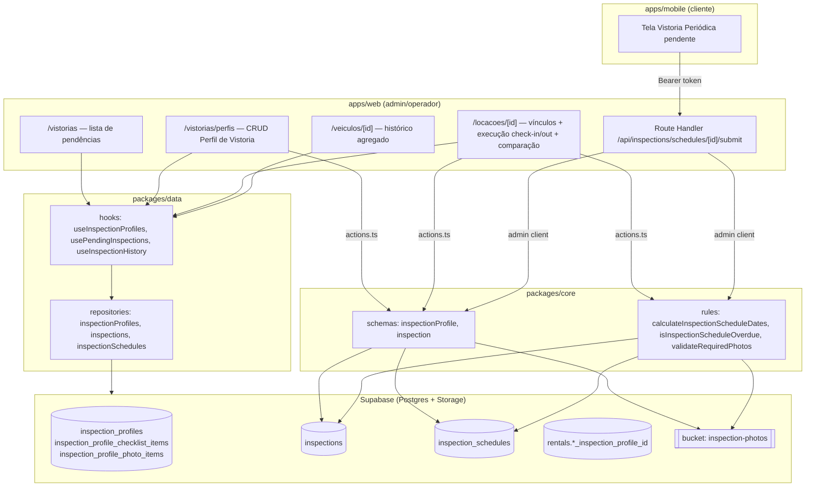

# Spec 0009 — Módulo de Vistoria: perfis, check-in/check-out e vistoria periódica

> 🟢 **Status: implementado** em 2026-07-30. Cobertura da matriz de rastreabilidade: 100%. ADRs [[decisions/0015-perfil-vistoria-entidade-compartilhada|0015]] e [[decisions/0016-escrita-cliente-mobile-route-handler|0016]] redigidas e aceitas. Migrations, `packages/core`, `packages/data`, telas web (`/vistorias`, `/vistorias/perfis`), Route Handler mobile e tela `apps/mobile` implementados. Pendente: suíte E2E Playwright (§9.2) e testes de Integration (§9.3) descritos nesta Spec ainda não escritos.

---

## 1. Visão Geral Técnica

O módulo de Vistoria reproduz o padrão estrutural já validado pelo módulo de manutenção ([[decisions/0006-manutencao-preventiva-plano-responsabilidade-registro|ADR 0006]]): perfis reutilizáveis por tenant (`packages/core/rules` + schemas Zod + tabelas com RLS), mas com duas famílias de item em vez de uma — item de checklist (OK/Não OK + observação) e item de imagem (rótulo + obrigatoriedade). Os dois vínculos possíveis por locação (Check-in/Check-out e Periódica) são modelados como colunas em `rentals`, não como tabela de junção, porque RN-004 fixa a cardinalidade em no máximo 1 vínculo de cada tipo por locação.

A execução da vistoria (`inspections`) grava um snapshot dos itens do perfil no momento em que é realizada — respostas, observações e paths de fotos — reaproveitando a infraestrutura de storage por tenant já usada por `rental-documents`, `fine-documents` e `expense-files` (bucket privado, path `<tenant_id>/<inspection_id>/<item_slug>.<ext>`, leitura via signed URL). O agendamento de vistorias periódicas vive em `inspection_schedules`, uma linha por ciclo (data-alvo), gerada automaticamente conforme a frequência configurada em `rentals`.

O ponto tecnicamente novo é a **primeira escrita do cliente no sistema**: RF-016/RN-011 exigem que o cliente submeta checklist + fotos pelo app mobile, mas a [[decisions/0003-escopo-e-auth-do-mobile-cliente|ADR 0003]] fixou o cliente como somente-leitura e sinalizou explicitamente ("Quando reavaliar") que, se isso mudasse, o caminho seria "portar o padrão `actions.ts` pra mobile, provavelmente via HTTP em API route Next, não Server Action direto". Esse caminho já foi pavimentado uma vez, sem ADR formal: `apps/web/src/app/api/billings/[id]/pix/route.ts` resolve autenticação por Bearer token + Supabase admin client (service role) + Zod de `@gomoto/core` para uma chamada do mobile. Este módulo estende esse mesmo padrão para o envio de vistoria periódica, formalizando-o como decisão arquitetural (§11.2).

A remoção do código morto (`checklists`) é uma migration `DROP TABLE` isolada — sem referência em `apps/web/src` ou `packages/` (confirmado via grep), não há código de aplicação a tocar.

---

## 2. Arquitetura

### 2.1 Contexto



### 2.2 Componentes

**Novos:**
- `supabase/migrations/<ts>_create_inspection_profiles.sql` — `inspection_profiles`, `inspection_profile_checklist_items`, `inspection_profile_photo_items`.
- `supabase/migrations/<ts>_create_inspections.sql` — `inspections`, `inspection_schedules`, colunas de vínculo em `rentals`, bucket `inspection-photos`.
- `supabase/migrations/<ts>_drop_checklists.sql` — remove tabela legada (isolada, ver §10).
- `supabase/migrations/<ts>_rename_maintenance_inspection_items.sql` — resolve colisão de nome com o catálogo de manutenção (§11.2).
- `packages/core/src/schemas/inspectionProfile.ts` — `CreateInspectionProfileSchema`, `UpdateInspectionProfileSchema`.
- `packages/core/src/schemas/inspection.ts` — `SubmitInspectionSchema`, `ReviewInspectionSchema`.
- `packages/core/src/rules/inspection.ts` — `calculateInspectionScheduleDates()`, `isInspectionScheduleOverdue()`, `validateRequiredPhotos()`.
- `packages/core/src/types/inspection.ts`.
- `packages/data/src/repositories/{inspectionProfiles,inspections,inspectionSchedules}.ts`.
- `packages/data/src/hooks/{useInspectionProfiles,usePendingInspections,useInspectionHistory,useRentalInspectionComparison}.ts`.
- `apps/web/src/app/(authenticated)/vistorias/page.tsx` + `actions.ts` — lista central de pendências (RF-017/018) e análise (RF-019/020).
- `apps/web/src/app/(authenticated)/vistorias/perfis/page.tsx` + `actions.ts` — CRUD de Perfil de Vistoria (RF-001-005).
- `apps/web/src/app/api/inspections/schedules/[scheduleId]/submit/route.ts` — Route Handler consumido pelo mobile (RF-016), padrão `pix/route.ts`.
- `apps/mobile/src/screens/Inspections/` — tela de vistoria periódica do cliente (RF-016, RF-021).

**Modificados:**
- `apps/web/src/app/(authenticated)/locacoes/[id]/page.tsx` + `actions.ts` — vínculos de perfil, execução de check-in/check-out inline (RF-018), comparação lado a lado (RF-022).
- `apps/web/src/app/(authenticated)/veiculos/[id]/page.tsx` — histórico agregado de vistorias (RF-023).
- `packages/core/src/data/suggested-plan-items.ts` (+ teste) e `supabase/seed.sql` — rename de itens colidentes (§11.2).
- RPC de criação de locação (`create_rental_with_charges` ou equivalente) — aceita os dois vínculos de perfil; gera check-in pendente e `inspection_schedules` upfront na mesma transação.

### 2.3 Responsabilidades

| Camada | Responsabilidade |
|---|---|
| `packages/core` (schemas Zod) | Única fonte de validação — compartilhada entre `actions.ts` (web) e o Route Handler (mobile), garantindo paridade de regras entre os dois pontos de escrita. |
| `packages/core` (rules) | Cálculo determinístico e puro do agendamento periódico e das checagens de completude (fotos obrigatórias, status atrasado) — testável sem I/O. |
| Server Actions (`apps/web/**/actions.ts`) | Orquestram mutações do administrativo: resolvem `getCurrentTenantId()`, validam, persistem, chamam `logAction()`, `revalidatePath()`. |
| Route Handler (`apps/web/src/app/api/inspections/...`) | Único ponto de escrita do cliente mobile: valida Bearer token via `supabase.auth.getUser()`, resolve `customer.tenant_id` e usa admin client (service role) — mesmo padrão de `billings/[id]/pix/route.ts` — aplica o mesmo schema Zod das Server Actions antes de persistir. |
| RPC PostgreSQL (`create_rental_with_charges` estendido) | Orquestra, na mesma transação da criação da locação: insere `rentals`, cria vistoria de check-in pendente (se vínculo existir) e vistoria de check-out pendente (mesmo momento — ver §3.1), gera `inspection_schedules` upfront até `rentals.end_date` (se vínculo periódico existir) — mesmo padrão de geração upfront de cobranças da [[decisions/0009-geracao-cobracas-upfront-vs-cron|ADR 0009]]. |
| `packages/data` (hooks) | Leitura; normaliza status "atrasada" no momento da leitura (`target_date < hoje` e nenhuma `inspections` submetida para o `schedule_id`) — mesmo padrão de normalização de `overdue` em billings ([[decisions/0014-estrategia-inadimplencia-trigger|ADR 0014]] §Limites), sem trigger nem cron. |

---

## 3. Fluxos Técnicos

### 3.1 Fluxo principal

```mermaid
sequenceDiagram
    actor Admin
    participant Web as apps/web
    participant RPC as RPC create_rental_with_charges (estendido)
    participant DB as Postgres

    Admin->>Web: cria locação (perfil check-in/out + perfil periódico + frequência)
    Web->>RPC: createRental(..., checkin_checkout_profile_id, periodic_profile_id, periodic_frequency_days)
    RPC->>DB: INSERT rentals
    RPC->>DB: INSERT inspections (kind='checkin', status='pending') e (kind='checkout', status='pending') — se vínculo (a) existir
    RPC->>DB: INSERT inspection_schedules (N linhas até rentals.end_date) — se vínculo (b) existir
    DB-->>Web: rental criada
    Web-->>Admin: locação criada; check-in pendente na lista

    Note over Admin,DB: Execução check-in/check-out (RF-018 — mesma action, 2 entradas)
    Admin->>Web: abre via /vistorias (pendências) OU /locacoes/[id] — mesmo componente
    Admin->>Web: preenche checklist (OK/Não OK + observação) + fotos, salva
    Web->>Web: actions.ts submitAdminInspection() valida com Zod (@gomoto/core)
    Web->>DB: UPDATE inspections SET status='completed', answers, photos, executed_by_user_id, executed_at
    Web-->>Admin: vistoria registrada

    Note over Admin,DB: Vistoria periódica — único ponto de escrita do cliente
    actor Cliente
    participant Mobile as apps/mobile
    participant API as Route Handler /api/inspections/schedules/[id]/submit
    Cliente->>Mobile: abre vistoria periódica pendente, preenche checklist + fotos
    Mobile->>API: POST Bearer token + payload
    API->>API: valida token (auth.getUser) + resolve customer.tenant_id
    API->>API: valida payload — mesmo schema Zod de submitAdminInspection
    API->>DB: admin client (service role) — INSERT inspections (kind='periodic', schedule_id, status='submitted')
    API-->>Mobile: 200 ok
    Mobile-->>Cliente: confirmação de envio

    Note over Admin,DB: Análise da vistoria periódica
    Admin->>Web: abre pendências de análise, aprova OU rejeita (motivo obrigatório se rejeitar)
    Web->>DB: UPDATE inspections SET status='approved'|'rejected', review_notes, reviewed_by, reviewed_at
    Web-->>Admin: análise registrada

    Note over Admin,DB: Comparação e histórico
    Admin->>Web: abre comparação da locação encerrada
    Web->>DB: SELECT inspections WHERE rental_id AND kind IN ('checkin','checkout')
    Web-->>Admin: exibe lado a lado (RF-022)

    Admin->>Web: abre tela do veículo
    Web->>DB: SELECT inspections JOIN rentals WHERE rentals.vehicle_id = :id (todas as locações)
    Web-->>Admin: histórico agregado (RF-023)
```

> **Nota sobre o check-out:** diferente de uma leitura literal do PRD (que descreve o check-out como algo que "fica disponível" no encerramento), a linha `inspections` de check-out já é criada como `pending` na mesma transação de criação da locação, simetricamente ao check-in. "Disponibilizar" (RF-010) é a UI passar a listá-lo como executável quando `rentals.status` indica encerrada — não uma escrita adicional no momento do encerramento. O comportamento observável (CA-010) é idêntico; o mecanismo interno é mais simples.

### 3.2 Fluxos alternativos

- **Tela responsiva no pátio:** mesma rota e mesmo componente de execução (`/vistorias/execute/[inspectionId]`); layout responsivo via breakpoints Tailwind — sem app nativo separado, sem PWA dedicado.
- **Locação sem nenhum vínculo:** RPC não insere `inspections` nem `inspection_schedules` — ausência de vínculo é um `IF ... IS NOT NULL` no RPC, não um estado a modelar.
- **Locação só com Perfil Periódico:** RPC gera apenas `inspection_schedules`; nenhuma linha `inspections` de check-in/check-out é criada.
- **Tenant sem Perfil de Vistoria cadastrado:** `useInspectionProfiles()` retorna lista vazia; seletor da tela de locação simplesmente não tem opções — sem atalho de criação inline.
- **Vistoria periódica rejeitada → reenvio:** cliente reenvia; a API faz `INSERT` de uma nova linha `inspections` com o mesmo `schedule_id` (nunca `UPDATE` sobre o registro rejeitado) — histórico preservado (RN-010).

### 3.3 Fluxos de falha

- **Cliente sem conexão:** tratado inteiramente client-side no app mobile (formulário permanece preenchido na tela); sem fila/retry no backend — sem requisito de entrega garantida no V1.
- **Falha de upload de foto obrigatória:** `validateRequiredPhotos()` (`packages/core/rules/inspection.ts`) roda no client (UX imediata) e é reafirmada no backend antes de persistir (`SubmitInspectionSchema` + checagem contra os itens `is_required=true` do perfil); ausência retorna `VALIDATION_ERROR` com o rótulo do item faltante.
- **Concorrência (dois administrativos na mesma vistoria):** `UPDATE` simples sem lock otimista — última gravação vence, conforme aceito no PRD (§6.3).
- **Vistoria periódica vencida (RN-009):** sem trigger/cron — `packages/data` normaliza `status: 'overdue'` na leitura quando `target_date < hoje` e nenhuma `inspections` foi submetida para aquele `schedule_id`.
- **Perfil periódico sem frequência (RN-005):** `refine()` condicional no schema Zod da locação — `periodic_inspection_frequency_days` obrigatório quando `periodic_inspection_profile_id` não é nulo; erro `VALIDATION_ERROR` no campo, reforçado por `CHECK` de banco.
- **Duas aprovações para o mesmo agendamento (RN-013):** índice único parcial `inspections(schedule_id) WHERE status = 'approved'` — a segunda tentativa falha na constraint, retornando `CONFLICT`.

### 3.4 Eventos

Sem eventos — operação síncrona. Não há webhook, worker ou fila envolvidos; agendamento periódico é upfront (RPC síncrono) e status "atrasada" é normalizado na leitura, ambos sem infraestrutura assíncrona (§2.3).

---

## 4. Modelo de Dados

### 4.1 Entidades

| Tabela | Ação | Função |
|---|---|---|
| `inspection_profiles` | **Nova** | Perfil de Vistoria nomeado por tenant (checklist + fotos), reaproveitado nos dois vínculos da locação. |
| `inspection_profile_checklist_items` | **Nova** | Itens de checklist de um perfil (nome). |
| `inspection_profile_photo_items` | **Nova** | Itens de foto de um perfil (rótulo + obrigatoriedade). |
| `inspections` | **Nova** | Registro de execução — check-in, check-out ou periódica. Guarda snapshot de respostas e fotos. |
| `inspection_schedules` | **Nova** | Um ciclo de vistoria periódica esperado (data-alvo), gerado upfront. Sem coluna de status — "pendente"/"atrasada" é derivado na leitura conforme existência/status de `inspections` vinculada. |
| `rentals` | **Modificada** | Ganha os dois vínculos de perfil + frequência. |
| `checklists` | **Removida** | Código morto — sem referência em `apps/web/src` ou `packages/` (confirmado via grep). |

### 4.2 Campos (SQL concreto)

```sql
-- ============================================================
-- Migration 1: create_inspection_profiles.sql
-- ============================================================

CREATE TABLE inspection_profiles (
    id           UUID PRIMARY KEY DEFAULT gen_random_uuid(),
    tenant_id    UUID NOT NULL REFERENCES tenants(id) ON DELETE CASCADE,
    name         VARCHAR(200) NOT NULL,
    description  TEXT,
    archived_at  TIMESTAMPTZ,
    created_at   TIMESTAMPTZ NOT NULL DEFAULT now(),
    updated_at   TIMESTAMPTZ NOT NULL DEFAULT now()
);

CREATE INDEX idx_inspection_profiles_tenant ON inspection_profiles(tenant_id);

CREATE TRIGGER update_inspection_profiles_updated_at
    BEFORE UPDATE ON inspection_profiles
    FOR EACH ROW EXECUTE FUNCTION update_updated_at_column();

ALTER TABLE inspection_profiles ENABLE ROW LEVEL SECURITY;

CREATE POLICY "tenant_isolation_inspection_profiles" ON inspection_profiles
    FOR ALL TO authenticated
    USING (tenant_id IN (SELECT get_user_tenants()))
    WITH CHECK (tenant_id IN (SELECT get_user_tenants()));

CREATE POLICY "platform_admin_bypass_inspection_profiles" ON inspection_profiles
    FOR ALL TO authenticated
    USING (is_platform_admin())
    WITH CHECK (is_platform_admin());

-- ------------------------------------------------------------

CREATE TABLE inspection_profile_checklist_items (
    id          UUID PRIMARY KEY DEFAULT gen_random_uuid(),
    tenant_id   UUID NOT NULL REFERENCES tenants(id) ON DELETE CASCADE,
    profile_id  UUID NOT NULL REFERENCES inspection_profiles(id) ON DELETE CASCADE,
    name        VARCHAR(200) NOT NULL,
    sort_order  INTEGER NOT NULL DEFAULT 0,
    created_at  TIMESTAMPTZ NOT NULL DEFAULT now(),
    updated_at  TIMESTAMPTZ NOT NULL DEFAULT now()
);

CREATE INDEX idx_inspection_profile_checklist_items_tenant  ON inspection_profile_checklist_items(tenant_id);
CREATE INDEX idx_inspection_profile_checklist_items_profile ON inspection_profile_checklist_items(profile_id);

CREATE TRIGGER update_inspection_profile_checklist_items_updated_at
    BEFORE UPDATE ON inspection_profile_checklist_items
    FOR EACH ROW EXECUTE FUNCTION update_updated_at_column();

ALTER TABLE inspection_profile_checklist_items ENABLE ROW LEVEL SECURITY;

CREATE POLICY "tenant_isolation_inspection_profile_checklist_items" ON inspection_profile_checklist_items
    FOR ALL TO authenticated
    USING (tenant_id IN (SELECT get_user_tenants()))
    WITH CHECK (tenant_id IN (SELECT get_user_tenants()));

CREATE POLICY "platform_admin_bypass_inspection_profile_checklist_items" ON inspection_profile_checklist_items
    FOR ALL TO authenticated
    USING (is_platform_admin())
    WITH CHECK (is_platform_admin());

-- ------------------------------------------------------------

CREATE TABLE inspection_profile_photo_items (
    id           UUID PRIMARY KEY DEFAULT gen_random_uuid(),
    tenant_id    UUID NOT NULL REFERENCES tenants(id) ON DELETE CASCADE,
    profile_id   UUID NOT NULL REFERENCES inspection_profiles(id) ON DELETE CASCADE,
    label        VARCHAR(100) NOT NULL,
    is_required  BOOLEAN NOT NULL DEFAULT true,
    sort_order   INTEGER NOT NULL DEFAULT 0,
    created_at   TIMESTAMPTZ NOT NULL DEFAULT now(),
    updated_at   TIMESTAMPTZ NOT NULL DEFAULT now()
);

CREATE INDEX idx_inspection_profile_photo_items_tenant  ON inspection_profile_photo_items(tenant_id);
CREATE INDEX idx_inspection_profile_photo_items_profile ON inspection_profile_photo_items(profile_id);

CREATE TRIGGER update_inspection_profile_photo_items_updated_at
    BEFORE UPDATE ON inspection_profile_photo_items
    FOR EACH ROW EXECUTE FUNCTION update_updated_at_column();

ALTER TABLE inspection_profile_photo_items ENABLE ROW LEVEL SECURITY;

CREATE POLICY "tenant_isolation_inspection_profile_photo_items" ON inspection_profile_photo_items
    FOR ALL TO authenticated
    USING (tenant_id IN (SELECT get_user_tenants()))
    WITH CHECK (tenant_id IN (SELECT get_user_tenants()));

CREATE POLICY "platform_admin_bypass_inspection_profile_photo_items" ON inspection_profile_photo_items
    FOR ALL TO authenticated
    USING (is_platform_admin())
    WITH CHECK (is_platform_admin());

-- ============================================================
-- Migration 2: create_inspections.sql
-- ============================================================

CREATE TYPE inspection_kind   AS ENUM ('checkin', 'checkout', 'periodic');
CREATE TYPE inspection_status AS ENUM ('pending', 'completed', 'submitted', 'approved', 'rejected');

CREATE TABLE inspection_schedules (
    id           UUID PRIMARY KEY DEFAULT gen_random_uuid(),
    tenant_id    UUID NOT NULL REFERENCES tenants(id) ON DELETE CASCADE,
    rental_id    UUID NOT NULL REFERENCES rentals(id) ON DELETE RESTRICT,
    target_date  DATE NOT NULL,
    created_at   TIMESTAMPTZ NOT NULL DEFAULT now(),
    updated_at   TIMESTAMPTZ NOT NULL DEFAULT now()
);

CREATE INDEX idx_inspection_schedules_tenant     ON inspection_schedules(tenant_id);
CREATE INDEX idx_inspection_schedules_rental      ON inspection_schedules(tenant_id, rental_id);
CREATE INDEX idx_inspection_schedules_target_date ON inspection_schedules(tenant_id, target_date);

CREATE TRIGGER update_inspection_schedules_updated_at
    BEFORE UPDATE ON inspection_schedules
    FOR EACH ROW EXECUTE FUNCTION update_updated_at_column();

ALTER TABLE inspection_schedules ENABLE ROW LEVEL SECURITY;

CREATE POLICY "tenant_isolation_inspection_schedules" ON inspection_schedules
    FOR ALL TO authenticated
    USING (tenant_id IN (SELECT get_user_tenants()))
    WITH CHECK (tenant_id IN (SELECT get_user_tenants()));

CREATE POLICY "platform_admin_bypass_inspection_schedules" ON inspection_schedules
    FOR ALL TO authenticated
    USING (is_platform_admin())
    WITH CHECK (is_platform_admin());

-- Cliente lê apenas os agendamentos das próprias locações (padrão ADR 0003 §5 / current_customer_ids())
CREATE POLICY "customer_self_select_inspection_schedules" ON inspection_schedules
    FOR SELECT TO authenticated
    USING (
        rental_id IN (
            SELECT id FROM rentals WHERE customer_id IN (SELECT current_customer_ids())
        )
    );

-- ------------------------------------------------------------

CREATE TABLE inspections (
    id                    UUID PRIMARY KEY DEFAULT gen_random_uuid(),
    tenant_id             UUID NOT NULL REFERENCES tenants(id) ON DELETE CASCADE,
    rental_id             UUID NOT NULL REFERENCES rentals(id) ON DELETE RESTRICT,
    inspection_profile_id UUID NOT NULL REFERENCES inspection_profiles(id) ON DELETE RESTRICT,
    schedule_id           UUID REFERENCES inspection_schedules(id) ON DELETE RESTRICT,

    kind    inspection_kind   NOT NULL,
    status  inspection_status NOT NULL,

    -- Snapshot dos itens do perfil no momento da execução — editar/arquivar
    -- o perfil depois NÃO altera vistorias já registradas.
    -- answers: [{ item_id, name, status: 'ok'|'not_ok', note }]
    -- photos:  [{ item_id, label, is_required, storage_path }]
    answers  JSONB NOT NULL DEFAULT '[]',
    photos   JSONB NOT NULL DEFAULT '[]',

    executed_by_user_id  UUID REFERENCES auth.users(id) ON DELETE RESTRICT,
    executed_at           TIMESTAMPTZ,

    review_notes  TEXT,
    reviewed_by   UUID REFERENCES auth.users(id) ON DELETE RESTRICT,
    reviewed_at   TIMESTAMPTZ,

    created_at  TIMESTAMPTZ NOT NULL DEFAULT now(),
    updated_at  TIMESTAMPTZ NOT NULL DEFAULT now(),

    CONSTRAINT chk_inspections_status_per_kind CHECK (
        (kind IN ('checkin', 'checkout') AND status IN ('pending', 'completed'))
        OR
        (kind = 'periodic' AND status IN ('submitted', 'approved', 'rejected'))
    ),
    CONSTRAINT chk_inspections_periodic_needs_schedule CHECK (
        (kind = 'periodic') = (schedule_id IS NOT NULL)
    ),
    CONSTRAINT chk_inspections_rejection_needs_reason CHECK (
        status <> 'rejected' OR review_notes IS NOT NULL
    )
);

CREATE INDEX idx_inspections_tenant            ON inspections(tenant_id);
CREATE INDEX idx_inspections_rental             ON inspections(tenant_id, rental_id);
CREATE INDEX idx_inspections_tenant_kind_status ON inspections(tenant_id, kind, status);
CREATE INDEX idx_inspections_schedule           ON inspections(schedule_id) WHERE schedule_id IS NOT NULL;

-- RN-013: no máximo 1 aprovação válida por agendamento
CREATE UNIQUE INDEX uq_inspections_schedule_approved
    ON inspections(schedule_id) WHERE status = 'approved';

CREATE TRIGGER update_inspections_updated_at
    BEFORE UPDATE ON inspections
    FOR EACH ROW EXECUTE FUNCTION update_updated_at_column();

ALTER TABLE inspections ENABLE ROW LEVEL SECURITY;

CREATE POLICY "tenant_isolation_inspections" ON inspections
    FOR ALL TO authenticated
    USING (tenant_id IN (SELECT get_user_tenants()))
    WITH CHECK (tenant_id IN (SELECT get_user_tenants()));

CREATE POLICY "platform_admin_bypass_inspections" ON inspections
    FOR ALL TO authenticated
    USING (is_platform_admin())
    WITH CHECK (is_platform_admin());

-- Cliente lê apenas as próprias vistorias (nunca escreve via RLS — grava via
-- Route Handler com admin client / service role, que ignora RLS por design)
CREATE POLICY "customer_self_select_inspections" ON inspections
    FOR SELECT TO authenticated
    USING (
        rental_id IN (
            SELECT id FROM rentals WHERE customer_id IN (SELECT current_customer_ids())
        )
    );

-- Cliente lê os itens do perfil vinculado à própria vistoria periódica
-- (necessário para renderizar o formulário de execução no app)
CREATE POLICY "customer_self_select_inspection_profiles" ON inspection_profiles
    FOR SELECT TO authenticated
    USING (
        id IN (
            SELECT periodic_inspection_profile_id FROM rentals
            WHERE customer_id IN (SELECT current_customer_ids())
        )
    );

CREATE POLICY "customer_self_select_inspection_profile_checklist_items" ON inspection_profile_checklist_items
    FOR SELECT TO authenticated
    USING (
        profile_id IN (
            SELECT periodic_inspection_profile_id FROM rentals
            WHERE customer_id IN (SELECT current_customer_ids())
        )
    );

CREATE POLICY "customer_self_select_inspection_profile_photo_items" ON inspection_profile_photo_items
    FOR SELECT TO authenticated
    USING (
        profile_id IN (
            SELECT periodic_inspection_profile_id FROM rentals
            WHERE customer_id IN (SELECT current_customer_ids())
        )
    );

-- ============================================================
-- rentals: vínculos de Perfil de Vistoria (RF-006, RF-007, RN-004, RN-005)
-- ============================================================

ALTER TABLE rentals
    ADD COLUMN checkin_checkout_inspection_profile_id UUID REFERENCES inspection_profiles(id) ON DELETE RESTRICT,
    ADD COLUMN periodic_inspection_profile_id         UUID REFERENCES inspection_profiles(id) ON DELETE RESTRICT,
    ADD COLUMN periodic_inspection_frequency_days     INTEGER CHECK (periodic_inspection_frequency_days IS NULL OR periodic_inspection_frequency_days > 0);

ALTER TABLE rentals
    ADD CONSTRAINT chk_rentals_periodic_inspection_requires_frequency CHECK (
        (periodic_inspection_profile_id IS NULL) = (periodic_inspection_frequency_days IS NULL)
    );

CREATE INDEX idx_rentals_checkin_checkout_inspection_profile ON rentals(checkin_checkout_inspection_profile_id) WHERE checkin_checkout_inspection_profile_id IS NOT NULL;
CREATE INDEX idx_rentals_periodic_inspection_profile         ON rentals(periodic_inspection_profile_id) WHERE periodic_inspection_profile_id IS NOT NULL;

-- rentals já tem RLS "tenant_isolation_rentals" cobrindo todas as colunas —
-- nada de RLS novo necessário (não é tabela nova).

-- ============================================================
-- Bucket: inspection-photos — privado, leitura via signed URL
-- Path: <tenant_id>/<inspection_id>/<item_slug>.<ext>
-- Mesmo padrão de fine-documents / rental-documents.
-- ============================================================

INSERT INTO storage.buckets (id, name, public, file_size_limit, allowed_mime_types)
VALUES ('inspection-photos', 'inspection-photos', false, 10485760, ARRAY['image/jpeg', 'image/png', 'image/webp'])
ON CONFLICT (id) DO NOTHING;

CREATE POLICY "inspection-photos: leitura autenticada"
    ON storage.objects FOR SELECT
    USING (bucket_id = 'inspection-photos' AND auth.role() = 'authenticated');

CREATE POLICY "inspection-photos: upload autenticado"
    ON storage.objects FOR INSERT
    WITH CHECK (bucket_id = 'inspection-photos' AND auth.role() = 'authenticated');

CREATE POLICY "inspection-photos: update autenticado"
    ON storage.objects FOR UPDATE
    USING (bucket_id = 'inspection-photos' AND auth.role() = 'authenticated');

CREATE POLICY "inspection-photos: delete autenticado"
    ON storage.objects FOR DELETE
    USING (bucket_id = 'inspection-photos' AND auth.role() = 'authenticated');

-- ============================================================
-- Migration 3: drop_checklists.sql — remoção de código morto
-- Isolada das demais (§10) — sem referência em apps/web/src ou packages/.
-- ============================================================

DROP TABLE IF EXISTS checklists;

-- ============================================================
-- Migration 4: rename_maintenance_inspection_items.sql
-- Resolve colisão de nome com o novo módulo de Vistoria (§11.2).
-- ============================================================

UPDATE maintenance_plan_items
SET name = CASE name
    WHEN 'Vistoria de entrega'  THEN 'Revisão de entrega'
    WHEN 'Vistoria periódica'   THEN 'Revisão periódica'
    WHEN 'Vistoria mensal'      THEN 'Revisão mensal'
    ELSE name
END
WHERE name IN ('Vistoria de entrega', 'Vistoria periódica', 'Vistoria mensal');
```

### 4.3 Relacionamentos e índices

```
tenants ─┬─< inspection_profiles ─┬─< inspection_profile_checklist_items
         │                        └─< inspection_profile_photo_items
         │
         ├─< inspection_schedules >── rentals
         │
         └─< inspections >── rentals
                          >── inspection_profiles (qual perfil foi usado)
                          >── inspection_schedules (nullable — só kind='periodic')

rentals.checkin_checkout_inspection_profile_id ──> inspection_profiles (nullable, RESTRICT)
rentals.periodic_inspection_profile_id         ──> inspection_profiles (nullable, RESTRICT)
```

- `ON DELETE RESTRICT` em todas as FKs que apontam para `rentals`/`inspection_profiles`/`auth.users` a partir de `inspections`/`inspection_schedules` — preserva evidência auditável indefinidamente (RNF-005), simetricamente ao tratamento de `billings` (ADR 0009: "cobranças futuras são registros reais... não lixo"). O produto nunca expõe hard-delete de locação (só mudança de `status`), então `RESTRICT` prioriza a garantia de permanência sobre uma conveniência que não existe na UI.
- `ON DELETE CASCADE` apenas para `tenant_id` (padrão) e para os itens do perfil (`profile_id` → perfil pai) — item não existe sem o perfil.
- Índice parcial `uq_inspections_schedule_approved` é a única garantia dura de RN-013 — não depende de lógica de aplicação.
- `idx_inspections_tenant_kind_status` cobre a query da lista de pendências (RF-017): `WHERE tenant_id = :t AND status IN ('pending','submitted')`.
- `idx_inspection_schedules_target_date` cobre a normalização de "atrasada" na leitura (RN-009).
- Bucket `inspection-photos` único para os três `kind`; path já discrimina por `inspection_id` — separar por bucket não traria isolamento adicional (mesmo padrão de `fine-documents`/`expense-files`: a policy de storage é por `bucket_id` + `authenticated`, não por tenant — o path é o que impede acesso cruzado).

---

## 5. APIs

### 5.1 Endpoints

**Perfis de Vistoria** — `apps/web/src/app/(authenticated)/vistorias/perfis/actions.ts`

| Server Action | Propósito | RF |
|---|---|---|
| `createInspectionProfile(input)` | Cria perfil com itens de checklist + itens de imagem | RF-001, RF-002, RF-003 |
| `updateInspectionProfile(id, input)` | Edita nome/descrição/itens | RF-004 |
| `archiveInspectionProfile(id)` | Arquiva (soft, `archived_at`) | RF-005 |

**Vínculos na locação** — extensão das Server Actions existentes de locação (`createRental`/`updateRental` passam a aceitar `checkin_checkout_inspection_profile_id`, `periodic_inspection_profile_id`, `periodic_inspection_frequency_days` no payload) — RF-006, RF-007.

**Execução e análise** — `apps/web/src/app/(authenticated)/vistorias/actions.ts` (consumida tanto pela lista de pendências quanto pela tela da locação — RF-018/CA-018, mesma action nos dois pontos de entrada)

| Server Action | Propósito | RF |
|---|---|---|
| `submitAdminInspection(inspectionId, input)` | Executa check-in ou check-out: respostas + fotos | RF-012, RF-013, RF-014, RF-015 |
| `approveInspection(inspectionId)` | Aprova vistoria periódica submetida | RF-019 |
| `rejectInspection(inspectionId, input)` | Rejeita com motivo obrigatório | RF-020 |

**Escrita do cliente mobile** — Route Handler, único ponto de escrita fora de Server Action (padrão `pix/route.ts`, §2.3)

| Endpoint | Propósito | RF |
|---|---|---|
| `POST /api/inspections/schedules/[scheduleId]/submit` | Cliente envia checklist + fotos de uma vistoria periódica pendente/rejeitada | RF-016, RF-021 |

### 5.2 Schemas (Zod via `@gomoto/core`)

```ts
// packages/core/src/schemas/inspectionProfile.ts
import { z } from 'zod';

export const InspectionProfileChecklistItemSchema = z.object({
  name: z.string().min(3).max(200),
  sort_order: z.number().int().nonnegative().default(0),
});

export const InspectionProfilePhotoItemSchema = z.object({
  label: z.string().min(2).max(100),
  is_required: z.boolean().default(true),
  sort_order: z.number().int().nonnegative().default(0),
});

export const CreateInspectionProfileSchema = z.object({
  name: z.string().min(3).max(200),
  description: z.string().max(2000).optional(),
  checklist_items: z.array(InspectionProfileChecklistItemSchema).min(1),
  photo_items: z.array(InspectionProfilePhotoItemSchema).min(1),
});
export type CreateInspectionProfile = z.infer<typeof CreateInspectionProfileSchema>;

export const UpdateInspectionProfileSchema = CreateInspectionProfileSchema.partial();
```

```ts
// packages/core/src/schemas/inspection.ts
import { z } from 'zod';

const InspectionAnswerSchema = z.object({
  item_id: z.string().uuid(),
  status: z.enum(['ok', 'not_ok']),
  note: z.string().max(1000).optional(),
});

const InspectionPhotoSchema = z.object({
  item_id: z.string().uuid(),
  storage_path: z.string().min(1),
});

// Usado por submitAdminInspection() E pelo Route Handler mobile — mesma
// validação nos dois pontos de escrita (§2.3).
export const SubmitInspectionSchema = z.object({
  answers: z.array(InspectionAnswerSchema).min(1),
  photos: z.array(InspectionPhotoSchema),
});
export type SubmitInspection = z.infer<typeof SubmitInspectionSchema>;
// Validação de fotos obrigatórias (RF-014/RN-007) depende do perfil vinculado
// (fora do payload) — feita por validateRequiredPhotos() em
// packages/core/rules/inspection.ts, chamada após o parse deste schema.

export const ReviewInspectionSchema = z.object({
  decision: z.enum(['approved', 'rejected']),
  review_notes: z.string().max(1000).optional(),
}).refine(
  (data) => data.decision !== 'rejected' || !!data.review_notes,
  { message: 'Motivo é obrigatório ao rejeitar', path: ['review_notes'] },
);
export type ReviewInspection = z.infer<typeof ReviewInspectionSchema>;
```

```ts
// packages/core/src/schemas/rental.ts (extensão do schema existente de locação)
export const RentalInspectionLinksSchema = z.object({
  checkin_checkout_inspection_profile_id: z.string().uuid().nullable().optional(),
  periodic_inspection_profile_id: z.string().uuid().nullable().optional(),
  periodic_inspection_frequency_days: z.number().int().positive().nullable().optional(),
}).refine(
  (data) => !!data.periodic_inspection_profile_id === !!data.periodic_inspection_frequency_days,
  { message: 'Frequência é obrigatória quando o perfil periódico é associado', path: ['periodic_inspection_frequency_days'] },
); // RN-005 — espelha o CHECK de banco (defesa em profundidade, não substitui)
```

Schemas vivem em `@gomoto/core`. **Nunca duplicar** em `apps/web` ou `apps/mobile`.

### 5.3 Erros

| Código | Quando ocorre | Resposta |
|---|---|---|
| `VALIDATION_ERROR` | Payload inválido; foto obrigatória do perfil ausente (RN-007); frequência ausente com perfil periódico associado (RN-005); rejeição sem motivo (RF-020) | 422 + `field` |
| `UNAUTHORIZED` | Sem sessão (web) / sem Bearer token válido (mobile) | 401 |
| `FORBIDDEN` | RLS bloqueou; cliente tentando submeter check-in/check-out (RN-011); tentativa de agir em `schedule_id`/`inspection_id` de tenant/locação diferente | 403 |
| `NOT_FOUND` | `inspectionId`/`scheduleId`/`profileId` inexistente ou fora do tenant resolvido | 404 |
| `CONFLICT` | Segunda aprovação para o mesmo `schedule_id` (RN-013, viola `uq_inspections_schedule_approved`) | 409 |
| `INTERNAL` | Falha inesperada (ex.: upload de foto falhou no storage) | 500 |

---

## 6. Segurança

### 6.1 Autenticação

- **Web (Administrativo):** Supabase Auth via cookies — `getCurrentTenantId(supabase)` resolvido server-side em cada Server Action (padrão ADR 0002), nunca confiando em `tenant_id` vindo do client.
- **Mobile (Cliente):** Bearer token no header `Authorization`, validado no Route Handler via `supabase.auth.getUser(token)` — mesmo padrão de `apps/web/src/app/api/billings/[id]/pix/route.ts`. `tenant_id` do cliente é resolvido a partir da linha `customers.user_id = auth.uid()` (nunca recebido do payload).

### 6.2 Autorização

| Ação | Administrativo | Cliente |
|---|---|---|
| CRUD Perfil de Vistoria | ✅ | ❌ |
| Associar vínculos na locação (perfil + frequência) | ✅ | ❌ |
| Executar check-in/check-out | ✅ | ❌ — RN-011 |
| Executar vistoria periódica | ❌ — RN-011 | ✅ (só a própria) |
| Aprovar/rejeitar vistoria periódica | ✅ | ❌ |
| Ler perfil vinculado à própria locação | ✅ | ✅ — `customer_self_select_inspection_profiles*` |
| Ler histórico de vistorias | ✅ (todo o tenant) | ✅ (só as próprias) — `customer_self_select_inspections` |

RLS (§4.2) é a fonte de verdade: nenhuma policy de INSERT/UPDATE existe para `authenticated` fora de `tenant_members` nas tabelas de vistoria — a única escrita do cliente é o Route Handler com service role, que **reimplementa a checagem de posse** em profundidade (o service role ignora RLS por design):

1. Resolve `customer` por `user_id = auth.uid()`.
2. Resolve `schedule` por `id = :scheduleId AND tenant_id = customer.tenant_id` — senão `NOT_FOUND`.
3. Resolve `rental` do `schedule` e confere `rental.customer_id = customer.id` — senão `FORBIDDEN`.
4. Confere ausência de `inspections` `approved` para esse `schedule_id` antes de tentar o INSERT — resposta `CONFLICT` amigável em vez de deixar o índice único estourar como erro genérico de banco.

### 6.3 Auditoria

Não opcional nesta feature — RNF-005 e o objetivo central do PRD (§1.3 — "evidência auditável... embasar disputas... acionamento de seguro") tornam a trilha de auditoria parte do valor entregue.

- Toda mutação via Server Action chama `logAction()` (ADR 0002 passo 4): `createInspectionProfile`, `updateInspectionProfile`, `archiveInspectionProfile`, `submitAdminInspection`, `approveInspection`, `rejectInspection`.
- `logAction()` (`apps/web/src/lib/audit.ts`) depende de `createClient()` com sessão via cookie e de `getCurrentTenantId(supabase)` — indisponíveis numa requisição Bearer-token/service-role. O Route Handler mobile insere diretamente em `audit_logs` com o admin client, usando o `tenant_id`/`user_id` já resolvidos nos passos de autorização acima — mesma tabela, mesmo formato de registro, sem passar pelo helper.
- `RF-015` (responsável + data/hora) é satisfeito primariamente pelas colunas `executed_by_user_id`/`executed_at` em `inspections` — `audit_logs` é a trilha adicional de mutação (convenção geral do produto), não a única fonte de RF-015.

---

## 7. Observabilidade

### 7.1 Logs essenciais

Structured logs via `console.log`/`console.error` com JSON (mesmo padrão de `log()` em `pix/route.ts`) — sem infra de logging dedicada além do que a Vercel já coleta.

| Evento | Onde | Campos |
|---|---|---|
| `inspection_profile.created` / `.updated` / `.archived` | Server Action | `tenant_id`, `user_id`, `profile_id` |
| `inspection.checkin_created` | RPC de criação de locação | `tenant_id`, `rental_id`, `inspection_id` |
| `inspection.periodic_schedules_generated` | RPC de criação/edição de locação | `tenant_id`, `rental_id`, `schedule_count` |
| `inspection.admin_submitted` | `submitAdminInspection()` | `tenant_id`, `user_id`, `inspection_id`, `kind` |
| `inspection.periodic_submitted` | Route Handler mobile | `tenant_id`, `customer_id`, `schedule_id`, `inspection_id` |
| `inspection.periodic_forbidden` | Route Handler mobile — tentativa fora de posse | `user_id`, `schedule_id` (warn) |
| `inspection.reviewed` | `approveInspection()` / `rejectInspection()` | `tenant_id`, `user_id`, `inspection_id`, `decision` |

**Não logar:** conteúdo de `answers`/`photos` (observações de texto livre podem conter PII ou detalhes sensíveis de disputa), `review_notes` completo (logar só que houve rejeição, não o motivo em texto livre).

### 7.2 Métricas e alertas

N/A — feature não crítica o suficiente para alertas automatizados, e o projeto não tem infraestrutura de métricas/alerting hoje. Os KPIs definidos no PRD (§3.3) são consultáveis sob demanda via query SQL direta, não via um sistema de métricas em tempo real.

---

## 8. Performance e Escalabilidade

Sem requisitos materiais — comportamento padrão Vercel + Supabase. O PRD não define RNF de latência/throughput/escala não trivial (RNF-001/RNF-002 são de UX, não de performance numérica).

---

## 9. Test Strategy

### 9.1 Unit tests (Vitest em `packages/core`)

| Função | Arquivo | Cenários |
|---|---|---|
| `calculateInspectionScheduleDates()` | `packages/core/src/rules/inspection.spec.ts` | frequência mensal gera N datas até `end_date`; frequência semanal gera mais datas |
| `isInspectionScheduleOverdue()` | idem | `target_date` passado sem `inspections` vinculada → `true`; com `inspections` `submitted`/`approved` → `false`; `target_date` futuro → `false` |
| `validateRequiredPhotos()` | idem | todos os itens obrigatórios presentes → `ok`; item obrigatório ausente → retorna rótulo faltante; item opcional ausente → `ok` |
| `RentalInspectionLinksSchema` (refine) | `packages/core/src/schemas/rental.spec.ts` | perfil periódico sem frequência → erro no campo (RN-005); perfil + frequência juntos → válido; nenhum vínculo → válido |
| `ReviewInspectionSchema` (refine) | `packages/core/src/schemas/inspection.spec.ts` | `rejected` sem `review_notes` → erro; `rejected` com motivo → válido; `approved` sem motivo → válido |
| `CreateInspectionProfileSchema` | `packages/core/src/schemas/inspectionProfile.spec.ts` | sem `checklist_items` → erro; item de foto sem `label` → erro |

Rodar: `pnpm --filter @gomoto/core test`.

### 9.2 E2E tests (Playwright em `apps/web`)

| Teste | Arquivo | Cobre |
|---|---|---|
| Admin cria Perfil de Vistoria com itens de checklist e foto | `apps/web/tests/e2e/inspection-profiles.spec.ts` | RF-001, RF-002, RF-003, CA-001, CA-002, CA-003 |
| Admin edita perfil existente | idem | RF-004, CA-004 |
| Admin arquiva perfil — some do seletor, vistorias antigas continuam acessíveis | idem | RF-005, RN-008, CA-005 |
| Criar locação com vínculo periódico sem frequência é bloqueado | `apps/web/tests/e2e/rental-inspection-links.spec.ts` | RF-007, RN-005, CA-007 |
| Criar locação com vínculo check-in/check-out — check-in nasce pendente | idem | RF-006, RF-009, RN-001, RN-002, CA-006, CA-009, CA-024 |
| Mesmo perfil usado em ambos vínculos e múltiplas locações | idem | RF-008 |
| Vínculos independentes (só periódica, ou só check-in/out) | idem | RN-004, CA-028 |
| Vistorias periódicas agendadas upfront | idem | RF-011 |
| Executar check-in pela lista de pendências | `apps/web/tests/e2e/inspection-pending-list.spec.ts` | RF-012, RF-013, RF-015, RF-017, RF-018, CA-012, CA-013, CA-017, CA-018 |
| Progresso e confirmação de upload | idem | RNF-002 |
| Executar check-in pela tela da locação — mesmo resultado | `apps/web/tests/e2e/rental-inspection-execution.spec.ts` | RF-018, CA-018 |
| Salvar vistoria sem foto obrigatória é bloqueado | idem | RF-014, RN-007, CA-014 |
| Encerrar locação disponibiliza check-out; check-in nunca executado não bloqueia encerramento | idem | RF-010, RN-003, RN-006, CA-010, CA-025 |
| Comparação lado a lado check-in × check-out | idem | RF-022, CA-022 |
| Execução em viewport mobile (RNF-001) | idem (device emulation) | RNF-001 |
| Histórico agregado de vistorias na tela do veículo | `apps/web/tests/e2e/vehicle-inspection-history.spec.ts` | RF-023, RN-012, CA-023 |
| Aprovar vistoria periódica submetida | `apps/web/tests/e2e/inspection-review.spec.ts` | RF-019, CA-019 |
| Rejeitar sem motivo é bloqueado; rejeitar com motivo funciona | idem | RF-020, CA-020 |
| Vistoria periódica atrasada aparece com status "atrasada" sem bloquear locação | idem | RN-009, CA-026 |

Rodar: `pnpm --filter web test:e2e`.

### 9.3 Integration / Contract

**Integration.** O caminho de escrita do cliente mobile cruza autenticação Bearer-token + service role + constraints de banco (RN-011, RN-013) de um jeito que Playwright (sem sessão mobile real) e Vitest puro (sem DB) não cobrem isoladamente:

| Teste | Arquivo | Cobre |
|---|---|---|
| Cliente autenticado submete vistoria periódica da própria locação | `apps/web/tests/integration/inspection-submit-route.spec.ts` | RF-016, CA-016 |
| Cliente tentando submeter `scheduleId` de outra locação recebe `FORBIDDEN` | idem | RN-011, RNF-003 |
| Segunda tentativa de aprovação do mesmo `schedule_id` falha por constraint | idem | RN-013, CA-027 |
| Reenvio após rejeição cria novo registro; rejeitado permanece no histórico | idem | RF-021, RN-010, CA-021 |

Rodar contra Supabase local (`pnpm db:reset` antes da suíte).

**Contract:** N/A — Unit + Integration + E2E suficientes; sem integração com sistema externo neste módulo.

---

## 10. Deploy e Rollback

**Sem feature flag dedicada.** A adoção é opt-in por locação (RN-001/RN-006): a presença do vínculo de perfil já funciona como o "flag" — nenhuma locação existente é afetada até um administrativo associar um perfil manualmente.

**Ordem de deploy:**

1. **Migrations** (`supabase db push`, controlado por humano): `create_inspection_profiles` → `create_inspections` (tabelas + colunas em `rentals` + bucket) → `drop_checklists` (isolada, ver abaixo) → `rename_maintenance_inspection_items`. Todas as colunas novas em `rentals` são nullable — nenhuma locação existente quebra.
2. **RPC estendido** (`create_rental_with_charges` aceita os 3 novos parâmetros, todos opcionais) — mesma migration 2.
3. **`packages/core`** (schemas + rules) — build do Turbo cobre antes de `apps/web`/`apps/mobile` consumirem.
4. **`apps/web`** — telas, Server Actions, Route Handler — deploy Vercel padrão.
5. **`apps/mobile`** — tela de vistoria periódica via EAS Build; desacoplado do deploy web (review de loja tem timing próprio). O Route Handler fica ocioso até a versão mobile publicar.

**Rollback:**

- **Código:** reversão via promoção da deployment anterior no Vercel.
- **Migrations:** sem down-migrations automáticas — reverter significa escrever uma nova migration que desfaz a anterior (nunca editar/apagar uma já aplicada).
- **⚠️ `drop_checklists` é irreversível sem backup:** confirmado como código morto (zero referências), mas é `DROP TABLE` destrutiva. Roda por último, isolada, para que um `supabase db push` parcial não force essa perda junto de outras mudanças.
- **Locações já criadas com vínculo de perfil:** se o módulo for desativado após uso real, `inspections`/`inspection_schedules` geradas permanecem como histórico válido — mesmo padrão de "cobranças canceladas não são lixo" (ADR 0009).

---

## 11. Riscos Técnicos e Questões Abertas

### 11.1 Riscos

- **Volume de `inspection_schedules` gerado upfront:** frequências curtas em contratos longos podem gerar centenas de linhas na criação da locação, análogo às 104 cobranças da ADR 0009. Mitigação: mesmo padrão de bulk insert; o PRD não define frequência mínima — não bloqueante, fica como questão aberta.
- **Primeira escrita do cliente no sistema via Route Handler:** superfície nova de autorização (service role bypassa RLS por design). Mitigação: testes de Integration cobrindo os casos `FORBIDDEN` (§9.3) + ADR formalizando o padrão antes da implementação real.
- **`audit_logs` inserido diretamente no Route Handler, fora de `logAction()`:** risco de drift se o formato do helper mudar no futuro. Mitigação: comentário no código apontando a duplicação intencional (§6.3).
- **Volume de fotos sem expurgo (RNF-005), sem paginação desenhada nesta Spec** (§8): se o histórico do veículo ou a lista de pendências crescerem muito, paginação vira necessária — não é problema hoje.

### 11.2 Questões abertas

- [x] **ADR — Modelo de dados do Perfil de Vistoria** (uma entidade, dois vínculos independentes por locação): sinalizada pelo PRD (§11.1) e detalhada nesta Spec (§4). Redigida e aceita como [[decisions/0015-perfil-vistoria-entidade-compartilhada|ADR 0015]].
- [x] **ADR — Padrão de escrita do cliente mobile via Route Handler** (extensão da [[decisions/0003-escopo-e-auth-do-mobile-cliente|ADR 0003]], formalizando o precedente de `pix/route.ts`): sinalizada nesta Spec (§1, §2, §6). Redigida e aceita como [[decisions/0016-escrita-cliente-mobile-route-handler|ADR 0016]].
- [ ] **Frequência mínima de vistoria periódica** não definida pelo PRD — fica em aberto para decisão de produto; não bloqueia a implementação (mitigado pelo padrão de bulk insert).

**Resolvida nesta Spec** (era questão aberta do PRD §12.1 — colisão de nome "Vistoria"): o catálogo de sugestões de manutenção tem três itens colidentes com a terminologia do novo módulo — `Vistoria de entrega`, `Vistoria periódica`, `Vistoria mensal` (categoria mecânica `inspection`, sem relação com o módulo de estado do veículo). Escopo maior do que o PRD citou (que só mencionou "Vistoria mensal") — descoberto durante esta Spec, confirmado com o usuário. Decisão: renomear os três (tabela em §4.2, migration 4).

---

## 12. Matriz de Rastreabilidade e Aprovação

### 12.1 Matriz

| PRD Item | Descrição curta | Seção(ões) da Spec | Cobertura de Testes |
|---|---|---|---|
| RF-001 | Criar Perfil de Vistoria (nome+descrição) | §4.2 (`inspection_profiles`), §5.1 (`createInspectionProfile`) | E2E: `inspection-profiles.spec.ts::admin-creates-profile` |
| RF-002 | Adicionar itens de checklist ao perfil | §4.2 (`inspection_profile_checklist_items`), §5.2 | Unit: `inspectionProfile.spec.ts::requires-checklist-items`; E2E: `inspection-profiles.spec.ts::admin-creates-profile` |
| RF-003 | Adicionar itens de imagem (rótulo+obrigatoriedade) | §4.2 (`inspection_profile_photo_items`), §5.2 | Unit: `inspectionProfile.spec.ts::photo-item-required-flag`; E2E: `inspection-profiles.spec.ts::admin-creates-profile` |
| RF-004 | Editar perfil existente | §5.1 (`updateInspectionProfile`) | E2E: `inspection-profiles.spec.ts::admin-edits-profile` |
| RF-005 | Arquivar perfil | §4.2 (`archived_at`), §5.1 (`archiveInspectionProfile`) | E2E: `inspection-profiles.spec.ts::admin-archives-profile` |
| RF-006 | Associar perfil ao vínculo Check-in/Check-out | §4.2 (`rentals.checkin_checkout_inspection_profile_id`), §5.1 | E2E: `rental-inspection-links.spec.ts::links-checkin-checkout-profile` |
| RF-007 | Associar perfil+frequência ao vínculo Periódica | §4.2, §5.2 (`RentalInspectionLinksSchema`) | Unit: `rental.spec.ts::requires-frequency-with-periodic-profile`; E2E: `rental-inspection-links.spec.ts::blocks-periodic-without-frequency` |
| RF-008 | Mesmo perfil reutilizável em ambos vínculos e múltiplas locações | §4.2 (`inspection_profiles` sem exclusividade de uso) | E2E: `rental-inspection-links.spec.ts::same-profile-multiple-links` |
| RF-009 | Check-in nasce pendente na criação da locação | §3.1, §4.2 | E2E: `rental-inspection-links.spec.ts::checkin-created-pending` |
| RF-010 | Check-out disponível ao encerrar locação | §3.1, §4.2 | E2E: `rental-inspection-execution.spec.ts::checkout-available-after-closing` |
| RF-011 | Agendamento automático de vistorias periódicas | §2.3, §3.1, §4.2 (`inspection_schedules`) | Unit: `inspection.spec.ts::calculateInspectionScheduleDates`; E2E: `rental-inspection-links.spec.ts::periodic-schedules-generated` |
| RF-012 | Admin executa check-in/check-out (checklist OK/Não OK) | §5.1 (`submitAdminInspection`), §4.2 | E2E: `inspection-pending-list.spec.ts::admin-executes-checkin` |
| RF-013 | Observação textual por item de checklist | §5.2 (`InspectionAnswerSchema.note`) | E2E: `inspection-pending-list.spec.ts::admin-executes-checkin` |
| RF-014 | Exigir fotos obrigatórias antes de salvar | §3.3, §5.2, `packages/core/rules/inspection.ts` | Unit: `inspection.spec.ts::validateRequiredPhotos`; E2E: `rental-inspection-execution.spec.ts::blocks-save-without-required-photo` |
| RF-015 | Registrar responsável + data/hora da execução | §4.2 (`executed_by_user_id`, `executed_at`) | E2E: `inspection-pending-list.spec.ts::admin-executes-checkin` |
| RF-016 | Cliente executa vistoria periódica no app mobile | §5.1 (Route Handler), §6.1, §6.2 | Integration: `inspection-submit-route.spec.ts::customer-submits-periodic-inspection` |
| RF-017 | Lista centralizada de pendências (check-in/out/periódica) | §4.2 (`idx_inspections_tenant_kind_status`), §5.1 | E2E: `inspection-pending-list.spec.ts::lists-all-pending-types` |
| RF-018 | Iniciar execução pela lista de pendências OU pela locação | §5.1 (mesma action nos 2 pontos) | E2E: `rental-inspection-execution.spec.ts::same-form-via-rental-page`; `inspection-pending-list.spec.ts::admin-executes-checkin` |
| RF-019 | Aprovar vistoria periódica submetida | §5.1 (`approveInspection`) | E2E: `inspection-review.spec.ts::admin-approves-periodic` |
| RF-020 | Rejeitar com motivo obrigatório | §5.1, §5.2 (`ReviewInspectionSchema`) | Unit: `inspection.spec.ts::review-schema-rejects-without-reason`; E2E: `inspection-review.spec.ts::blocks-reject-without-reason` |
| RF-021 | Cliente reenvia vistoria rejeitada com correção | §3.2, §4.2 | Integration: `inspection-submit-route.spec.ts::resubmit-after-rejection-creates-new-record` |
| RF-022 | Comparação lado a lado check-in × check-out | §3.1, §5.1 | E2E: `rental-inspection-execution.spec.ts::side-by-side-comparison` |
| RF-023 | Histórico agregado de vistorias na tela do veículo | §4.3, §5.1 | E2E: `vehicle-inspection-history.spec.ts::aggregates-all-rentals` |
| RNF-001 | Execução responsiva em smartphone comum | §3.2 | E2E: `rental-inspection-execution.spec.ts` (viewport mobile) |
| RNF-002 | Feedback de progresso + confirmação de sucesso/falha no upload | §2.2 | E2E: `inspection-pending-list.spec.ts::shows-upload-progress-and-confirmation` |
| RNF-003 | Fotos/dados visíveis só ao tenant/cliente dono | §4.2 (RLS), §6.2 | Integration: `inspection-submit-route.spec.ts::forbidden-cases` |
| RNF-004 | Mesma matriz de dispositivos/SO do app mobile existente | Herdado — nenhum requisito técnico novo | N/A — mesma base Expo/RN do app existente |
| RNF-005 | Fotos/registros permanentes, sem expurgo | §4.3 (`ON DELETE RESTRICT`, sem TTL) | DB: garantida por design de FK — sem teste automatizado dedicado |
| RN-001 | Ausência de vínculo = ausência de vistoria | §4.2 | E2E: `rental-inspection-links.spec.ts::no-link-no-inspection` |
| RN-002 | Check-in nasce pendente automaticamente | §3.1, §4.2 | E2E: `rental-inspection-links.spec.ts::checkin-created-pending` |
| RN-003 | Check-out disponível automaticamente ao encerrar | §3.1 | E2E: `rental-inspection-execution.spec.ts::checkout-available-after-closing` |
| RN-004 | Vínculos Check-in/out e Periódica são independentes | §2.3, §4.2 | E2E: `rental-inspection-links.spec.ts::independent-links` |
| RN-005 | Vínculo Periódica exige frequência | §4.2 (`CHECK`), §5.2 (`refine`) | Unit: `rental.spec.ts::requires-frequency-with-periodic-profile`; E2E: `rental-inspection-links.spec.ts::blocks-periodic-without-frequency` |
| RN-006 | Nenhuma vistoria bloqueia início/encerramento da locação | §3.3 | E2E: `rental-inspection-execution.spec.ts::checkout-available-after-closing` |
| RN-007 | Vistoria não salva sem fotos obrigatórias | §3.3, §5.2 | Unit: `inspection.spec.ts::validateRequiredPhotos`; E2E: `rental-inspection-execution.spec.ts::blocks-save-without-required-photo` |
| RN-008 | Perfil arquivado permanece válido nas referências existentes | §4.2 (`archived_at`) | E2E: `inspection-profiles.spec.ts::admin-archives-profile` |
| RN-009 | Vistoria periódica vencida fica "atrasada" sem expirar | §2.3, §3.3 | Unit: `inspection.spec.ts::isInspectionScheduleOverdue`; E2E: `inspection-review.spec.ts::shows-overdue-status` |
| RN-010 | Vistoria rejeitada permanece no histórico; correção gera novo registro | §3.2, §4.2 | Integration: `inspection-submit-route.spec.ts::resubmit-after-rejection-creates-new-record` |
| RN-011 | Periódica só pelo cliente; check-in/out só pelo admin | §6.2 | Integration: `inspection-submit-route.spec.ts::forbidden-cases` |
| RN-012 | Histórico do veículo agrega todas as locações | §4.3 | E2E: `vehicle-inspection-history.spec.ts::aggregates-all-rentals` |
| RN-013 | No máximo 1 registro aprovado por agendamento | §4.2 (`uq_inspections_schedule_approved`) | Integration: `inspection-submit-route.spec.ts::second-approval-fails-constraint` |

### 12.2 Checklist de aprovação

- [x] Sem placeholders `<!-- preencher -->`
- [x] Toda tabela nova em §4 tem `tenant_id` + RLS + trigger `update_updated_at_column`
- [x] Toda decisão arquitetural não trivial referencia ou propõe ADR — [[decisions/0015-perfil-vistoria-entidade-compartilhada|ADR 0015]] (modelo de dados do Perfil de Vistoria) e [[decisions/0016-escrita-cliente-mobile-route-handler|ADR 0016]] (padrão de escrita do cliente mobile via Route Handler), ambas redigidas e aceitas.
- [x] Matriz §12.1 cobre 100% dos RF/RNF/RN do PRD
- [x] Anti-padrões GoMoto não foram adotados (`actions.ts` morto, `createClient()` em `page.tsx`, lógica em handler de UI, Zod duplicado em `apps/web`)

**Aprovado por:** Alan em 2026-07-30
