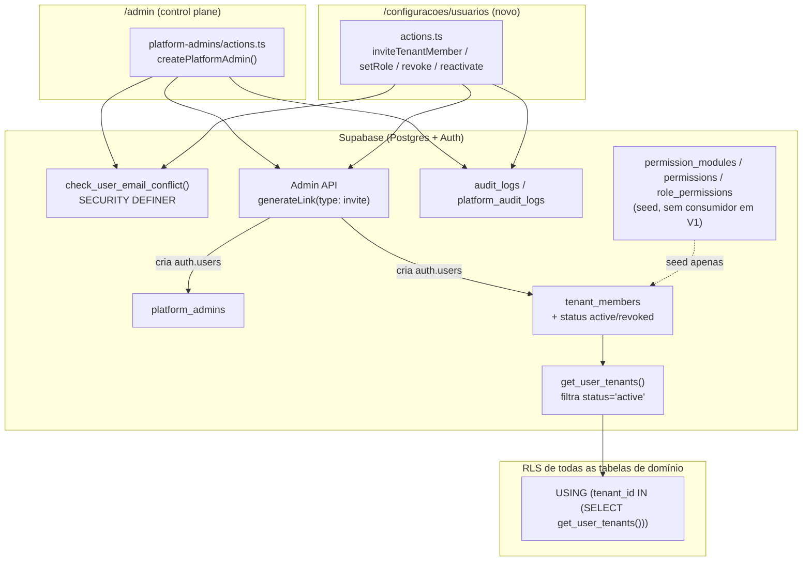
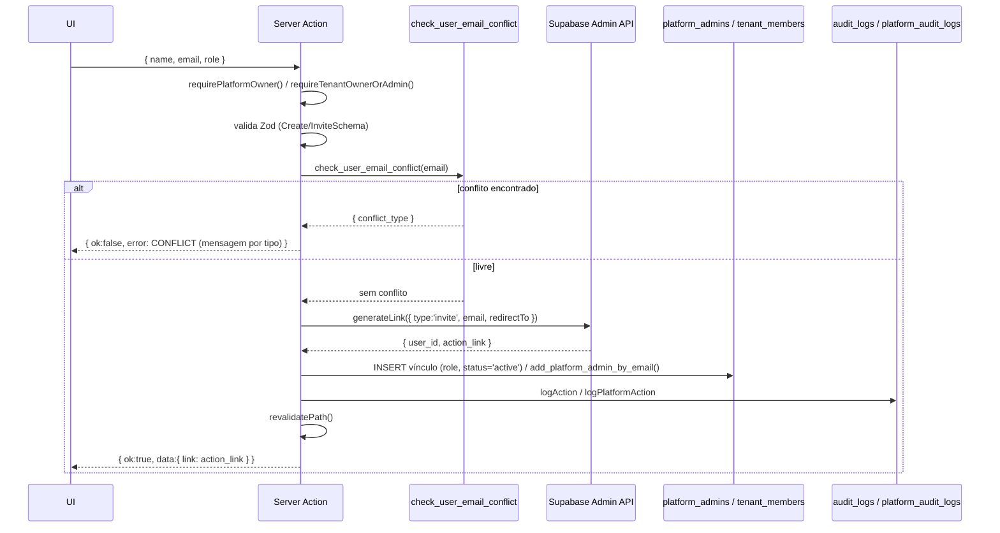

# Spec 0011 — Módulo de Usuários e Controle de Acesso

> ✅ **Status: aprovado.** Versão 1.0 — 2026-08-08. Spec técnica derivada de [[PRDs/0011-modulo-usuarios-acessos]], apoiada em [[decisions/0022-modelo-controle-acesso-configuravel|ADR 0022]]. Cobertura da matriz: 100% (44/44 itens do PRD). Próximo passo: implementar começando pela migration → schema Zod em `@gomoto/core` → server action → UI → testes.

---

## 1. Visão Geral Técnica

Este módulo fecha o ciclo de vida de usuário que hoje só cobre o caso mínimo (primeiro owner do tenant, criado junto com a empresa). Duas superfícies novas de escrita:

1. **Criação de Platform Admin do zero** (`apps/web/src/app/(admin)/admin/platform-admins/`) — hoje `addPlatformAdmin` só promove um `auth.users` já existente (`add_platform_admin_by_email`); passa a existir um caminho de convite que cria o usuário.
2. **Gestão de Usuários do Tenant** (`apps/web/src/app/(dashboard)/configuracoes/usuarios/`, tela nova) — convidar, listar/buscar, alterar papel, revogar e reativar membros do próprio tenant. Não existe hoje nenhuma escrita em `tenant_members` fora do INSERT único feito por `create_tenant_with_owner` na criação do tenant.

Ambas as superfícies reaproveitam o mesmo mecanismo de convite (Supabase Admin API `generateLink({ type: 'invite' })`, decidido na ADR 0022) e o mesmo padrão de Server Action + RPC `SECURITY DEFINER` já usado em `platform_admins_rpc.sql` para checagens que precisam enxergar `auth.users` (inacessível via PostgREST).

Não há tabela de domínio nova em `packages/core`/`apps/web` além do catálogo de permissões global decidido na ADR 0022 (`permission_modules`, `permissions`, `role_permissions`) — que nesta versão é só seed, sem consumidor em runtime. Toda a autorização efetiva desta Spec (quem pode convidar, alterar papel, revogar) continua sendo checada contra `tenant_members.role` / `platform_admins.role`, os mesmos campos que já existem.

---

## 2. Arquitetura

### 2.1 Contexto



A revogação de acesso (RF-021) não usa a Admin API do Supabase Auth (banir/desativar `auth.users`) — reaproveita o **mesmo mecanismo de isolamento que já protege multi-tenancy**: `get_user_tenants()` passa a filtrar `status = 'active'`, e como toda RLS de tabela de domínio já depende dessa função (ADR 0001/Fase 5), um usuário revogado perde acesso a dado em **todas** as tabelas automaticamente, sem tocar em nenhuma policy existente. É o mesmo padrão de "defesa por choke point único" que a suspensão de tenant já usa (ADR 0004 §4).

### 2.2 Componentes

**Migrations (`supabase/migrations/`):**

- `<ts>_create_permission_catalog.sql` — `permission_modules`, `permissions`, `role_permissions` (globais, RLS leitura-livre, seed dos 4 papéis fixos). Decidido na ADR 0022 §2; sem consumidor em runtime nesta versão.
- `<ts>_tenant_members_lifecycle.sql` — adiciona `tenant_members.status` (`active`/`revoked`); reescreve `get_user_tenants()` para filtrar `status = 'active'`; cria as RPCs `SECURITY DEFINER`: `check_user_email_conflict`, `list_tenant_members`, `set_tenant_member_role`, `revoke_tenant_member`, `reactivate_tenant_member`.

**`@gomoto/core` (`packages/core/src/schemas/`):**

- `CreatePlatformAdminSchema` (nome, email, role) — RF-001.
- `InviteTenantMemberSchema` (nome, email, role) — RF-006.
- `TenantMemberRoleSchema` — enum compartilhado `owner|admin|operator|viewer`.
- `packages/core/src/rules/access-control.ts` — `isSelfPromotion()`/`wouldLeaveZeroActiveOwners()`, funções puras que espelham os guards das RPCs (RN-003/004/005) para hint de UI + cobertura Unit (detalhado em §9).

**`apps/web` — control plane (existente, estendido):**

- `admin/platform-admins/actions.ts` — `addPlatformAdmin` vira `createPlatformAdmin(name, email, role)`: checa conflito, convida via Admin API, insere em `platform_admins` (reaproveita `add_platform_admin_by_email` depois que o `auth.users` já existe).
- `admin/platform-admins/PlatformAdminsClient.tsx` — modal ganha campo Nome; remove o aviso "usuário precisa já existir em auth.users".

**`apps/web` — tenant (novo):**

- `(dashboard)/configuracoes/usuarios/page.tsx` — Server Component, chama `list_tenant_members` via RPC.
- `(dashboard)/configuracoes/usuarios/actions.ts` — `inviteTenantMember`, `updateTenantMemberRole`, `revokeTenantMember`, `reactivateTenantMember`.
- `(dashboard)/configuracoes/usuarios/UsuariosClient.tsx` — tabela (`h-9 text-[13px]`) + modais de convite/alteração/revogação/reativação.
- `(dashboard)/configuracoes/page.tsx` — ganha link/card para a nova tela (mesmo padrão de navegação já usado em Configurações).

**`apps/web/src/lib/auth/`:**

- `tenant.ts` — nova função `requireTenantOwnerOrAdmin()`, mesmo formato de `requirePlatformAdmin()` (guard reutilizável nas Server Actions).
- `(dashboard)/layout.tsx` — passa a distinguir "sem tenant" (redirect `/login`, comportamento atual) de "acesso revogado" (nova página de aviso, análoga a `TenantSuspendedPage`), usando uma checagem que não depende de `get_user_tenants()` (que já retorna vazio para revogados).

**`apps/web` — página de definição de senha (novo, gap encontrado durante a Spec — ver §3.5/§11):**

- `(auth)/definir-senha/page.tsx` — Client Component. Não existe hoje **nenhuma** página web que consuma o link de convite/magic link (`generateLink`) e deixe o convidado definir a senha — o mecanismo só está fiado ponta a ponta para o mobile (`MOBILE_REDIRECT = 'gomoto://auth-callback'` em `clientes/actions.ts`). Sem essa página, RF-002/RF-007 geram um link que não leva a lugar nenhum. `redirectTo` do `generateLink` passa a apontar para esta rota.

### 2.3 Responsabilidades

| Camada | Responsabilidade |
|---|---|
| Server Action | Resolve tenant/contexto (`getCurrentTenantId` / `requirePlatformAdmin`), valida Zod, orquestra convite (checagem de conflito → Admin API → vínculo), chama `logAction`/`logPlatformAction`, `revalidatePath`. Nunca decide invariante de negócio sozinha. |
| RPC `SECURITY DEFINER` | Única fonte de verdade para invariantes que cruzam linhas (≥1 owner, sem autopromoção, sem autorrevogação, conflito de email via `auth.users`) — mesmo padrão já usado em `platform_admins_rpc.sql`. |
| `get_user_tenants()` | Choke point único: ao filtrar `status='active'`, bloqueia dado de usuário revogado em toda RLS existente sem precisar tocar em nenhuma policy de tabela de domínio. |
| Admin API (Supabase Auth) | Só cria `auth.users` + gera link de convite. Nunca decide papel nem grava audit — isso é responsabilidade da Server Action/RPC depois que o `auth.users` existe. |

---

## 3. Fluxos Técnicos

### 3.1 Fluxo principal — Convite (RF-001/002 Platform Admin; RF-006/007 Tenant Member)

Mesmo motor para os dois casos — só muda o guard, a tabela de vínculo e o log. `<target>` = `platform_admins` (A) ou `tenant_members` (B).



Passos:

1. UI (modal) envia `{ name, email, role }` para `createPlatformAdmin` (A) ou `inviteTenantMember` (B).
2. Server Action resolve contexto: `requirePlatformOwner()` (RF-001 exige Owner, RN-007) ou `requireTenantOwnerOrAdmin()` (RN-006).
3. Valida payload com `CreatePlatformAdminSchema` / `InviteTenantMemberSchema` (`@gomoto/core`).
4. Chama RPC `check_user_email_conflict(p_email)` — resolve `email → auth.users.id` e verifica presença em `platform_admins`/`tenant_members` (não dá pra fazer via PostgREST direto, mesmo motivo já documentado em `platform_admins_rpc.sql`).
5. Sem conflito: Server Action (com `service_role`, mesmo padrão de `regenerateOwnerLink`) chama `supabaseAdmin.auth.admin.generateLink({ type: 'invite', email, options: { redirectTo } })`. GoTrue cria o `auth.users` (não confirmado) e devolve `action_link` — TTL de 72h já é o valor usado hoje (`expiresIn: 259200` em `regenerateOwnerLink`).
6. Server Action grava o vínculo:
   - **A:** chama `add_platform_admin_by_email(email, role)` — RPC existente, **sem mudança**; agora sempre encontra o `auth.users` recém-criado.
   - **B:** `INSERT INTO tenant_members (tenant_id, user_id, role, status) VALUES (<tenant_atual>, <user_id>, <role>, 'active')` — permitido pela RLS `Owners/admins can manage members` já existente (nenhuma policy nova necessária para o INSERT).
7. Server Action grava auditoria: `logPlatformAction` (A) ou `logAction` (B).
8. Retorna `{ ok:true, data:{ link } }` — link exibido em campo copiável na UI (mesmo padrão do "magic link manual" da ADR 0004 §7); responsável envia manualmente (notificação automática por email é não-objetivo do PRD).
9. `revalidatePath` da lista correspondente.

### 3.2 Fluxos alternativos

**Editar papel (RF-015, Fluxo C do PRD):**

1. UI aciona `updateTenantMemberRole(memberId, newRole)`.
2. `requireTenantOwnerOrAdmin()`.
3. RPC `set_tenant_member_role(p_member_id, p_new_role)`:
   - Se `p_member_id` pertence ao próprio caller **e** `p_new_role` é hierarquicamente maior que o atual → `RAISE ERRCODE='42501'` (RF-016/RN-004).
   - Se o membro alvo é Owner e a mudança resultaria em 0 Owners ativos no tenant → `RAISE ERRCODE='23514'` (RF-017/RN-003).
   - Senão `UPDATE tenant_members SET role = p_new_role WHERE id = p_member_id` e devolve `{ old_role, new_role }`.
4. Server Action grava `logAction({ action:'update', table:'tenant_members', oldData:{role:old_role}, newData:{role:new_role} })`.
5. `revalidatePath`.

**Reativar (RF-024/025/026, Fluxo D1 do PRD):**

1. UI aciona `reactivateTenantMember(memberId)`.
2. `requireTenantOwnerOrAdmin()`.
3. RPC `reactivate_tenant_member(p_member_id)` — `UPDATE tenant_members SET status = 'active' WHERE id = p_member_id AND status = 'revoked'`. `role` não é tocado (nunca foi alterado na revogação — RF-025 é automático).
4. Server Action grava `logAction({ action:'update', table:'tenant_members', newData:{status:'active'} })`.
5. Usuário volta a autenticar/acessar dados imediatamente — mesma credencial, sem novo link (consequência direta de `get_user_tenants()` voltar a incluir o tenant).

### 3.3 Fluxos de falha

- **Autorrevogação bloqueada (RF-019/RN-005):** RPC `revoke_tenant_member` rejeita se `p_member_id` corresponde a `auth.uid()` — `RAISE ERRCODE='42501'`. UI também esconde a ação na própria linha do usuário logado (defesa em profundidade, RPC é a garantia real).
- **Revogar o único Owner (RF-020/RN-003):** mesma checagem de contagem do fluxo de edição de papel, aplicada em `revoke_tenant_member`.
- **Ação concorrente — dois Admins revogam o mesmo usuário ao mesmo tempo:** `revoke_tenant_member` não falha se `status` já é `'revoked'` — é idempotente, retorna sucesso silencioso. A segunda chamada não gera um segundo registro de audit log (evita poluição) e a UI mostra "usuário já sem acesso" em vez de erro.
- **Conflito de email na criação (RF-003/004/008/009/010):** `check_user_email_conflict` devolve o tipo de conflito; Server Action traduz para a mensagem específica de cada RF (nunca uma mensagem genérica).
- **`generateLink` falha** (rede, GoTrue fora do ar, rate limit): Server Action devolve `{ ok:false, error:{ code:'INTERNAL' } }` sem tocar em `platform_admins`/`tenant_members` — não há vínculo órfão possível nesse ponto porque a ordem é sempre invite-primeiro-vínculo-depois.
- **Vínculo falha depois do invite bem-sucedido** (passo 6 do fluxo principal): `auth.users` fica órfão (sem `platform_admins`/`tenant_members`). Reconvidar o mesmo email detecta, via `check_user_email_conflict`, "existe em `auth.users` mas sem vínculo" e pula direto para o passo 6 (não gera um segundo `auth.users`) — ver §11.1 para o risco completo.
- **Sessão já aberta de usuário revogado:** não há invalidação ativa de token — a próxima requisição que dependa de RLS (praticamente todas as leitura/escritas do cockpit) encontra `tenant_id NOT IN (SELECT get_user_tenants())` e falha; o layout (`(dashboard)/layout.tsx`) intercepta antes de renderizar e mostra a página de acesso revogado (RF-021).

### 3.4 Eventos

Sem eventos — operação síncrona. Toda a orquestração (checagem de conflito → convite → vínculo → auditoria) acontece dentro de uma única Server Action, sem worker/fila/webhook.

### 3.5 Fluxo complementar — Definição de senha inicial (gap encontrado, incluído nesta Spec)

Continuação do passo 8 de §3.1: o link gerado por `generateLink` precisa levar a algum lugar que funcione. Hoje isso só existe pro mobile — para o cockpit web, esta Spec adiciona:

1. Convidado clica no link (`redirectTo` = `<APP_URL>/definir-senha`). Supabase Auth processa o token e devolve o browser pra essa URL com a sessão embutida (hash da URL).
2. `(auth)/definir-senha/page.tsx` (Client Component) monta; o client Supabase do browser detecta a sessão automaticamente (`detectSessionInUrl`, comportamento padrão do SDK) — sem chamada extra.
3. Usuário preenche senha + confirmação; validação client-side com `SetInitialPasswordSchema` (`@gomoto/core`, mínimo 8 caracteres — mesmo mínimo já usado em `changeOwnerPassword`).
4. Chama `supabase.auth.updateUser({ password })` **diretamente do client** (sem Server Action — a sessão já autentica essa chamada; mesmo padrão de página de login/auth do projeto, que já opera client-side).
5. Sucesso → `redirect('/dashboard')` (o layout já resolve platform_admin vs. tenant_member e manda pro lugar certo, lógica existente em `(dashboard)/layout.tsx`).
6. Falha (token expirado — 72h, ou já usado): mensagem "Link expirado ou já utilizado. Peça um novo convite ao responsável." Não há reenvio automático nesta tela — reconvidar o mesmo email já é idempotente (§3.3).

---

## 4. Modelo de Dados

### 4.1 Entidades

| Entidade | Tipo de mudança | Escopo |
|---|---|---|
| `permission_modules` | Nova tabela | Global (catálogo, ADR 0022 §2) |
| `permissions` | Nova tabela | Global (catálogo) |
| `role_permissions` | Nova tabela | Global (seed dos 4 papéis fixos) |
| `tenant_members` | Alterada — coluna `status` nova | Tenant-scoped (já existente) |
| `get_user_tenants()` | Alterada — filtra `status = 'active'` | Função (choke point de RLS) |
| `check_user_email_conflict` | Nova RPC | — |
| `list_tenant_members` | Nova RPC | — |
| `set_tenant_member_role` | Nova RPC | — |
| `revoke_tenant_member` | Nova RPC | — |
| `reactivate_tenant_member` | Nova RPC | — |

> **Nota sobre convenção de tipo:** `role`/`status`/`action` usam `VARCHAR` + `CHECK`, não `CREATE TYPE ... AS ENUM`. Diverge do template genérico da skill, mas segue o padrão **já estabelecido** em todo o schema atual (`tenant_members.role`, `platform_admins.role`, `billings.status`, `contracts.status` — nenhum usa ENUM nativo). Consistência com o código existente vence o template genérico aqui (CLAUDE.md: "use sempre o estado atual do código como verdade").

> **Nota sobre `tenant_id`:** `permission_modules`/`permissions`/`role_permissions` **não têm `tenant_id`** — exceção deliberada e justificada na ADR 0022 §3 (catálogo de sistema, igual em todo tenant, mesmo tratamento já dado a `platform_admins`).

### 4.2 Campos (SQL concreto)

**Migration 1 — `supabase/migrations/20260808120000_create_permission_catalog.sql`:**

```sql
-- ============================================================
-- ADR 0022 §2 — Catálogo global de permissões por módulo.
-- Seed apenas: nenhum caminho de autorização em V1 consulta
-- estas tabelas — RLS/guards continuam checando role fixo direto.
-- ============================================================

CREATE TABLE permission_modules (
    code        VARCHAR(40) PRIMARY KEY,
    label_pt    VARCHAR(80) NOT NULL,
    sort_order  SMALLINT NOT NULL DEFAULT 0
);

CREATE TABLE permissions (
    id          UUID PRIMARY KEY DEFAULT gen_random_uuid(),
    module_code VARCHAR(40) NOT NULL REFERENCES permission_modules(code) ON DELETE CASCADE,
    action      VARCHAR(20) NOT NULL CHECK (action IN ('view', 'create', 'edit', 'delete')),
    UNIQUE (module_code, action)
);

CREATE TABLE role_permissions (
    id            UUID PRIMARY KEY DEFAULT gen_random_uuid(),
    system_role   VARCHAR(20) NOT NULL CHECK (system_role IN ('owner', 'admin', 'operator', 'viewer')),
    permission_id UUID NOT NULL REFERENCES permissions(id) ON DELETE CASCADE,
    UNIQUE (system_role, permission_id)
);

CREATE INDEX idx_permissions_module_code ON permissions(module_code);
CREATE INDEX idx_role_permissions_role ON role_permissions(system_role);

-- Global, leitura livre (dado não sensível), escrita só via migration/service_role.
ALTER TABLE permission_modules ENABLE ROW LEVEL SECURITY;
ALTER TABLE permissions ENABLE ROW LEVEL SECURITY;
ALTER TABLE role_permissions ENABLE ROW LEVEL SECURITY;

CREATE POLICY "permission_modules_read" ON permission_modules FOR SELECT TO authenticated USING (true);
CREATE POLICY "permissions_read" ON permissions FOR SELECT TO authenticated USING (true);
CREATE POLICY "role_permissions_read" ON role_permissions FOR SELECT TO authenticated USING (true);

-- ============================================================
-- SEED — vocabulário de módulos (PRD 0011 §2)
-- ============================================================
INSERT INTO permission_modules (code, label_pt, sort_order) VALUES
    ('fleet',       'Frota',          1),
    ('customers',   'Clientes',       2),
    ('contracts',   'Contratos',      3),
    ('financial',   'Financeiro',     4),
    ('maintenance', 'Manutenção',     5),
    ('inspection',  'Vistoria',       6),
    ('users',       'Usuários',       7),
    ('settings',    'Configurações',  8);

INSERT INTO permissions (module_code, action)
SELECT pm.code, a.action
FROM permission_modules pm
CROSS JOIN unnest(ARRAY['view', 'create', 'edit', 'delete']) AS a(action);

-- ============================================================
-- SEED — mapeamento papel fixo → permissão.
-- Primeira aproximação documental (V1 não aplica isso em runtime;
-- ao construir V2, validar contra o comportamento real de cada
-- guard antes de expor num construtor de papel).
-- ============================================================
INSERT INTO role_permissions (system_role, permission_id)
SELECT 'viewer', id FROM permissions WHERE action = 'view';

INSERT INTO role_permissions (system_role, permission_id)
SELECT 'operator', id FROM permissions
WHERE action IN ('view', 'create', 'edit')
  AND module_code IN ('fleet', 'customers', 'contracts', 'maintenance', 'inspection')
UNION
SELECT 'operator', id FROM permissions WHERE action = 'view' AND module_code = 'financial';

INSERT INTO role_permissions (system_role, permission_id)
SELECT 'admin', id FROM permissions;

INSERT INTO role_permissions (system_role, permission_id)
SELECT 'owner', id FROM permissions;
```

**Migration 2 — `supabase/migrations/20260808120100_tenant_members_lifecycle.sql`:**

```sql
-- ============================================================
-- PRD 0011 — ciclo de vida de tenant_members: status (revogar/
-- reativar) + RPCs de convite/gestão. get_user_tenants() passa a
-- ser o choke point único que bloqueia acesso de revogado em toda
-- RLS existente (nenhuma outra policy muda).
-- ============================================================

ALTER TABLE tenant_members
    ADD COLUMN status VARCHAR(20) NOT NULL DEFAULT 'active' CHECK (status IN ('active', 'revoked'));

CREATE INDEX idx_tenant_members_tenant_status ON tenant_members(tenant_id, status);

CREATE OR REPLACE FUNCTION get_user_tenants()
RETURNS SETOF UUID
LANGUAGE sql
SECURITY DEFINER
STABLE
AS $$
    SELECT tenant_id FROM tenant_members WHERE user_id = auth.uid() AND status = 'active';
$$;

-- ============================================================
-- check_user_email_conflict — RF-003/004/008/009/010.
-- auth.users não é acessível via PostgREST (mesmo motivo já
-- documentado em platform_admins_rpc.sql).
-- ============================================================
CREATE OR REPLACE FUNCTION check_user_email_conflict(p_email TEXT)
RETURNS TABLE (
    user_id           UUID,
    is_platform_admin BOOLEAN,
    tenant_id         UUID,
    tenant_member_id  UUID
)
LANGUAGE sql
SECURITY DEFINER
STABLE
AS $$
    SELECT
        u.id,
        EXISTS(SELECT 1 FROM platform_admins pa WHERE pa.user_id = u.id),
        tm.tenant_id,
        tm.id
    FROM auth.users u
    LEFT JOIN tenant_members tm ON tm.user_id = u.id
    WHERE LOWER(u.email) = LOWER(p_email)
    LIMIT 1;
$$;

-- ============================================================
-- list_tenant_members — RF-013/014. Enriquece com email/nome
-- (join auth.users) e já filtra por busca. Gate de role dentro
-- da própria função (defesa em profundidade além do 404 de rota).
-- ============================================================
CREATE OR REPLACE FUNCTION list_tenant_members(p_search TEXT DEFAULT NULL)
RETURNS TABLE (
    id          UUID,
    user_id     UUID,
    email       TEXT,
    name        TEXT,
    role        TEXT,
    status      TEXT,
    created_at  TIMESTAMPTZ
)
LANGUAGE sql
SECURITY DEFINER
STABLE
AS $$
    SELECT
        tm.id,
        tm.user_id,
        u.email::TEXT,
        COALESCE(u.raw_user_meta_data->>'name', split_part(u.email, '@', 1))::TEXT,
        tm.role,
        tm.status,
        tm.created_at
    FROM tenant_members tm
    JOIN auth.users u ON u.id = tm.user_id
    WHERE tm.tenant_id IN (SELECT get_user_tenants())
      AND EXISTS (
        SELECT 1 FROM tenant_members caller
        WHERE caller.user_id = auth.uid() AND caller.role IN ('owner', 'admin') AND caller.status = 'active'
      )
      AND (
        p_search IS NULL OR p_search = ''
        OR u.email ILIKE '%' || p_search || '%'
        OR COALESCE(u.raw_user_meta_data->>'name', '') ILIKE '%' || p_search || '%'
      )
    ORDER BY
        CASE tm.status WHEN 'active' THEN 0 ELSE 1 END,
        CASE tm.role WHEN 'owner' THEN 0 WHEN 'admin' THEN 1 WHEN 'operator' THEN 2 ELSE 3 END,
        u.email;
$$;

-- ============================================================
-- set_tenant_member_role — RF-015/016/017, RN-003/004.
-- ============================================================
CREATE OR REPLACE FUNCTION set_tenant_member_role(p_member_id UUID, p_new_role TEXT)
RETURNS TABLE (old_role TEXT, new_role TEXT)
LANGUAGE plpgsql
SECURITY DEFINER
AS $$
DECLARE
    v_actor         UUID := auth.uid();
    v_actor_role    TEXT;
    v_target_tenant UUID;
    v_target_user   UUID;
    v_current_role  TEXT;
    v_owner_count   INT;
    v_rank          JSONB := '{"viewer":1,"operator":2,"admin":3,"owner":4}'::JSONB;
BEGIN
    SELECT role INTO v_actor_role FROM tenant_members WHERE user_id = v_actor AND status = 'active';
    IF v_actor_role NOT IN ('owner', 'admin') THEN
        RAISE EXCEPTION 'apenas owner/admin alteram papel' USING ERRCODE = '42501';
    END IF;

    IF p_new_role NOT IN ('owner', 'admin', 'operator', 'viewer') THEN
        RAISE EXCEPTION 'papel inválido' USING ERRCODE = '22023';
    END IF;

    SELECT tenant_id, user_id, role INTO v_target_tenant, v_target_user, v_current_role
      FROM tenant_members WHERE id = p_member_id AND status = 'active';
    IF v_target_tenant IS NULL OR v_target_tenant NOT IN (SELECT get_user_tenants()) THEN
        RAISE EXCEPTION 'membro não encontrado' USING ERRCODE = 'P0002';
    END IF;

    IF v_current_role = p_new_role THEN
        RETURN QUERY SELECT v_current_role, p_new_role;
        RETURN;
    END IF;

    IF v_target_user = v_actor AND (v_rank ->> p_new_role)::INT > (v_rank ->> v_current_role)::INT THEN
        RAISE EXCEPTION 'não é possível se autopromover' USING ERRCODE = '42501';
    END IF;

    IF v_current_role = 'owner' AND p_new_role <> 'owner' THEN
        SELECT COUNT(*) INTO v_owner_count FROM tenant_members
          WHERE tenant_id = v_target_tenant AND role = 'owner' AND status = 'active';
        IF v_owner_count <= 1 THEN
            RAISE EXCEPTION 'o tenant precisa de ao menos 1 owner ativo' USING ERRCODE = '23514';
        END IF;
    END IF;

    UPDATE tenant_members SET role = p_new_role WHERE id = p_member_id;

    RETURN QUERY SELECT v_current_role, p_new_role;
END;
$$;

-- ============================================================
-- revoke_tenant_member — RF-018/019/020, RN-003/005. Idempotente
-- se já revogado (concorrência, ver §3.3).
-- ============================================================
CREATE OR REPLACE FUNCTION revoke_tenant_member(p_member_id UUID)
RETURNS VOID
LANGUAGE plpgsql
SECURITY DEFINER
AS $$
DECLARE
    v_actor         UUID := auth.uid();
    v_actor_role    TEXT;
    v_target_tenant UUID;
    v_target_user   UUID;
    v_target_role   TEXT;
    v_target_status TEXT;
    v_owner_count   INT;
BEGIN
    SELECT role INTO v_actor_role FROM tenant_members WHERE user_id = v_actor AND status = 'active';
    IF v_actor_role NOT IN ('owner', 'admin') THEN
        RAISE EXCEPTION 'apenas owner/admin revogam acesso' USING ERRCODE = '42501';
    END IF;

    SELECT tenant_id, user_id, role, status INTO v_target_tenant, v_target_user, v_target_role, v_target_status
      FROM tenant_members WHERE id = p_member_id;
    IF v_target_tenant IS NULL OR v_target_tenant NOT IN (SELECT get_user_tenants()) THEN
        RAISE EXCEPTION 'membro não encontrado' USING ERRCODE = 'P0002';
    END IF;

    IF v_target_status = 'revoked' THEN
        RETURN; -- idempotente
    END IF;

    IF v_target_user = v_actor THEN
        RAISE EXCEPTION 'você não pode revogar o próprio acesso' USING ERRCODE = '42501';
    END IF;

    IF v_target_role = 'owner' THEN
        SELECT COUNT(*) INTO v_owner_count FROM tenant_members
          WHERE tenant_id = v_target_tenant AND role = 'owner' AND status = 'active';
        IF v_owner_count <= 1 THEN
            RAISE EXCEPTION 'o tenant precisa de ao menos 1 owner ativo' USING ERRCODE = '23514';
        END IF;
    END IF;

    UPDATE tenant_members SET status = 'revoked' WHERE id = p_member_id;
END;
$$;

-- ============================================================
-- reactivate_tenant_member — RF-024/025/026. role não é tocado.
-- ============================================================
CREATE OR REPLACE FUNCTION reactivate_tenant_member(p_member_id UUID)
RETURNS VOID
LANGUAGE plpgsql
SECURITY DEFINER
AS $$
DECLARE
    v_actor         UUID := auth.uid();
    v_actor_role    TEXT;
    v_target_tenant UUID;
BEGIN
    SELECT role INTO v_actor_role FROM tenant_members WHERE user_id = v_actor AND status = 'active';
    IF v_actor_role NOT IN ('owner', 'admin') THEN
        RAISE EXCEPTION 'apenas owner/admin reativam acesso' USING ERRCODE = '42501';
    END IF;

    SELECT tenant_id INTO v_target_tenant FROM tenant_members WHERE id = p_member_id;
    IF v_target_tenant IS NULL OR v_target_tenant NOT IN (SELECT get_user_tenants()) THEN
        RAISE EXCEPTION 'membro não encontrado' USING ERRCODE = 'P0002';
    END IF;

    UPDATE tenant_members SET status = 'active' WHERE id = p_member_id AND status = 'revoked';
END;
$$;

GRANT EXECUTE ON FUNCTION check_user_email_conflict(TEXT)      TO authenticated;
GRANT EXECUTE ON FUNCTION list_tenant_members(TEXT)             TO authenticated;
GRANT EXECUTE ON FUNCTION set_tenant_member_role(UUID, TEXT)    TO authenticated;
GRANT EXECUTE ON FUNCTION revoke_tenant_member(UUID)            TO authenticated;
GRANT EXECUTE ON FUNCTION reactivate_tenant_member(UUID)        TO authenticated;
```

### 4.3 Relacionamentos e índices

- `permissions.module_code → permission_modules.code` — `ON DELETE CASCADE` (módulo removido derruba suas permissões; só acontece via migration).
- `role_permissions.permission_id → permissions.id` — `ON DELETE CASCADE`.
- `idx_tenant_members_tenant_status (tenant_id, status)` — sustenta `list_tenant_members` (filtro + ordenação por status) e as checagens de `COUNT(*) ... WHERE tenant_id = ? AND role = 'owner' AND status = 'active'` nas RPCs de invariante; `idx_tenant_members_tenant_id` já existente continua servindo o restante das queries por tenant.
- Nenhum índice novo em `permission_modules`/`permissions`/`role_permissions` além de `PRIMARY KEY`/`UNIQUE` — volume fixo e pequeno (8 módulos × 4 ações × 4 papéis ≤ 128 linhas em `role_permissions`).

---

## 5. APIs

Leitura segue o padrão já usado em `admin/platform-admins/page.tsx`: Server Component chama a RPC direto via `supabase.rpc(...)` e passa `initialRows` para o Client Component, que filtra localmente por nome/email (RF-014) — sem round-trip por tecla, coerente com o volume esperado ("dezenas por tenant", PRD §3.4). Não há Server Action de leitura; só as de escrita abaixo.

### 5.1 Endpoints (Server Actions)

| Server Action | Arquivo | Guard | RF |
|---|---|---|---|
| `createPlatformAdmin(input: unknown)` | `admin/platform-admins/actions.ts` | `requirePlatformOwner()` | RF-001, 002, 003, 004, 005 |
| `inviteTenantMember(input: unknown)` | `(dashboard)/configuracoes/usuarios/actions.ts` | `requireTenantOwnerOrAdmin()` | RF-006, 007, 008, 009, 010, 011, 012 |
| `updateTenantMemberRole(memberId: string, newRole: string)` | idem | `requireTenantOwnerOrAdmin()` | RF-015, 016, 017, 023 |
| `revokeTenantMember(memberId: string)` | idem | `requireTenantOwnerOrAdmin()` | RF-018, 019, 020, 021, 022, 023 |
| `reactivateTenantMember(memberId: string)` | idem | `requireTenantOwnerOrAdmin()` | RF-024, 025, 026 |

Todas retornam `ActionResult<T>` (envelope já usado em `configuracoes/actions.ts`, não o padrão ad-hoc mais antigo de `admin/empresas/actions.ts`/`admin/platform-admins/actions.ts` — `createPlatformAdmin` mantém o formato do arquivo que estende, ver nota em §5.3).

### 5.2 Schemas (Zod via `@gomoto/core`)

```ts
// packages/core/src/schemas/access-control.ts

export const TenantMemberRoleSchema = z.enum(['owner', 'admin', 'operator', 'viewer']);
export type TenantMemberRole = z.infer<typeof TenantMemberRoleSchema>;

export const PlatformAdminRoleSchema = z.enum(['owner', 'operator']);
export type PlatformAdminRole = z.infer<typeof PlatformAdminRoleSchema>;

export const CreatePlatformAdminSchema = z.object({
  name: z.string().trim().min(2).max(120),
  email: z.string().trim().toLowerCase().email(),
  role: PlatformAdminRoleSchema,
});
export type CreatePlatformAdmin = z.infer<typeof CreatePlatformAdminSchema>;

export const InviteTenantMemberSchema = z.object({
  name: z.string().trim().min(2).max(120),
  email: z.string().trim().toLowerCase().email(),
  role: TenantMemberRoleSchema,
});
export type InviteTenantMember = z.infer<typeof InviteTenantMemberSchema>;

// Usado em (auth)/definir-senha — ver §3.5. Mesmo mínimo de changeOwnerPassword.
export const SetInitialPasswordSchema = z.object({
  password: z.string().min(8),
});
export type SetInitialPassword = z.infer<typeof SetInitialPasswordSchema>;
```

Schemas vivem em `@gomoto/core`. **Nunca duplicar** em `apps/web`.

### 5.3 Erros

| Código | Quando ocorre | RF |
|---|---|---|
| `VALIDATION_ERROR` | Zod rejeita `name`/`email`/`role` | — |
| `UNAUTHORIZED` | Sem sessão válida | — |
| `FORBIDDEN` | Operator tenta criar Platform Admin; Operator/Viewer tenta convidar/alterar/revogar; autopromoção; autorrevogação | RF-001 (Erro), RF-011, RF-016, RF-019 |
| `NOT_FOUND` | `memberId` não existe ou não pertence ao tenant do caller | — |
| `CONFLICT` | Email já é Platform Admin / já é membro de outro tenant / já é membro do mesmo tenant; alteração resultaria em 0 Owners ativos | RF-003, 004, 008, 009, 010, 017, 020 |
| `INTERNAL` | `generateLink` falha (rede/GoTrue) | — |

> **Nota sobre o envelope de `createPlatformAdmin`:** o arquivo `admin/platform-admins/actions.ts` já usa hoje `{ error: string } | { success: true, row }` (não o `ActionResult<T>` canônico) nas demais funções (`setPlatformAdminRole`, `removePlatformAdmin`). `createPlatformAdmin` mantém esse formato por consistência **dentro do arquivo que está sendo estendido** — regra geral do projeto é `ActionResult<T>`, mas trocar o contrato de um arquivo existente inteiro está fora do escopo desta Spec (viraria um refactor não pedido pelo PRD). Arquivos novos (`configuracoes/usuarios/actions.ts`) usam `ActionResult<T>` desde o início.

---

## 6. Segurança

### 6.1 Autenticação

Supabase Auth via cookies (`createClient()` server-side), igual ao resto do produto — nenhuma mudança no fluxo de login. O convite usa adicionalmente o **Admin API com `service_role`**, chamado só dentro da Server Action (nunca exposto ao client), mesmo padrão já em produção em `regenerateOwnerLink`/`changeOwnerPassword` (`admin/empresas/actions.ts`), incluindo o guard de variáveis de ambiente:

```ts
const serviceUrl = process.env.NEXT_PUBLIC_SUPABASE_URL
const serviceKey = process.env.SUPABASE_SERVICE_ROLE_KEY
if (!serviceUrl || !serviceKey) return { ok: false, error: { code: 'INTERNAL', message: 'Configuração do servidor incompleta' } }
```

`(auth)/definir-senha` (§3.5) é a única rota nova desta Spec acessível **sem** sessão pré-existente de app — o acesso é autorizado pelo próprio token do link (validado pelo GoTrue ao montar a sessão), não por `requirePlatformAdmin()`/`requireTenantOwnerOrAdmin()`. `updateUser({ password })` só é aceito pela API do Supabase com uma sessão válida (recém-criada pelo token) — sem sessão, a chamada falha naturalmente, sem checagem adicional necessária no app.

### 6.2 Autorização

| Ação | Platform Owner | Platform Operator | Tenant Owner/Admin | Tenant Operator/Viewer |
|---|:-:|:-:|:-:|:-:|
| Criar Platform Admin | ✅ | ❌ FORBIDDEN | — | — |
| Convidar Usuário do Tenant | — | — | ✅ | ❌ |
| Listar/buscar Usuários do Tenant | — | — | ✅ | ❌ (RNF-003) |
| Alterar papel de membro | — | — | ✅ (com guards RN-003/004) | ❌ |
| Revogar acesso | — | — | ✅ (com guards RN-003/005) | ❌ |
| Reativar acesso | — | — | ✅ | ❌ |

Duas camadas, mesmo padrão do resto do produto:

1. **Guard na Server Action** (`requirePlatformOwner()` / `requireTenantOwnerOrAdmin()`) — primeira barreira, evita round-trip desnecessário ao banco.
2. **RPC `SECURITY DEFINER`** — reverifica o papel do caller internamente (`get_platform_role()` / checagem de `tenant_members.role` do próprio `auth.uid()`) porque `SECURITY DEFINER` sempre bypassa RLS — mesma justificativa já documentada em `platform_admins_rpc.sql`.

**RNF-003 (Operador/Visualizador não pode nem saber que a tela existe):** a rota `(dashboard)/configuracoes/usuarios/page.tsx` chama `requireTenantOwnerOrAdmin()` e, se falhar, usa `redirect()` — **não** `notFound()`. Segue o padrão já estabelecido em `(admin)/layout.tsx` (bloqueia `tenant_member` tentando acessar `/admin/*` redirecionando, não com 404). Um `redirect()` silencioso para `/configuracoes` não revela mais informação do que um 404 revelaria.

### 6.3 Auditoria

Toda ação desta Spec grava auditoria (RN-012):

| Ação | Onde | Tabela |
|---|---|---|
| Criar Platform Admin | `add_platform_admin_by_email` (RPC existente, sem mudança) | `platform_audit_logs` |
| Convidar Usuário do Tenant | `logAction({ action:'create', table:'tenant_members' })` | `audit_logs` |
| Alterar papel | `logAction({ action:'update', table:'tenant_members', oldData, newData })` | `audit_logs` |
| Revogar acesso | `logAction({ action:'update', table:'tenant_members', newData:{status:'revoked'} })` | `audit_logs` |
| Reativar acesso | `logAction({ action:'update', table:'tenant_members', newData:{status:'active'} })` | `audit_logs` |

Nenhum novo valor de `action` precisa ser adicionado ao union type de `lib/audit.ts` — `'create'`/`'update'` já cobrem os casos, com `table_name` + `old_data`/`new_data` carregando o detalhe (papel anterior/novo, status).

> ⚠️ **Gap pré-existente encontrado durante esta Spec, fora do escopo do PRD mas relevante pra RNF-005.** RNF-005 exige que o audit log seja imutável — "nenhum usuário, incluindo Owner, pode editar ou excluir esses registros após criados (mesma garantia já estabelecida no PRD 0001)". Isso **é verdade para `platform_audit_logs`** (só tem policies de `SELECT`/`INSERT`, sem `UPDATE`/`DELETE` — RLS nega por padrão). **Não é verdade para `audit_logs`** (tenant-scoped): a policy `tenant_isolation_audit_logs`, criada na Fase 5 (`tenant_isolation.sql`), é `FOR ALL` — inclui `UPDATE`/`DELETE` para qualquer membro do tenant. Ou seja, hoje um Owner **consegue** editar/apagar linhas de `audit_logs` do próprio tenant, inclusive as que este PRD passa a gravar. Como RNF-005 cita essa garantia especificamente para o audit trail que RF-012/023/026 alimentam, a Migration 2 (§4.2) também substitui a policy `FOR ALL` de `audit_logs` por policies restritas a `SELECT`/`INSERT`, replicando o padrão já usado em `platform_audit_logs`:
>
> ```sql
> DROP POLICY IF EXISTS "tenant_isolation_audit_logs" ON audit_logs;
>
> CREATE POLICY "tenant_isolation_audit_logs_select" ON audit_logs
>   FOR SELECT TO authenticated
>   USING (tenant_id IN (SELECT get_user_tenants()));
>
> CREATE POLICY "tenant_isolation_audit_logs_insert" ON audit_logs
>   FOR INSERT TO authenticated
>   WITH CHECK (tenant_id IN (SELECT get_user_tenants()));
> ```
>
> Sem policy de `UPDATE`/`DELETE` → RLS nega por padrão, para qualquer role, inclusive Owner. Nenhum outro código do produto depende de editar/apagar `audit_logs` (confirmado: nenhuma chamada de `UPDATE`/`DELETE` nessa tabela em `apps/web`) — mudança segura.

---

## 7. Observabilidade

### 7.1 Logs essenciais

O próprio audit log (`audit_logs`/`platform_audit_logs`, §6.3) já é o registro estruturado principal de cada ação (quem, o quê, alvo, quando) — não duplicamos isso em log de aplicação. Além disso:

- Falhas de `generateLink` (Admin API) e de qualquer RPC (`check_user_email_conflict`, `set_tenant_member_role`, `revoke_tenant_member`, `reactivate_tenant_member`) são logadas com `console.error('[USER_INVITE ERROR]', err)` / `console.error('[TENANT_MEMBER ERROR]', err)` — mesma convenção de tag entre colchetes já usada em `lib/audit.ts` (`[AUDIT ERROR]`) e `admin/empresas/actions.ts`.
- Nenhum dado sensível (senha, link de convite completo) vai para `console.error` — só código de erro e IDs.

### 7.2 Métricas e alertas

N/A — feature não crítica de negócio (uso esporádico: onboarding/mudança de equipe, não caminho operacional diário). Sem SLA formal além do RNF-002 (p95 < 2s), que é validado por teste, não por alerta em produção.

---

## 8. Performance e Escalabilidade

PRD tem RNF-001 (listagem p95 < 1s até 50 usuários) e RNF-002 (convite p95 < 2s) — endereçados diretamente, sem exigir infraestrutura nova:

- **RNF-001 (listagem):** `list_tenant_members` é uma única query com `JOIN` em `auth.users` (indexado por PK) filtrada por `idx_tenant_members_tenant_status`. Volume alvo (≤50 linhas) não precisa de paginação — busca (RF-014) é client-side sobre o array já carregado (§5.1), zero round-trip adicional. p95 < 1s é folgado para esse volume/shape de query.
- **RNF-002 (convite):** o passo mais lento do fluxo (§3.1) é a chamada de rede à Admin API (`generateLink`) — mesma chamada que `regenerateOwnerLink` já faz hoje em produção sem problema de latência percebido. Os passos de banco (`check_user_email_conflict` + INSERT/RPC de vínculo + audit) são queries simples e indexadas. Sem motivo para esperar > 2s em uso normal; se a Admin API apresentar latência alta em produção, é um problema de infraestrutura Supabase, não desta feature.
- Nenhum índice composto adicional além do já definido em §4.3 — volume (dezenas por tenant) não justifica otimização além disso.

---

## 9. Test Strategy

Os invariantes de negócio desta feature (≥1 owner, sem autopromoção, sem autorrevogação) vivem nas RPCs `SECURITY DEFINER` (§4.2), não em `packages/core/rules` — diferente da maioria das Specs do GoMoto. Para não perder a cobertura Unit esperada e para dar à UI uma forma de desabilitar ações sem round-trip (mesmo objetivo que `PlatformAdminsClient.isLastOwner` já resolve hoje, mas inline no componente), esta Spec introduz duas funções puras em `@gomoto/core` — **retroativo a §2.2**, complementando os schemas de §5.2:

```ts
// packages/core/src/rules/access-control.ts
export type TenantMemberRole = 'owner' | 'admin' | 'operator' | 'viewer';
const ROLE_RANK: Record<TenantMemberRole, number> = { viewer: 1, operator: 2, admin: 3, owner: 4 };

export function isSelfPromotion(
  actorUserId: string,
  targetUserId: string,
  currentRole: TenantMemberRole,
  newRole: TenantMemberRole,
): boolean {
  return actorUserId === targetUserId && ROLE_RANK[newRole] > ROLE_RANK[currentRole];
}

export function wouldLeaveZeroActiveOwners(
  members: { userId: string; role: TenantMemberRole; status: 'active' | 'revoked' }[],
  targetUserId: string,
  action: 'revoke' | { changeRoleTo: TenantMemberRole },
): boolean {
  const activeOwners = members.filter((m) => m.role === 'owner' && m.status === 'active');
  const target = members.find((m) => m.userId === targetUserId);
  if (!target || target.role !== 'owner' || target.status !== 'active') return false;
  const remaining =
    action === 'revoke'
      ? activeOwners.filter((m) => m.userId !== targetUserId)
      : activeOwners.filter((m) => m.userId !== targetUserId || action.changeRoleTo === 'owner');
  return remaining.length === 0;
}
```

Espelham exatamente a lógica das RPCs `set_tenant_member_role`/`revoke_tenant_member` — a RPC continua sendo a fonte de verdade (enforcement real); estas funções são só para hint de UI + cobertura Unit direta dos RN-003/004/005.

### 9.1 Unit tests (Vitest em `packages/core`)

- `packages/core/src/schemas/access-control.spec.ts` — `CreatePlatformAdminSchema`/`InviteTenantMemberSchema` rejeitam email inválido, nome < 2 chars, role fora do enum; aceitam payload válido.
- `packages/core/src/rules/access-control.spec.ts`:
  - `isSelfPromotion` retorna `true` quando ator tenta subir o próprio papel (viewer→admin, admin→owner) e `false` quando é o mesmo papel, papel menor, ou é outro usuário — RF-016/RN-004.
  - `wouldLeaveZeroActiveOwners` retorna `true` só quando o alvo é o único Owner ativo e a ação é revogar ou trocar para papel ≠ owner; `false` quando há ≥2 Owners ativos — RF-017/020/RN-003.

### 9.2 E2E tests (Playwright em `apps/web`)

- `apps/web/tests/e2e/platform-admins-invite.spec.ts` — criação bem-sucedida (CA-001), conflito com Usuário do Sistema (CA-002), conflito com outro Platform Admin (CA-003), Operator negado (CA-005).
- `apps/web/tests/e2e/tenant-users.spec.ts` — convite bem-sucedido + auditoria (CA-006, CA-011), conflitos de email nas 3 variantes (CA-007/008/009), restrição de quem convida (CA-010), listagem+busca (CA-012), alteração de papel + auditoria (CA-013, CA-021), bloqueio de autopromoção (CA-014), bloqueio de zero-Owner na edição (CA-015), revogação + preservação de histórico (CA-016, CA-020), bloqueio de autorrevogação (CA-017), bloqueio de zero-Owner na revogação (CA-018), bloqueio de acesso pós-revogação (CA-019), reativação + auditoria (CA-022, CA-023), Operador/Visualizador sem acesso à tela (RNF-003).
- `apps/web/tests/e2e/definir-senha.spec.ts` — fluxo completo: link de convite → `/definir-senha` → sessão detectada → senha definida → redireciona pro dashboard correto (RF-002/RF-007, §3.5); link expirado/já usado mostra mensagem de erro sem quebrar a página.
- `apps/web/tests/e2e/audit-logs-immutability.spec.ts` — autenticado como Owner do tenant, tentativa de `UPDATE`/`DELETE` direto via client Supabase em `audit_logs` falha por RLS (RNF-005, §6.3). Chamada direta à API, não interação de UI — Playwright serve como runner por já ter o client autenticado disponível no fixture, não é teste de tela.

### 9.3 Integration / Contract

N/A — Unit + E2E suficientes. O convite via Admin API (`generateLink`) é exercitado pelos próprios testes E2E contra o Supabase local (mesmo padrão do resto do produto) — não é uma integração externa versionada que justifique contract test dedicado.

---

## 10. Deploy e Rollback

**Ordem:** (1) as duas migrations (§4.2) via `pnpm db:reset` local → validação → `supabase db push` **controlado por humano** contra o projeto cloud (nunca automático, regra do `CLAUDE.md`); (2) `@gomoto/core` (schemas + `rules/access-control.ts`) — parte do build normal do monorepo, sem passo isolado; (3) `apps/web` (Server Actions + telas) — deploy Vercel padrão. Migrations sempre antes do código que as usa, mesma ordem de qualquer feature do GoMoto.

**Passo manual adicional (não é código):** registrar `NEXT_PUBLIC_APP_URL` (por ambiente) na allowlist de Redirect URLs do projeto Supabase — local (Studio `http://127.0.0.1:54323` → Authentication → URL Configuration) e cloud (controlado por humano). Sem isso, `generateLink` do fluxo de convite (§3.1/§3.5) funciona mas o `redirectTo` é rejeitado pelo GoTrue. Ver §11.2.

**Feature flag:** nenhuma. Superfície é admin-only (Platform Owner / Tenant Owner-Admin), já protegida por guard + RLS + RPC — não há público geral exposto a um estado intermediário que justifique flag.

**Rollback:**
- `apps/web`: rollback padrão do Vercel (redeploy do commit anterior). A coluna `tenant_members.status` é aditiva com `DEFAULT 'active'` — código antigo que não conhece a coluna continua funcionando normalmente contra o schema novo.
- Migrations: o projeto não usa down-migrations (nenhum arquivo em `supabase/migrations/` reverte outro — convenção observada, não só desta Spec). Reverter é sempre uma **nova migration forward**: restaurar o corpo anterior de `get_user_tenants()` (sem filtro de `status`) e a policy `FOR ALL` original de `audit_logs`, se algo inesperado quebrar. Baixo risco: a mudança em `get_user_tenants()` é estritamente mais restritiva (só exclui revogados, que não existiam antes desta feature), então não há usuário ativo hoje que passe a perder acesso por engano.

---

## 11. Riscos Técnicos e Questões Abertas

### 11.1 Riscos

- **Convite em dois passos não atômico (§3.1/3.3):** falha entre `generateLink` e o INSERT de vínculo deixa `auth.users` órfão. Mitigação: reconvidar o mesmo email é idempotente (`check_user_email_conflict` detecta "existe sem vínculo" e pula direto pro passo de vínculo) — já desenhado em §3.3, não é um caso não tratado.
- **`get_user_tenants()` é o choke point de toda RLS do sistema (§2.1/§4.2):** redefinir essa função é a mudança de maior raio de explosão desta Spec — qualquer erro na nova cláusula `WHERE status = 'active'` afeta leitura/escrita em **todas** as tabelas de domínio, não só as desta feature. Mitigação: mudança é estritamente aditiva (só exclui linhas `status='revoked'`, que não existiam antes), validada com `pnpm db:reset` local + suíte E2E **completa** do produto (não só os specs novos) antes de qualquer `supabase db push` pra cloud.
- **Página `(auth)/definir-senha` não existia (§3.5) — endereçada nesta Spec.** Gap real encontrado durante a pesquisa técnica: RF-002/RF-007 prometiam um link funcional que, na prática, só funcionava pro mobile. Resolvido incluindo a rota + fluxo na própria Spec (não ficou como débito).
- **`audit_logs` não era imutável (RNF-005) — endereçado nesta Spec.** Gap real de RLS encontrado durante §6: policy `FOR ALL` pré-existente permitia `UPDATE`/`DELETE`. Resolvido na Migration 2 (§4.2/§6.3).
- **Seed de `role_permissions` é aproximação, não validada contra o comportamento real de cada tela** — baixo risco porque nada em V1 consulta essa tabela em runtime (ADR 0022 §2); só vira risco real se V2 (Papéis Customizados) reaproveitar o seed sem revisão.
- **Rate limit do GoTrue em `generateLink`** se muitos convites forem disparados em sequência — baixa prioridade dado o volume esperado (onboarding esporádico, não fluxo em massa).

### 11.2 Questões abertas

Nenhuma — pronto para implementação. A única questão aberta (origem do `redirectTo`) foi decidida abaixo.

**Decisão: nova env var `NEXT_PUBLIC_APP_URL`.** Descartei `VERCEL_URL`/`NEXT_PUBLIC_VERCEL_URL` (indisponível em dev local; em produção reflete a URL de deploy, não necessariamente o domínio customizado) e derivar de `headers().get('host')` (funciona, mas fica implícito e mais difícil de auditar do que um valor explícito). Env var explícita segue o mesmo padrão já usado por `NEXT_PUBLIC_SUPABASE_URL` — pública, uma por ambiente, gerenciada via `vercel env` (preview/produção) e `.env.local` (dev):

```
# .env.local.example — nova entrada
NEXT_PUBLIC_APP_URL=http://127.0.0.1:3000
```

`admin/platform-admins/actions.ts` e `configuracoes/usuarios/actions.ts` montam `redirectTo: \`${process.env.NEXT_PUBLIC_APP_URL}/definir-senha\`` ao chamar `generateLink`. **Passo manual de deploy (§10):** essa URL (por ambiente) precisa estar na allowlist de Redirect URLs do projeto Supabase (Studio local `http://127.0.0.1:54323` → Authentication → URL Configuration; e no projeto cloud, controlado por humano) — sem isso o GoTrue rejeita o `redirectTo` silenciosamente. Adicionado como item do checklist de deploy desta feature.

---

## 12. Matriz de Rastreabilidade e Aprovação

### 12.1 Matriz

Cobertura **100%** dos RF/RNF/RN do PRD [[PRDs/0011-modulo-usuarios-acessos]].

| PRD Item | Descrição curta | Seção(ões) da Spec | Cobertura de Testes |
|---|---|---|---|
| RF-001 | Platform Owner cria Admin (nome/email/role) | §3.1, §4.2 (`add_platform_admin_by_email`), §5.1 | E2E: `platform-admins-invite.spec.ts::CA-001` |
| RF-002 | Gera link de definição de senha (72h) | §3.1 passo 5, §3.5 | E2E: `platform-admins-invite.spec.ts::CA-001`; `definir-senha.spec.ts` |
| RF-003 | Rejeita email já Usuário do Sistema | §3.1 passo 4, §4.2 (`check_user_email_conflict`), §5.3 | E2E: `platform-admins-invite.spec.ts::CA-002` |
| RF-004 | Rejeita email já Platform Admin | §3.1 passo 4, §4.2, §5.3 | E2E: `platform-admins-invite.spec.ts::CA-003` |
| RF-005 | Auditoria da criação de Admin | §6.3 | E2E: `platform-admins-invite.spec.ts::CA-004` |
| RF-006 | Owner/Admin tenant convida Usuário do Sistema | §3.1, §4.2, §5.1 (`inviteTenantMember`) | Unit: `access-control.spec.ts::InviteTenantMemberSchema`; E2E: `tenant-users.spec.ts::CA-006` |
| RF-007 | Gera link de definição de senha (72h, tenant) | §3.1 passo 5, §3.5 | E2E: `tenant-users.spec.ts::CA-006`; `definir-senha.spec.ts` |
| RF-008 | Rejeita email já Platform Admin (convite tenant) | §4.2 (`check_user_email_conflict`), §5.3 | E2E: `tenant-users.spec.ts::CA-007` |
| RF-009 | Rejeita email já em outro tenant | §4.2, §5.3 | E2E: `tenant-users.spec.ts::CA-008` |
| RF-010 | Rejeita email já no mesmo tenant | §4.2, §5.3 | E2E: `tenant-users.spec.ts::CA-009` |
| RF-011 | Só Owner/Admin do tenant convidam | §6.2, §2.3 | E2E: `tenant-users.spec.ts::CA-010` |
| RF-012 | Auditoria do convite | §6.3 | E2E: `tenant-users.spec.ts::CA-011` |
| RF-013 | Lista Usuários do Sistema do tenant | §4.2 (`list_tenant_members`), §5.1 | E2E: `tenant-users.spec.ts::CA-012` |
| RF-014 | Busca por nome/email | §5.1 (filtro client-side) | E2E: `tenant-users.spec.ts::CA-012` |
| RF-015 | Altera Papel de Sistema de membro existente | §3.2, §4.2 (`set_tenant_member_role`), §5.1 | E2E: `tenant-users.spec.ts::CA-013` |
| RF-016 | Impede autopromoção | §3.2, §4.2, `rules/access-control.ts::isSelfPromotion` | Unit: `access-control.spec.ts::isSelfPromotion`; E2E: `tenant-users.spec.ts::CA-014` |
| RF-017 | Impede alteração que resulte em 0 Owners | §3.2, §4.2, `rules/access-control.ts::wouldLeaveZeroActiveOwners` | Unit: `access-control.spec.ts::wouldLeaveZeroActiveOwners`; E2E: `tenant-users.spec.ts::CA-015` |
| RF-018 | Revoga acesso de membro do tenant | §3.3, §4.2 (`revoke_tenant_member`), §5.1 | E2E: `tenant-users.spec.ts::CA-016` |
| RF-019 | Impede autorrevogação | §3.3, §4.2 | E2E: `tenant-users.spec.ts::CA-017` |
| RF-020 | Impede revogação que resulte em 0 Owners | §3.3, §4.2, `wouldLeaveZeroActiveOwners` | Unit: `access-control.spec.ts::wouldLeaveZeroActiveOwners`; E2E: `tenant-users.spec.ts::CA-018` |
| RF-021 | Revogado não autentica nem acessa dados | §2.1 (`get_user_tenants`), §3.3, §6.2 | E2E: `tenant-users.spec.ts::CA-019` |
| RF-022 | Revogação preserva histórico de ações | §4.2 (`status`, sem `DELETE`) | E2E: `tenant-users.spec.ts::CA-020` |
| RF-023 | Auditoria de alteração de papel e revogação | §6.3 | E2E: `tenant-users.spec.ts::CA-021` (alteração), `::CA-016` (revogação) |
| RF-024 | Reativa acesso restaurando papel anterior | §3.2, §4.2 (`reactivate_tenant_member`) | E2E: `tenant-users.spec.ts::CA-022` |
| RF-025 | Reativação sem novo convite/link | §3.2 (`role` nunca tocado na revogação) | E2E: `tenant-users.spec.ts::CA-022` |
| RF-026 | Auditoria da reativação | §6.3 | E2E: `tenant-users.spec.ts::CA-023` |
| RNF-001 | Listagem p95 < 1s (até 50 usuários) | §8 (índice `idx_tenant_members_tenant_status`, busca client-side) | N/A — validado por design (índice + volume ≤50, sem paginação); projeto não tem suíte de teste de carga |
| RNF-002 | Convite p95 < 2s | §8 | N/A — validado por design (mesma latência de rede já usada em produção por `regenerateOwnerLink`); sem teste de carga automatizado |
| RNF-003 | Operator/Viewer recebem "não encontrado" | §6.2 (`redirect()`, não `notFound()`) | E2E: `tenant-users.spec.ts::RNF-003` |
| RNF-004 | Só Platform Owner cria Admin; Operator negado | §6.2 | E2E: `platform-admins-invite.spec.ts::CA-005` |
| RNF-005 | Audit log imutável (nem Owner edita/apaga) | §6.3 (correção de policy `audit_logs`, Migration 2 §4.2) | E2E: `audit-logs-immutability.spec.ts` |
| RNF-006 | Dados de revogado só visíveis dentro do próprio tenant | §2.1, §4.2 (RLS por `tenant_id` já existente, revogação não altera `tenant_id`) | N/A — coberto pelo teste de isolamento multi-tenant já existente (Fase 5); esta feature não introduz caminho novo de leitura cross-tenant |
| RN-001 | Usuário pertence a exatamente 1 tenant | §4.2 (`check_user_email_conflict`, RF-009/010) | E2E: `tenant-users.spec.ts::CA-008`, `::CA-009` |
| RN-002 | Email é Platform Admin OU Tenant Member, nunca ambos | §4.2 (`check_user_email_conflict`) | E2E: `platform-admins-invite.spec.ts::CA-002`; `tenant-users.spec.ts::CA-007` |
| RN-003 | ≥1 Owner ativo sempre | §4.2, `rules/access-control.ts::wouldLeaveZeroActiveOwners` | Unit: `access-control.spec.ts::wouldLeaveZeroActiveOwners`; E2E: `tenant-users.spec.ts::CA-015`, `::CA-018` |
| RN-004 | Sem autopromoção | §4.2, `rules/access-control.ts::isSelfPromotion` | Unit: `access-control.spec.ts::isSelfPromotion`; E2E: `tenant-users.spec.ts::CA-014` |
| RN-005 | Sem autorrevogação | §4.2 (`revoke_tenant_member`) | E2E: `tenant-users.spec.ts::CA-017` |
| RN-006 | Só Owner/Admin gerenciam membros do próprio tenant | §6.2, §4.2 (guards em cada RPC) | E2E: `tenant-users.spec.ts::CA-010`, `::RNF-003` |
| RN-007 | Só Platform Owner cria Platform Admin | §6.2 | E2E: `platform-admins-invite.spec.ts::CA-005` |
| RN-008 | Revogação desativa vínculo sem apagar histórico | §4.2 (`status`, sem `DELETE`) | E2E: `tenant-users.spec.ts::CA-020` |
| RN-009 | Revogado perde autenticação/dados na próxima requisição | §2.1, §3.3 | E2E: `tenant-users.spec.ts::CA-019` |
| RN-010 | Reativação restaura papel sem novo convite | §3.2 | E2E: `tenant-users.spec.ts::CA-022` |
| RN-011 | Só Papéis de Sistema nesta versão, sem Papel Customizado | §4.1/§4.2 (catálogo é seed sem enforcement; nenhuma UI de criação de papel) | N/A — RN documental/arquitetural, garantido pela ausência de superfície de criação de papel nesta versão |
| RN-012 | Toda ação de usuário gera audit log imutável (quem/ação/alvo/quando) | §6.3 | E2E: `platform-admins-invite.spec.ts::CA-004`; `tenant-users.spec.ts::CA-011`, `::CA-021`, `::CA-023`; `audit-logs-immutability.spec.ts` |

### 12.2 Checklist de aprovação

- [x] Sem placeholders `<!-- preencher -->`
- [x] Toda tabela nova em §4 tem `tenant_id` + RLS + trigger `update_updated_at_column` — **exceto** `permission_modules`/`permissions`/`role_permissions`, exceção deliberada e justificada na ADR 0022 §3 (catálogo global, não tenant-scoped)
- [x] Toda decisão arquitetural não trivial referencia ou propõe ADR — [[decisions/0022-modelo-controle-acesso-configuravel]]
- [x] Matriz §12.1 cobre 100% dos RF/RNF/RN do PRD (validador `diff` retornou vazio — ver abaixo)
- [x] Anti-padrões GoMoto não foram adotados (`actions.ts` morto, `createClient()` em `page.tsx`, lógica em handler de UI, Zod duplicado em `apps/web`)

**Aprovado por:** Alan em 2026-08-08

---
