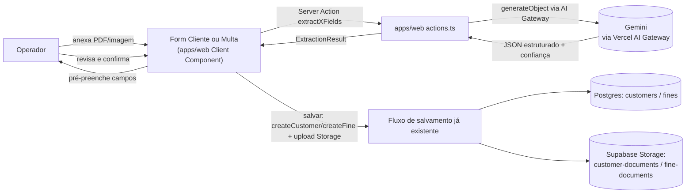

# Spec 0012 — Extração de Dados de Documentos via IA (CNH e Multa)

> 🟢 **Status: aprovado** em 2026-08-09. Spec técnica derivada de [[PRDs/0012-extracao-documentos-ia]]. Próximo passo: redigir a ADR 0023 (`obsidian-notes/decisions/`) consolidando as decisões de arquitetura desta Spec, depois implementar (sem migration → schemas Zod em `@gomoto/core` → Server Actions → UI → testes).

---

## 1. Visão Geral Técnica

A extração roda inteiramente sob demanda, disparada pelo operador, sem introduzir workers, filas ou Edge Functions novas. Um Server Action em `apps/web` recebe o arquivo (PDF ou imagem) e o tipo de documento, chama o Gemini via Vercel AI SDK roteada pelo AI Gateway (`generateObject` com schema Zod, string de modelo `google/gemini-...`) e devolve ao client um objeto tipado com os campos extraídos e o nível de confiança de cada um. O client usa esse resultado só para pré-preencher o formulário já existente (Cliente ou Multa) — nenhuma escrita em banco acontece nesse passo.

Extensibilidade (RN-005) é resolvida em `packages/core`: um registry mapeia `documentType → { schema Zod dos campos extraídos, prompt de extração, mapeamento pros campos do formulário }`. O Server Action de extração é genérico — recebe `documentType` e despacha pro schema/prompt certo do registry. Adicionar um tipo de documento novo no futuro (comprovante de residência, contrato) é uma entrada nova no registry, não uma mudança no fluxo de extração já entregue.

Não há persistência dedicada à extração em si — nem tabela de histórico, nem upload intermediário para o Storage antes da confirmação. O arquivo selecionado fica em memória no client até o operador salvar o formulário; nesse momento, ele é enviado ao bucket já existente da tela correspondente (`customer-documents` para Cliente, `fine-documents` para Multa), reaproveitando o fluxo de anexo que já existe hoje — a extração não cria um padrão de anexo novo, ela alimenta o mesmo formulário/anexo que o cadastro manual já usa. Para Multa, isso exige estender o fluxo de criação (`createFine`) para também anexar o documento logo após criar o registro, já que hoje o anexo só é possível depois que a multa existe (tela de detalhe) — mesmo padrão sequencial já usado hoje na criação de Cliente (upload após `createCustomer` retornar o `id`).

---

## 2. Arquitetura

### 2.1 Contexto



Nenhum serviço externo novo além do provedor de IA. Nenhuma mudança em Auth/Storage/Postgres nesse fluxo — o Storage só recebe o arquivo quando o formulário é salvo, pelo caminho que já existe hoje.

### 2.2 Componentes

- `packages/core/src/document-extraction/registry.ts` — **novo**. Registry `documentType → { fieldsSchema (Zod), promptBuilder, targetEntity }`. Puro, sem I/O — ponto de extensão pra novos tipos de documento (RN-005).
- `packages/core/src/document-extraction/types.ts` — **novo**. Tipos `ExtractionField<T>` (`{ value, confidence: 'high' | 'low' }`), `ExtractionResult<TFields>`, `DocumentType`.
- `packages/core/src/rules/matchVehicleByPlate.ts` — **novo**. Função pura `matchVehicleByPlate(plate, vehicles): Vehicle | null` (RF-008 / CA-008 / CA-009), testável isolada com Vitest.
- `apps/web/src/lib/document-extraction/extract.ts` — **novo**. Único ponto que chama o Gemini de fato (`generateObject` via AI Gateway), usando o registry. Código server-only, nunca importado por Client Component. Fora de produção devolve um `ExtractionResult` fixo por PADRÃO, sem chamar o Gateway; `DOCUMENT_EXTRACTION_REAL=1` pede o caminho real. `NODE_ENV === 'production'` força o real, independente da variável.
- `apps/web/src/app/(dashboard)/clientes/actions.ts` — **modificado**. Novo export `extractCnhFields(formData): Promise<ActionResult<ExtractionResult<CnhFields>>>`, Server Action fina que delega pro helper compartilhado.
- `apps/web/src/app/(dashboard)/multas/actions.ts` — **modificado**. Novo export `extractFineNoticeFields(formData): Promise<ActionResult<ExtractionResult<FineNoticeFields>>>`, mesmo padrão. `createFine` passa a aceitar anexar o documento logo após criar o registro (ver §3).
- `apps/web/src/app/(dashboard)/clientes/_components/CustomerForm.tsx` — **modificado**. Novo estado de upload/extração, chama `extractCnhFields`, pré-preenche e sinaliza confiança baixa.
- `apps/web/src/app/(dashboard)/multas/_components/FineForm.tsx` — **modificado**. Mesmo padrão + chamada a `matchVehicleByPlate` com a lista já carregada via `useVehicles`.
- Nenhuma migration nova — sem tabela (decisão da §1).

### 2.3 Responsabilidades

| Componente | Responsabilidade |
|---|---|
| `CustomerForm` / `FineForm` (Client) | Dispara upload, chama Server Action de extração, aplica resultado no estado do form, sinaliza confiança baixa, decide o anexo final no submit |
| `extractCnhFields` / `extractFineNoticeFields` (Server Action) | Valida tipo/tamanho do arquivo (RNF-003) antes de gastar chamada de IA, aplica timeout de 30s (RNF-001), traduz erro do provedor em `ActionResult` |
| `extract.ts` (helper compartilhado) | Monta a chamada ao Gemini a partir do registry — não conhece Cliente/Multa, só `documentType` |
| `registry.ts` (`packages/core`) | Única fonte de verdade de campos esperados + prompt por tipo de documento — extensão futura mexe só aqui |
| `matchVehicleByPlate` (pura) | Recebe placa extraída + lista de veículos já carregada, devolve match ou `null` |

---

## 3. Fluxos Técnicos

### 3.1 Fluxo principal

**Fluxo A — CNH (tela Cliente)**

1. Operador seleciona arquivo (PDF/imagem) no `CustomerForm`, sem submeter o formulário ainda.
2. Client valida tipo/tamanho no browser (feedback imediato) — validação definitiva acontece no Server Action, nunca só no client.
3. Client monta `FormData { file }` e chama `extractCnhFields(formData)`.
4. Server Action valida o `FormData`, busca a entrada `'cnh'` no registry (schema de campos + prompt), chama `generateObject` (model `google/gemini-...`, schema `CnhFieldsSchema`, arquivo + prompt como mensagem) com timeout de 30s.
5. **Sucesso**: Gemini retorna objeto validado pelo schema (cada campo com `value` + `confidence`). Server Action calcula `fieldsFound`/`fieldsTotal`, retorna `{ ok: true, data: ExtractionResult }`.
   **Falha/timeout**: retorna `{ ok: false, error: { code: 'EXTRACTION_FAILED', message } }`.
6. Client aplica o resultado: preenche o form, sinaliza campos `confidence: 'low'`, mostra "X de Y campos identificados" (RF-005), guarda o `File` original em memória (`pendingCnhFile`) pra anexar depois. Em caso de falha, mostra mensagem com "Tentar novamente" / "Preencher manualmente" (CA-010).
7. Operador revisa/edita livremente, inclusive campos de baixa confiança — client state comum, sem chamada extra.
8. Operador submete o form (`createCustomer`/`updateCustomer`, fluxo já existente).
9. Se havia `pendingCnhFile`: após `createCustomer` retornar `id` (criação) ou usando o `id` existente (edição), sobe o arquivo pro bucket `customer-documents` (path já convencionado) e chama `updateCustomer(id, { drivers_license_photo_url: path })` — mesmo fluxo de upload que já existe hoje, reaproveitando o arquivo já obtido na extração (sem pedir de novo ao operador).

**Fluxo B — Multa (tela Multa)**

1. Operador seleciona o PDF no `FineForm`.
2. Client chama `extractFineNoticeFields({ file })`.
3. Server Action segue o mesmo padrão do Fluxo A, retorna `ExtractionResult<FineNoticeFields>` (inclui `license_plate`).
4. Client aplica os campos extraídos (`description`, `infraction_date`, `due_date`, `amount`, `ait_number`, etc.).
5. Client chama `matchVehicleByPlate(extractedPlate, vehicles)` com a lista já carregada via `useVehicles` — encontrou → pré-seleciona `vehicle_id` (CA-008); não encontrou → campo fica vazio pra seleção manual (CA-009/RN-006).
6. Operador revisa/edita, seleciona `customer_id` se aplicável (auto-vínculo por contrato ativo continua funcionando como hoje).
7. Operador salva: `createFine(payload)`.
8. Se havia `pendingFineNoticeFile`: após `createFine` retornar `id`, sobe o arquivo pro bucket `fine-documents` e chama `addFineAttachment(id, type: 'ait', path)` — reaproveita o mesmo componente/Server Action que já existe em `FineAttachments`, só que disparado automaticamente na sequência do save, sem o operador precisar ir na tela de detalhe depois.

### 3.2 Fluxos alternativos

- Operador não anexa nada → formulário funciona exatamente como hoje, zero chamada de extração (RF-011/CA-012/RN-003).
- Operador anexa, extração roda, mas descarta o resultado → `pendingXFile` é limpo do estado; o que já tinha sido digitado manualmente permanece intacto.
- Placa extraída não bate com veículo cadastrado → CA-009/RN-006, sem bloqueio do restante do preenchimento.
- Operador tenta a extração de novo após falha → nova chamada ao Server Action; nada do form é perdido.

### 3.3 Fluxos de falha

- Timeout de 30s (RNF-001) ou erro do provedor → `EXTRACTION_FAILED`, client mostra mensagem + retry/manual (CA-010). Estado do form nunca é resetado pela chamada.
- Documento ilegível ou tipo errado → Gemini retorna poucos/nenhum campo (`value: null`); `fieldsFound` baixo é exibido normalmente — resultado válido de baixo aproveitamento, não erro técnico.
- Upload do arquivo final falha **depois** que `createCustomer`/`createFine` já teve sucesso → registro fica salvo sem o anexo. Não é atômico — mesma limitação que já existe hoje em qualquer fluxo de anexo (Storage não participa de transação com Postgres). Client avisa "cadastro salvo, mas anexo falhou" e permite reenviar sem duplicar o registro.
- Conflito de concorrência: sem tratamento novo — mesmo comportamento que `createCustomer`/`createFine` já têm hoje.

### 3.4 Eventos

Sem eventos — operação síncrona (request/response dentro do próprio Server Action, sem webhook/worker/fila).

---

## 4. Modelo de Dados

### 4.1 Entidades

Nenhuma tabela nova. A feature reaproveita 100% do modelo de dados já existente:

| Entidade reaproveitada | Onde vive | Papel nesta feature |
|---|---|---|
| `customers.drivers_license_photo_url` | Coluna já existente em `customers` | Recebe o path do arquivo de CNH após confirmação (Fluxo A, passo 9) |
| `fine_attachments` | Tabela já existente (`type` ENUM inclui `'ait'`) | Recebe o anexo da notificação de multa após confirmação (Fluxo B, passo 8) |
| Bucket `customer-documents` | Supabase Storage, privado, 10MB, já existe | Destino do upload final da CNH |
| Bucket `fine-documents` | Supabase Storage, privado, 10MB, já existe | Destino do upload final da notificação de multa |

### 4.2 Campos (SQL concreto)

N/A — nenhuma migration. As tabelas/colunas/buckets acima já existem e já cumprem os requisitos invioláveis (`tenant_id` + RLS + trigger `updated_at`) desde que foram criados:

- `customers` — já tem `tenant_id` + RLS desde a Fase 5 de multi-tenancy.
- `fine_attachments` (migration `20260703120000_fine_attachments.sql`) — `tenant_id NOT NULL REFERENCES tenants(id) ON DELETE CASCADE`, RLS via `tenant_id IN (SELECT get_user_tenants())`, **sem** trigger `updated_at` por design (linha imutável após upload, por comentário explícito na migration original — não é omissão).

Nenhum `ALTER TABLE` necessário — os campos usados já existem com o tipo certo.

### 4.3 Relacionamentos e índices

Sem mudança. `fine_attachments.fine_id → fines.id ON DELETE CASCADE` e a PK de `customers` já existem e já são suficientes pro volume desta feature (processamento de um documento por vez — §3.4 do PRD).

**Observação registrada — resolvida durante a implementação:** `CustomerSchema` em `@gomoto/core` não validava `drivers_license_photo_url` (nem `residency_proof_url`) via Zod — como o schema não usa `.passthrough()`, `updateCustomer()` descartava esses campos silenciosamente (nenhum erro, apenas um update vazio). Isso quebrava de verdade o CA-011 pro fluxo de Cliente: o upload chegava no Storage, mas o cadastro nunca ficava com o anexo vinculado. Descoberto ao rodar o E2E `apos-salvar-documento-anexado` contra o servidor local — corrigido adicionando os dois campos como `z.string().trim().max(500).optional().nullable()` no `CustomerSchema` (sem migration, a coluna já existia).

---

## 5. APIs

### 5.1 Endpoints (Server Actions)

| Server Action | Local | Auth | Request | Response |
|---|---|---|---|---|
| `extractCnhFields` | `apps/web/src/app/(dashboard)/clientes/actions.ts` | Sessão autenticada (`getCurrentTenantId`) | `FormData { file: File }` | `ActionResult<ExtractionResult<CnhFields>>` |
| `extractFineNoticeFields` | `apps/web/src/app/(dashboard)/multas/actions.ts` | Sessão autenticada | `FormData { file: File }` | `ActionResult<ExtractionResult<FineNoticeFields>>` |

`documentType` não trafega do client — cada Server Action já é fixa pro seu tipo (a rota de Clientes só extrai `'cnh'`, a de Multas só extrai `'fine_notice'`), evitando o cliente poder pedir o tipo errado pra tela errada. O parâmetro só existe internamente, entre a Server Action e o helper/registry compartilhado.

### 5.2 Schemas (Zod via `@gomoto/core`)

```ts
// packages/core/src/document-extraction/types.ts
import { z } from 'zod';

export const DocumentTypeSchema = z.enum(['cnh', 'fine_notice']);
export type DocumentType = z.infer<typeof DocumentTypeSchema>;

export function extractionField<T extends z.ZodTypeAny>(valueSchema: T) {
  return z.object({
    value: valueSchema.nullable(),
    confidence: z.enum(['high', 'low']),
  });
}

export function extractionResultSchema<TFields extends z.ZodRawShape>(
  fields: z.ZodObject<TFields>
) {
  return z.object({
    documentType: DocumentTypeSchema,
    fields,
    fieldsFound: z.number().int().min(0),
    fieldsTotal: z.number().int().min(0),
  });
}

export const ExtractDocumentFileSchema = z
  .instanceof(File)
  .refine((f) => f.size <= 10 * 1024 * 1024, 'Arquivo excede 10MB (RNF-003)')
  .refine(
    (f) => ['application/pdf', 'image/jpeg', 'image/png', 'image/webp'].includes(f.type),
    'Formato não suportado — use PDF, JPG, PNG ou WEBP'
  );
```

```ts
// packages/core/src/document-extraction/registry.ts
import { z } from 'zod';
import { extractionField, extractionResultSchema } from './types';

export const CnhFieldsSchema = z.object({
  name: extractionField(z.string()),
  cpf: extractionField(z.string()),
  rg: extractionField(z.string()),
  birth_date: extractionField(z.string()), // ISO date
  drivers_license: extractionField(z.string()),
  drivers_license_category: extractionField(z.string()),
  drivers_license_validity: extractionField(z.string()), // ISO date
});
export type CnhFields = z.infer<typeof CnhFieldsSchema>;
export const CnhExtractionResultSchema = extractionResultSchema(CnhFieldsSchema);

export const FineNoticeFieldsSchema = z.object({
  license_plate: extractionField(z.string()),
  description: extractionField(z.string()),
  infraction_date: extractionField(z.string()),
  due_date: extractionField(z.string()),
  amount: extractionField(z.number()),
  ait_number: extractionField(z.string()),
  infraction_location: extractionField(z.string()),
});
export type FineNoticeFields = z.infer<typeof FineNoticeFieldsSchema>;

// RN-005: novo tipo de documento = nova entrada aqui, sem tocar nas existentes.
export const documentExtractionRegistry = {
  cnh: {
    fieldsSchema: CnhFieldsSchema,
    promptBuilder: buildCnhPrompt, // packages/core/src/document-extraction/prompts.ts
    targetEntity: 'customer' as const,
  },
  fine_notice: {
    fieldsSchema: FineNoticeFieldsSchema,
    promptBuilder: buildFineNoticePrompt,
    targetEntity: 'fine' as const,
  },
} satisfies Record<string, { fieldsSchema: z.ZodTypeAny; promptBuilder: (...args: any[]) => string; targetEntity: string }>;
```

Schemas vivem em `@gomoto/core`. **Nunca duplicados** em `apps/web`.

### 5.3 Erros

| Código | Quando ocorre | Resposta |
|---|---|---|
| `VALIDATION_ERROR` | Arquivo ausente, MIME não suportado, ou > 10MB (RNF-003) | Erro de validação exibido antes de chamar a IA — nem gasta a chamada |
| `UNAUTHORIZED` | Sem sessão válida | Comportamento padrão já existente (redireciona pro login) |
| `EXTRACTION_FAILED` | Timeout de 30s (RNF-001), erro do provedor Gemini, ou resposta fora do schema esperado | Mensagem amigável + "Tentar novamente" / "Preencher manualmente" (CA-010) |

`EXTRACTION_FAILED` é um código novo, adicionado à união `ErrorCode` de `@gomoto/core` — cobre timeout e falha genérica do provedor com o mesmo tratamento de UI, já que o PRD (RF-009/CA-010) não distingue os dois casos.

---

## 6. Segurança

### 6.1 Autenticação

Ambas as Server Actions (`extractCnhFields`, `extractFineNoticeFields`) exigem sessão Supabase válida — mesma checagem já usada em `createCustomer`/`createFine` (client server-side via cookies). Sem sessão → `UNAUTHORIZED`. A chave do provedor de IA (AI Gateway) nunca chega ao client — vive só em env var server-side (Vercel), usada exclusivamente dentro do helper `apps/web/src/lib/document-extraction/extract.ts`.

### 6.2 Autorização

Qualquer usuário autenticado do tenant pode disparar a extração — não é uma ação sensível de escrita (nada é persistido nesse passo, §1), então não precisa de checagem de role além de "autenticado e pertence a um tenant". A autorização que de fato importa é a do *save final* — `updateCustomer`/`createFine`/`addFineAttachment` já têm suas próprias checagens/RLS herdadas hoje, e nada muda ali. Sem matriz de persona × ação nova: PRD tem persona única (Operador), já com acesso total às duas telas.

### 6.3 Auditoria

Cobertura herdada — nenhuma linha nova em `audit_logs` porque a extração em si não persiste nada (decisão da §1). O save final continua auditado normalmente pelos actions já existentes (`updateCustomer`, `createFine`, `addFineAttachment`), que já chamam `logAction(...)` hoje.

### 6.4 Privacidade e dados sensíveis (RNF-004/005/006, RN-007)

- **RNF-004** (aviso de processamento por IA terceiro): texto informativo na UI, próximo ao botão de anexar — decisão de tela, sem impacto de arquitetura backend.
- **RNF-006/RN-007** (retenção mínima, uso exclusivo pro formulário): já garantido pela arquitetura da §1 — nenhuma cópia intermediária, nenhum reaproveitamento pra outro propósito.
- **RNF-005** (config sem reuso pra treino, "sempre que contratualmente disponível") — **resolvido**: o AI Gateway da Vercel tem o controle `disallowPromptTraining` — disponível em **qualquer plano, sem custo extra** (não exige Pro), e Google/Gemini está entre os provedores cobertos pelo acordo negociado pela Vercel. `extract.ts` passa `providerOptions: { gateway: { disallowPromptTraining: true } }` em toda chamada `generateObject`. Se por algum motivo o modelo solicitado não estiver coberto pelo acordo naquele momento, o Gateway falha a chamada explicitamente (`no_providers_available`, HTTP 400) em vez de rotear silenciosamente por um provedor sem essa garantia — cai no mesmo tratamento de erro já desenhado em §3.3/§5.3 (`EXTRACTION_FAILED`), sem caminho de código novo. **Importante:** essa proteção só vale usando as credenciais gerenciadas do AI Gateway (o que já é a decisão da §1/ADR 0023) — não se aplica a chamadas via BYOK (chave própria do Gemini), então a Spec não deve migrar pra BYOK sem reavaliar isso.

---

## 7. Observabilidade

### 7.1 Logs essenciais

Segue o padrão já usado no projeto hoje (`console.error`/`console.warn` com prefixo `[nomeDaAction]` + objeto de contexto — ex.: `[createCustomer] cross-tenant lookup falhou`) — sem infra de logging estruturado nova.

| Evento | Nível | Contexto |
|---|---|---|
| `[extractCnhFields] extraction_failed` | `console.error` | `{ tenant_id, outcome: 'error', error_code, latency_ms }` |
| `[extractCnhFields] extraction_completed` | `console.info` | `{ tenant_id, outcome: 'ok', fields_found, fields_total, latency_ms }` |
| `[extractFineNoticeFields] extraction_failed` | `console.error` | mesmo shape acima |
| `[extractFineNoticeFields] extraction_completed` | `console.info` | mesmo shape acima |
| Falha de upload pós-criação (Fluxo A/B, passo final) | `console.error` | já existe no fluxo de anexo atual — nenhuma mudança de padrão |

**Nunca logado:** conteúdo do documento, valores extraídos (nome, CPF, CNH, endereço, placa, valor da multa) — só metadados operacionais (contagens, latência, outcome, tenant/user id). Isso cumpre RNF-004/RN-007 no nível de observabilidade, não só no nível de persistência.

### 7.2 Métricas e alertas

N/A — feature não crítica. O PRD (§3.3) explicita que não há meta numérica bloqueante no V1, e o projeto não tem infraestrutura de métricas (Prometheus/Grafana ou equivalente) hoje.

---

## 8. Performance e Escalabilidade

N/A — sem requisitos materiais. Comportamento padrão Vercel (timeout de função 300s, folga grande sobre os 30s do RNF-001) + Supabase, processamento de um documento por vez (§3.4 do PRD, sem concorrência a otimizar).

---

## 9. Test Strategy

### 9.1 Unit tests (Vitest em `packages/core`)

| Teste | Arquivo | Cobre |
|---|---|---|
| `matchVehicleByPlate` — encontra match exato | `packages/core/src/rules/matchVehicleByPlate.spec.ts` | RF-008/CA-008 |
| `matchVehicleByPlate` — sem match retorna `null` | mesmo arquivo | CA-009/RN-006 |
| `matchVehicleByPlate` — normaliza formatação de placa (maiúsculas/hífen) | mesmo arquivo | robustez de RF-008 |
| `CnhFieldsSchema`/`FineNoticeFieldsSchema` — aceita objeto bem formado | `packages/core/src/document-extraction/registry.spec.ts` | RF-003 |
| Schema rejeita `confidence` fora de `'high'/'low'` | mesmo arquivo | RF-004 |
| `ExtractDocumentFileSchema` — rejeita arquivo > 10MB | `packages/core/src/document-extraction/types.spec.ts` | RNF-003 |
| `ExtractDocumentFileSchema` — rejeita MIME não suportado | mesmo arquivo | RNF-003 |

### 9.2 E2E tests (Playwright em `apps/web`)

| Teste | Arquivo | Cobre |
|---|---|---|
| Operador preenche Cliente sem anexar documento (fluxo manual intacto) | `apps/web/tests/e2e/document-extraction-cliente.spec.ts::sem-anexar-fluxo-manual-intacto` | RF-011/CA-012/RN-003/RNF-002 |
| Anexa arquivo inválido (MIME/tamanho) → erro de validação, sem chamar IA | `document-extraction-cliente.spec.ts::anexa-arquivo-invalido` | RNF-003 |
| Anexa CNH válida (extração simulada, padrão fora de produção) → campos pré-preenchidos, contagem exibida, confiança baixa sinalizada, edição de campo prevalece, salva mesmo com baixa confiança não corrigida | `document-extraction-cliente.spec.ts::anexa-cnh-valida` | RF-003/004/005/006/007, CA-003/004/005/006/007, RN-001/002 |
| Extração falha (mock retorna erro) → mensagem + retry/manual, form não perde dado já digitado | `document-extraction-cliente.spec.ts::extracao-falha-mensagem-retry` | RF-009/CA-010 |
| Após salvar, documento aparece anexado ao registro de Cliente | `document-extraction-cliente.spec.ts::apos-salvar-documento-anexado` | RF-010/CA-011/RN-004 |
| Anexa notificação de multa com placa cadastrada → veículo pré-selecionado | `apps/web/tests/e2e/document-extraction-multa.spec.ts::anexa-multa-com-placa-cadastrada` | RF-008/CA-008 |
| Placa extraída sem match → campo de veículo vazio, resto do form funciona | `document-extraction-multa.spec.ts::placa-sem-match-campo-vazio` | CA-009/RN-006 |
| Após salvar, documento aparece anexado ao registro de Multa | `document-extraction-multa.spec.ts::apos-salvar-documento-anexado` | RF-010/CA-011/RN-004 |

### 9.3 Integration / Contract

Primeira integração com IA externa do projeto — a lógica de dispatch (registry) e tratamento de erro merece teste isolado da UI, sem custo de chamada real.

| Teste | Arquivo | Cobre |
|---|---|---|
| `extractFields('cnh', file)` chama `generateObject` com `CnhFieldsSchema` + prompt de CNH corretos | `apps/web/src/lib/document-extraction/extract.spec.ts` (Vitest, `generateObject` mockado) | Dispatch correto do registry |
| Calcula `fieldsFound`/`fieldsTotal` a partir de um resultado com campos nulos | mesmo arquivo | RF-005 |
| Timeout de 30s → retorna `EXTRACTION_FAILED`, nunca lança exceção | mesmo arquivo | RNF-001/CA-010 |
| Erro do provedor (mock rejeitado) → retorna `EXTRACTION_FAILED` | mesmo arquivo | CA-010 |
| Toda chamada `generateObject` inclui `providerOptions.gateway.disallowPromptTraining === true` | mesmo arquivo | RNF-005 |

---

## 10. Deploy e Rollback

**Deploy:** sem migration — nenhuma mudança de schema (§4). Ordem:

1. Configurar env var do AI Gateway na Vercel (`AI_GATEWAY_API_KEY` ou OIDC via `vercel env pull`) em produção **antes** do deploy do código — o Server Action falha em runtime se a env var não existir, mas só quando o operador de fato aciona a extração (não bloqueia build nem quebra nada existente).
2. Deploy único de `apps/web` com todo o código da feature (registry, helper, Server Actions, mudanças de formulário) — sem necessidade de fases, já que tudo é aditivo: novos exports em `actions.ts`, novos arquivos em `packages/core`, nenhuma mudança de contrato em código existente.
3. RNF-005 já resolvido em código (`disallowPromptTraining: true` no AI Gateway, §6.4) — nenhum pré-requisito de billing/conta pendente antes de abrir pra produção.

**Rollback:** sem feature flag dedicada — o projeto não tem infraestrutura de flags hoje, e introduzir uma só pra essa feature seria over-engineering (é um botão opcional, nunca no caminho crítico de salvar Cliente/Multa). Reverter é rollback padrão de deployment na Vercel (voltar pro deployment anterior via dashboard/CLI) — sem migration, não há "migration down" a coordenar. Se o problema for custo/qualidade da extração (não um bug de código), também dá pra remover o botão de anexar num hotfix pequeno, sem reverter o deploy inteiro.

---

## 11. Riscos Técnicos e Questões Abertas

### 11.1 Riscos

| Risco | Mitigação |
|---|---|
| ~~RNF-005 pode não ser cumprido se o Gemini ficar no tier gratuito de desenvolvedor~~ — **resolvido** | `disallowPromptTraining: true` no AI Gateway (grátis em qualquer plano Vercel, Gemini coberto pelo acordo) elimina a necessidade de negociar tier/billing pago do Gemini diretamente — ver §6.4. Sem bloqueio de negócio remanescente. |
| Falha de upload do documento final após `createCustomer`/`createFine` já ter sucedido — registro fica sem anexo | Client avisa e permite reenviar sem duplicar o registro (§3.3). Mesma limitação pré-existente em todos os fluxos de anexo do projeto — não é regressão introduzida por esta feature. |
| Modelo erra um campo e marca confiança como alta (falso positivo) | RN-001/RN-002 já exigem revisão humana obrigatória antes de salvar — extração nunca grava sozinha. Risco residual aceito pelo próprio desenho do PRD. |
| Custo por chamada ao Gemini cresce sem controle com o volume (risco já citado no PRD §11.2, delegado à Spec) | AI Gateway já suporta budget alerts mensais configuráveis no painel Vercel, tags por feature (`document-extraction`) pra rastrear gasto isolado, e rate limit por usuário — tudo configuração de painel, sem código extra. Recomenda-se configurar o budget alert assim que a feature for pro ar. |
| Conteúdo adversarial no documento tentando manipular a extração (prompt injection via texto no PDF) | Baixo impacto: saída é sempre JSON validado por schema Zod (não texto livre, não tool-calling), e RN-001 exige revisão humana antes de gravar — pior caso é um campo errado que o operador corrige. |
| Mitigação do PRD parcialmente enfraquecida: PRD §11.2 cita "métrica de adoção (§3.3) revela o problema cedo" como parte da mitigação pro risco de o operador perder confiança na extração e voltar a digitar manualmente | Como decidido em §1 (não persistir nada da extração), essa métrica não tem de onde vir — só a sinalização de confiança por campo (RF-004) continua de pé. Pra um único dono operando o sistema, a queda de uso tende a ser percebida de forma qualitativa; fica registrado que o dado quantitativo não existe hoje. |

### 11.2 Questões abertas

- [ ] Escolher o modelo Gemini específico (ex.: `gemini-2.5-flash` vs `gemini-2.5-pro`) — troca de custo × qualidade, validar empiricamente com documentos reais antes de produção. A Spec já abstrai isso numa string de config — trocar depois não muda arquitetura.
- [ ] Escrever o texto final dos prompts de extração (`buildCnhPrompt`, `buildFineNoticePrompt`) — detalhe de implementação, iterável sem mudar o contrato/schema já fechado aqui.
- [x] `CustomerSchema` em `@gomoto/core` não validava `drivers_license_photo_url`/`residency_proof_url` via Zod — resolvido durante a implementação (ver §4.3), pois bloqueava o CA-011 de verdade.

---

## 12. Matriz de Rastreabilidade e Aprovação

### 12.1 Matriz

| PRD Item | Descrição curta | Seção(ões) da Spec | Cobertura de Testes |
|---|---|---|---|
| RF-001 | Anexar documento na tela de Cliente pra extrair CNH | §2.2, §3.1 (Fluxo A), §5.1 | E2E: `document-extraction-cliente.spec.ts::anexa-cnh-valida` |
| RF-002 | Anexar documento na tela de Multa pra extrair notificação | §2.2, §3.1 (Fluxo B), §5.1 | E2E: `document-extraction-multa.spec.ts::anexa-multa-com-placa-cadastrada` |
| RF-003 | Sistema extrai campos e preenche formulário | §3.1, §5.2 | Unit: `registry.spec.ts::aceita-objeto-bem-formado`; E2E: `document-extraction-cliente.spec.ts::anexa-cnh-valida` |
| RF-004 | Indica campos extraídos e sinaliza confiança baixa | §2.2, §5.2 | Unit: `registry.spec.ts::rejeita-confidence-invalido`; E2E: `document-extraction-cliente.spec.ts::anexa-cnh-valida` |
| RF-005 | Informa quantos campos extraídos do total | §5.2, §9.3 | Integration: `extract.spec.ts::calcula-fieldsFound-fieldsTotal`; E2E: `document-extraction-cliente.spec.ts::anexa-cnh-valida` |
| RF-006 | Operador edita qualquer campo, incl. baixa confiança | §3.1 | E2E: `document-extraction-cliente.spec.ts::anexa-cnh-valida` |
| RF-007 | Salvar mesmo com confiança baixa não corrigida | §3.2, §3.3 | E2E: `document-extraction-cliente.spec.ts::anexa-cnh-valida` |
| RF-008 | Cross-reference placa → veículo cadastrado | §2.2 (`matchVehicleByPlate`), §3.1 (Fluxo B) | Unit: `matchVehicleByPlate.spec.ts::encontra-match-exato`; E2E: `document-extraction-multa.spec.ts::anexa-multa-com-placa-cadastrada` |
| RF-009 | Falha/timeout → mensagem + retry/manual | §3.3, §5.3 | Integration: `extract.spec.ts::timeout-retorna-EXTRACTION_FAILED`; E2E: `document-extraction-cliente.spec.ts::extracao-falha-mensagem-retry` |
| RF-010 | Anexa documento original ao registro após confirmação | §3.1, §4.1 | E2E: `document-extraction-cliente.spec.ts::apos-salvar-documento-anexado`, `document-extraction-multa.spec.ts::apos-salvar-documento-anexado` |
| RF-011 | Preencher manualmente sem anexar documento | §3.2 | E2E: `document-extraction-cliente.spec.ts::sem-anexar-fluxo-manual-intacto` |
| RNF-001 | Timeout de 30s | §3.1, §3.3, §6.1 | Integration: `extract.spec.ts::timeout-15s-retorna-EXTRACTION_FAILED` |
| RNF-002 | Indisponibilidade nunca impede cadastro/multa | §3.2, §3.3 | E2E: `document-extraction-cliente.spec.ts::sem-anexar-fluxo-manual-intacto` |
| RNF-003 | Aceita PDF/JPG/PNG/WEBP até 10MB | §5.2 | Unit: `types.spec.ts::rejeita-arquivo-grande`, `rejeita-mime-nao-suportado`; E2E: `document-extraction-cliente.spec.ts::anexa-arquivo-invalido` |
| RNF-004 | Informa processamento por IA de terceiro | §6.4 | N/A — texto estático de UI, verificação por revisão de copy |
| RNF-005 | Config sem reuso pra treino, quando disponível | §6.4 | Integration: `extract.spec.ts::inclui-disallowPromptTraining` |
| RNF-006 | Não retém documento além do necessário | §1, §3.1 | N/A — propriedade arquitetural (ausência de persistência intermediária), verificável por revisão de código |
| RN-001 | Extração nunca grava sem revisão/confirmação | §1, §3.1 | E2E: `document-extraction-cliente.spec.ts::anexa-cnh-valida` |
| RN-002 | Confiança baixa nunca bloqueia salvamento | §3.3 | E2E: `document-extraction-cliente.spec.ts::anexa-cnh-valida` |
| RN-003 | Extração sempre opcional | §3.2 | E2E: `document-extraction-cliente.spec.ts::sem-anexar-fluxo-manual-intacto` |
| RN-004 | Documento permanece vinculado ao registro | §4.1 | E2E: `document-extraction-cliente.spec.ts::apos-salvar-documento-anexado` |
| RN-005 | Novo tipo de documento não altera os existentes | §2.2, §5.2 (`documentExtractionRegistry`) | N/A — propriedade arquitetural do registry (entradas independentes), validada por revisão de código |
| RN-006 | Ausência de match não impede lançamento da multa | §3.1 (Fluxo B) | E2E: `document-extraction-multa.spec.ts::placa-sem-match-campo-vazio` |
| RN-007 | Dados usados exclusivamente pro formulário correspondente | §1, §6.4 | N/A — propriedade arquitetural (sem reaproveitamento do resultado), verificável por revisão de código |

### 12.2 Checklist de aprovação

- [x] Sem placeholders `<!-- preencher -->`
- [x] Nenhuma tabela nova em §4 — N/A (feature reaproveita schema existente, já validado que cumpre `tenant_id`+RLS+trigger)
- [x] Decisão arquitetural não trivial referencia ADR — PRD já sinaliza a ADR; esta Spec reserva o número 0023 (`decisions/0023-arquitetura-extracao-documentos-ia.md`), a redigir como próximo passo
- [x] Matriz §12.1 cobre 100% dos RF/RNF/RN do PRD
- [x] Anti-padrões GoMoto não foram adotados (`actions.ts` morto, `createClient()` em `page.tsx`, lógica em handler de UI, Zod duplicado em `apps/web`)

**Aprovado por:** Alan em 2026-08-09
